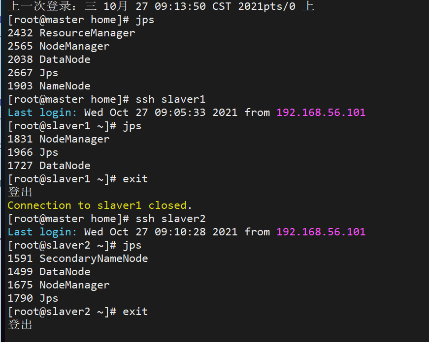

## 分布式 Hadoop 的部署

> 三台设备：
>
> - 56.11 master namenode resourcemanager
> - 56.12 slaver1 datanode
> - 56.13 slaver2 datanode secandaray namenode1.

1. 三个设备的集群配置前提条件

   - 三台设备：56.11/12/13

- jdk 部署好、jdk hadoop 环境变量配置好，
  - `vi /etc/profile source /etc/profile`
- 主机名与 IP 映射
  - 设备之间 ssh 免密码登录

2. 配置 Hadoop 集群运行环境

   - core-site.xml 和单机相同

   - hdfs-site.xml

     - 前提：在 Hadoop 主目录下创建 dfs/name 和 dfs/data 目录

     ```shell
     mkdir dfs
     cd dfs
     mkdir name
     mkdir data
     ```

   - mapred-site.xml

   - yarn-site.xml

   - workers

   - 将 master 设备上整个 Hadoop 目录发送到 slaver1 和 slaver2

     ```shell
     # 将目录压缩
     cd /home
     tar zcvf hadoop-3.2.2.tar.gz hadoop-3.2.2
     # 利用scp将压缩包发送到 slaver1、slaver2 的 /home 目录下
     scp hadoop-3.2.2.tar.gz root@slaver1:/home
     scp hadoop-3.2.2.tar.gz root@slaver2:/home
     # 到 slaver1、slaver2 上将压缩包解压
     cd /home
     tar xzvf hadoop-3.2.2.tar.gz
     ```

3. 启动 Hadoop 集群，[浏览器查看 Hadoop 管理界面](http://192.168.56.11:9870)

   - ```shell
     # 在master上运行格式化hdfs命令
     hdfs namenode -format
     # master启动
     start-all.sh
     # 分别在master、slaver1、slaver2 上查看运行的服务
     jps
     ```

     - master：namenode datanode resourcemanager nodemanger

     - slaver1：datanode nodemanager

     - slaver2：secondarynamenode datanode nodemanager

       

   - 停止 Hadoop 服务

     ```shell
     stop-all.sh
     ```
