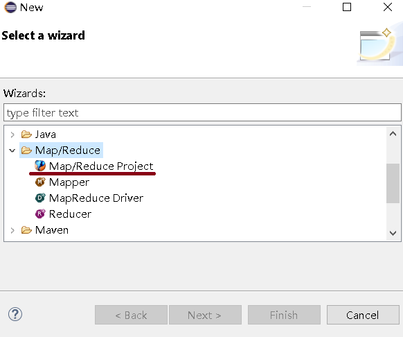
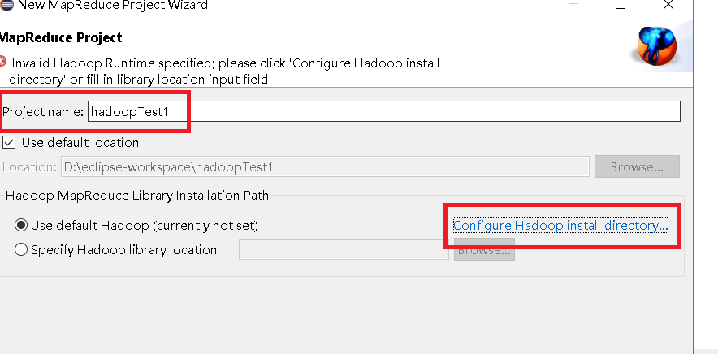
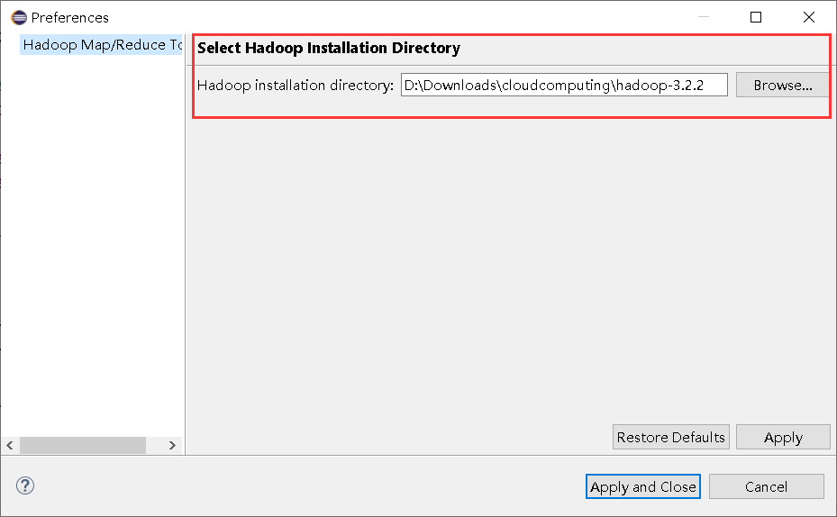
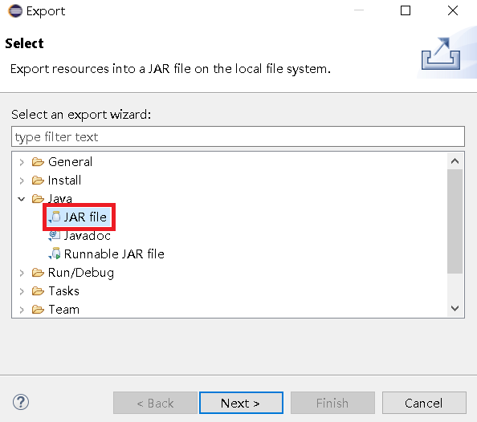
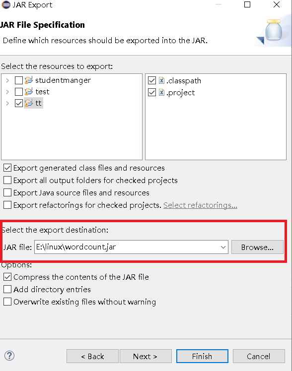
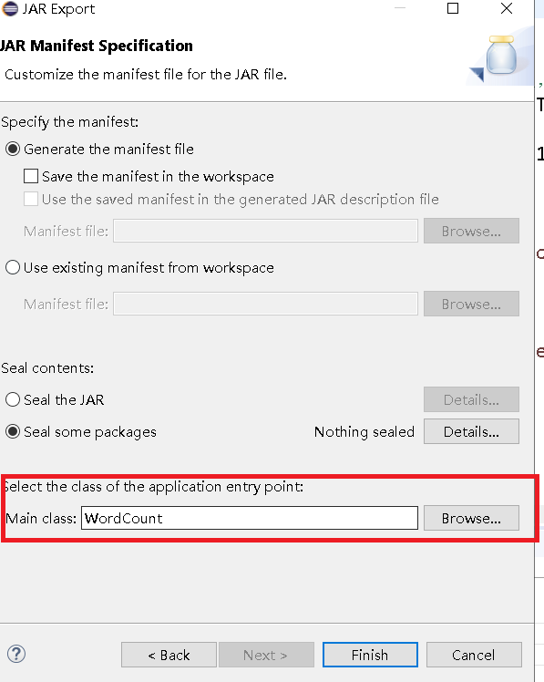
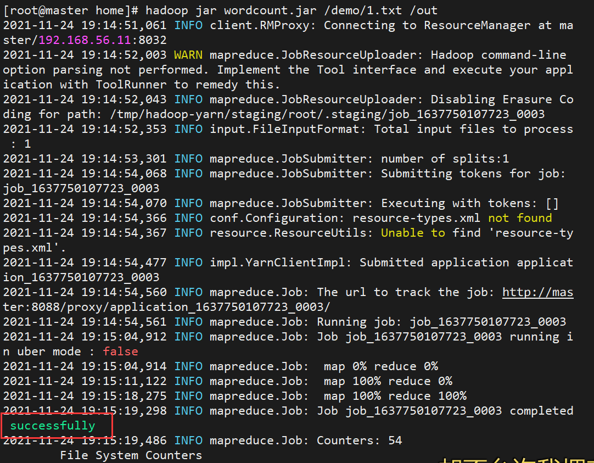

## Hadoop 云计算编程

> 安装用于 Hadoop 云计算编程的 eclipse 插件
> 导出 wordcount.jar 文件，运行

1. 将 `hadoop-eclipse-plugin-3.2.0.jar` 文件拷贝到 eclipse 安装目录中的 `plugins`文件夹中

   - 

2. 启动 eclipse，在 `file->new->other` 里面新增了 `Map/Reduce Project` 选项

   - 

3. 第一次创建 Map/Reduce Project 需要配置 Hadoop 安装目录，为了能引人相关的 lib 包

   - 将 `hadoop-3.2.2.tar.gz`解压
   - 配置安装路径
   - 
   - 
   - 拷贝**wordcount.java**到**src**内

4. 将项目导出成 jar 文件，右键项目 -> export -> Java- > JAR file

   - 
   - 选择保存的文件名和路径
   - 
   - 选择主类 Main Class
   - 

5. 运行 jar

   - 启动 Linux

   - start-all.sh

   - jps 查看服务确保已经启动 Hadoop

   - 将生成的 jar 文件上传到/home 目录下

   - cd /home 执行 jar `hadoop jar wordcount.jar /demo/1.txt /out`

   - ```shell
       # 先确保hdfs里面有 /demo 文件夹 和 1.txt 文件，没有就执行下面代码
       hdfs dfs -mkdir /demo
       hdfs dfs -put 1.txt /demo
       # /out 文件夹不用建
       # 报错/out already exists ，则需要删除out文件夹
     hadoop fs -rm -r -skipTrash /out

       # 如果报错NoRouteToHost，可能是slaver1和slaver2的防火墙没有关闭
       # 切换到slaver1、查看防火墙状态
       firewall-cmd --state
       # running
       # 关闭防火墙
       systemctl stop firewalld.service
       # 禁用防火墙，永久关闭
       systemctl disable firewalld.service
     ```

   - 

   - 

6. 查看结果

   ```shell
   # 将运行结果文件 `/out/part-r-00000` 文件内容下载到本地的 `3.txt` 中
   hdfs dfs -get /out/part-r-00000 3.txt
   # 查看结果
   more 3.txt
   ```

## wordcount.java

```java
import java.io.IOException;
import java.util.StringTokenizer;

import org.apache.hadoop.conf.Configuration;
import org.apache.hadoop.fs.Path;
import org.apache.hadoop.io.IntWritable;
import org.apache.hadoop.io.LongWritable;
import org.apache.hadoop.io.Text;
import org.apache.hadoop.mapreduce.Job;
import org.apache.hadoop.mapreduce.Mapper;
import org.apache.hadoop.mapreduce.Reducer;
import org.apache.hadoop.mapreduce.lib.input.FileInputFormat;
import org.apache.hadoop.mapreduce.lib.input.TextInputFormat;
import org.apache.hadoop.mapreduce.lib.output.FileOutputFormat;
import org.apache.hadoop.mapreduce.lib.output.TextOutputFormat;
import org.apache.hadoop.util.GenericOptionsParser;
import org.apache.hadoop.mapreduce.Reducer.Context;

public class WordCount {

    // 继承Mapper类,Mapper类的四个泛型参数分别为：输入key类型，输入value类型，输出key类型，输出value类型
    public static class Map extends Mapper<LongWritable, Text, Text, IntWritable> {

        private final static IntWritable one = new IntWritable(1); // output value
        private Text word = new Text(); // output key

        @Override
        public void map(LongWritable key, Text value, Context context)
                throws IOException, InterruptedException {

            String line = value.toString();
            StringTokenizer tokenizer = new StringTokenizer(line);

            while (tokenizer.hasMoreTokens()) {
                word.set(tokenizer.nextToken());
                context.write(word, one);
            }

        }
    }

    // Reduce类，继承了Reducer类
    public static class Reduce extends
            Reducer<Text, IntWritable, Text, IntWritable> {

        @Override
        public void reduce(Text key, Iterable<IntWritable> values,
                Context context) throws IOException, InterruptedException {
            int sum = 0;
            for (IntWritable val : values) {
                sum += val.get();
            }
            context.write(key, new IntWritable(sum));
        }
    }

    public static void main(String[] args) throws Exception {

        if (args.length != 2) {
            System.err
                    .println("Usage: MaxTemperature <input path> <output path>");
            System.exit(-1);
        }

        Job job = new Job(); // 创建一个作业对象
        job.setJarByClass(WordCount.class); // 设置运行/处理该作业的类
        job.setJobName("WordCount");

        FileInputFormat.addInputPath(job, new Path(args[0]));
        FileOutputFormat.setOutputPath(job, new Path(args[1]));

        job.setMapperClass(Map.class);
        job.setReducerClass(Reduce.class);

        job.setOutputKeyClass(Text.class);
        job.setOutputValueClass(IntWritable.class);

        System.exit(job.waitForCompletion(true) ? 0 : 1);

    }

}
```
