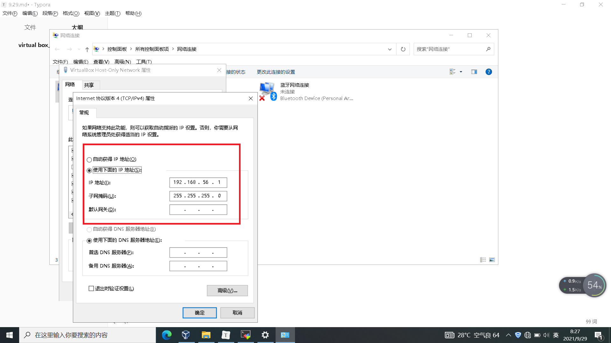

## virtual box 上 linux 集群

> 目标创建三个 Linux，三台之前能网络互动。3 台 Linux 各自有固定的 IP 地址。1.

1. 将现有的 Linux 配置成固定 IP 地址，且和 Windows 主机在一个网段上

   1. 启动新的网卡
      - 设置-->网络-->网卡 2-->勾选"**启用网络连接**"-->连接方式选择**仅主机(host-only)网络**
      - virtual Box 给 windows 增加网卡，默认 IP 192.168.56.1
      - 
      - Linux 主机增加了一个网卡**enp0s8**
   2. 启动 Linux，查看网卡，输入 # ip addr
   3. 给网卡 enp0s8 固定 IP 地址：192.168.56.1

   - cd /etc/sysconfig/network-scripts

   - 默认没有 enp0s8，拷贝一份 enp0s3 重命名为 enp0s8
   - #cp ifcfg-enp0s3 ifcfg-enp0s8
   - #vi ifcfg-enp0s8
   - 修改 enp0s8 配置，将第四行的**BOOTPROTO=dhcp**改成**BOOTPROTO=static**
   - 即将动态获取 IP 地址改为静态
   - 禁用 ipv6：**IPV6INIT=no**
   - 将**NAME**和**DEVICE**都改为**enp0s8**
   - 将**UUID**任意修改，确保和 enp0s3 不相同，同一台 Linux 设备，不同网卡的 uuid 要唯一
   - 增加两行，设置固定 IP 地址
   - IPADDR=192.168.56.11
   - NETMASK=255.255.255.0
   - 保存退出
   - 重启网络服务，是修改后的网卡配置生效
   - #service network restart
   - 测试 Windows 主机与 Linux 新网卡 192.168.56.11 是否相通
   - cmd 运行 ping 192.168.56.11

> 已现有 Linux 为基础，复制另外两台 Linux
>
> ip 地址分别设置为 192.168.56.12/13

1. 为了区分，把 pc1 改名称为 56.11
2. 右键->复制，名称 56.12，选择保存路径，
   - MAC 地址设定-->选择第三项：为所有网卡重新生成 MAC 地址
3. 进入 56.12 将 enp0s8 的 ip 设置为：192.168.56.12
   - 修改完成重启网络服务，#service network restart
4. 启动 56.11，测试 56.11 和 56.12 之间网络是否联通
   - 在 56.11 上 ping 192.168.56.12
   - 在 56.12 上 ping 192.168.56.11
