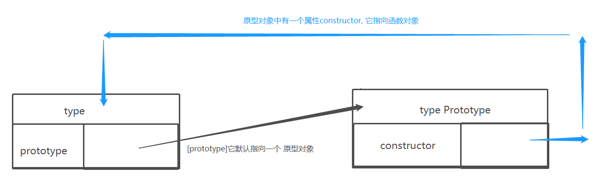
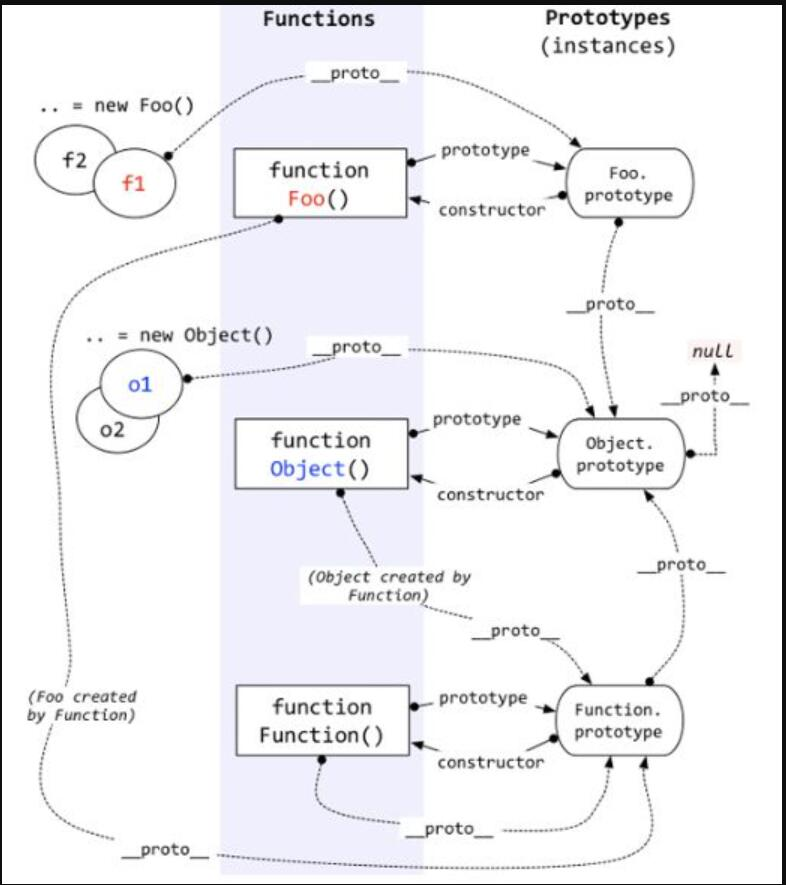

## 原型

1.函数的prototype属性

* 每个函数都有一个prototype属性, 它默认指向一个Object空对象(即称为: 原型对象)
* 原型对象中有一个属性constructor, 它指向函数对象

  

 2.给原型对象添加属性(一般都是方法)

* 作用: 函数的所有实例对象自动拥有原型中的属性(方法)

```js
  // 每个函数都有一个prototype属性, 它默认指向一个Object空对象(即称为: 原型对象)
    console.log(Date.prototype, typeof Date.prototype)
    function Fun() {}
    console.log(Fun.prototype) // 默认指向一个Object空对象(没有我们的属性)
    // 原型对象中有一个属性constructor, 它指向函数对象
    console.log(Date.prototype.constructor === Date)
    console.log(Fun.prototype.constructor === Fun)
    //给原型对象添加属性(一般是方法) ===>实例对象可以访问
    Fun.prototype.test = function () {
        console.log('test()')
    }
    var fun = new Fun()
    fun.test()
```

## 显示原型和隐式原型


* 每个函数function都有一个prototype， 即显式原型(属性)
* 每个实例对象都有一个[__ proto __]， 可称为隐式原型(属性)

    对象的隐式原型的值为其对应构造函数的显式原型的值

总结:

1. 函数的[prototype] 属性: 在定义函数时自动添加的, 默认值是一个空Object对象
2. 对象的[__ proto __] 属性: 创建对象时自动添加的, 默认值为构造函数的prototype属性值
3. 程序员能直接操作显式原型, 但不能直接操作隐式原型(ES6之前)

## 原型链


① 原型链

    原型链访问一个对象的属性时，先在自身属性中查找， 找到返回

    如果没有, 再沿着[__ proto __] 这条链向上查找, 找到返回

    如果最终没找到, 返回undefined

    别名: 隐式原型链

    作用: 查找对象的属性(方法)

② 构造函数 / 原型 / 实例对象的关系(图解)



    var o1 = new Object();

    var o2 = {};

    function Foo() {}

    ps: 所有函数的[__ proto __] 都是一样的

③ 属性问题

    读取对象的属性值时: 会自动到原型链中查找

    设置对象的属性值时: 不会查找原型链, 如果当前对象中没有此属性, 直接添加此属性并设置其值

    方法一般定义在原型中, 属性一般通过构造函数定义在对象本身
