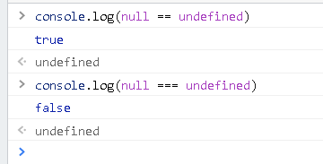

## Array.prototype.reduce()

reduce() 方法对数组中的每个元素执行一个由您提供的 reducer 函数(升序执行)，将其结果汇总为**单个返回值**。

```js
let arr = [1, 2, 3, 4]
let ret = arr.reduce((t, v) => t + `<span>${v}</span>`, '')

console.log(ret) // <span>1</span><span>2</span><span>3</span><span>4</span>
```



## 比较两个对象是否相等

- 在 js 中是无法使用 == 来比较两个对象的，比较的是两个对象的**地址**。
- 我们一般定义如果对象的各个属性值相等，那么两个对象就是相等的。如：{} 与 {} 相等

算法描述：

1. 假定有两个**对象** a 和 b
2. 遍历 a 中的成员，判断每一个 a 中的成员是否都在 b 中，并且与 b 中的对应成员值相等。
3. 遍历 b 中的成员，判断每一个 b 中的成员是否都在 a 中，并且与 a 中的对应成员值相等。
4. 如果成员是引用类型，递归
5. 如果 a 和 b 是 Date 类型，时间戳是一样的，即 a.getTime() === b.getTime()
6. 函数类型、正则表达式则可 toString 后再判断是否相等

在数学中就是判断两个集合相等：若 A 包含于 B 同时 B 包含于 A ，则称 A 与 B 相等，记为 A=B

详见 Vue 源码中 shared > until.js 中的 **looseEqual** 函数，用于比较俩个值是否大致相等。

## 让函数只能调用一次

```js
function once(func) {
  let called = false // 是否调用过
  return function() {
    if (!called) {
      called = true
      func.apply(this, arguments)
    }
  }
}
```

## 删除数组中任意一个元素

```js
function remove(arr, item) {
  if (arr.length) {
    const index = arr.indexOf(item)
    if (index > -1) {
      return arr.splice(index, 1)
    }
  }
}
```

## 数组去重

1. 一般做法：遍历原数组，判断新数组里是否存在这个值，如果不存在就把值 push 进新数组。

   ```js
   let arr = [1, 1, 1, 2, 2, 2, 3, 3, 3]
   let newArr = []
   arr.forEach(value => newArr.indexOf(v) === -1 && newArr.push(v))
   ```

2. ES6 Set。

   ```js
   let arr = [1, 1, 1, 2, 2, 2, 3, 3, 3]
   let newArr = [...new Set(arr)]
   ```

3. 利用对象键的唯一性实现去重。

   ```js
   let arr = [1, 1, 1, 2, 2, 2, 3, 3, 3]
   let _set = {}
   let newArr = []
   arr.forEach(v => _set[v] || ((_set[v] = true), newArr.push(v)))
   ```

4. ...

## 逻辑中断

:::tip

1. 表达式 1 && 表达式 2：若执行表达式 1 为 true 则继续执行表达式 2，否则不执行表达式 2。
2. 表达式 1 || 表达式 2：若执行表达式 1 为 false，则执行表达式 2，否则不执行表达式 2。

:::

```js
let a
a && console.log(1) // 不执行console.log

let b = 2
b && console.log('b') // 执行console.log 打印 b
////////
let a
a || console.log(1) // 执行console.log 打印 1

let b = 2
b || console.log('b') // 不执行console.log
```

## 回调函数

```js
function test(callback) {
  // 如果存在回调函数就立即执行它
  callback && callback()
  console.log(123)
}
test() // 123
test(() => console.log('回调函数被执行了')) // 回调函数被执行了 123
```

## 节流阀

- 使用节流阀控制函数执行次数

```js
let btn = document.createElement('button')
btn.innerHTML = '点我呀'
document.body.appendChild(btn)

// 节流阀
let isDoing = false

async function demo() {
  // 打开节流阀
  isDoing = true
  let a = await new Promise((resolve, reject) => {
    setTimeout(() => resolve(1), 1000)
  })
  // 关闭节流阀
  isDoing = false
  console.log(a)
}

btn.addEventListener('click', function() {
  // 如果异步操作没有结束就不继续执行
  if (isDoing) return
  demo()
})
```

## 使用定时器防抖

```js
let input = document.createElement('input')
document.body.appendChild(input)

let timer = null
// 监听输入框值发生改变事件
input.addEventListener('input', function() {
  // 清除定时器
  clearTimeout(timer)
  // 开启定时器
  timer = setTimeout(() => {
    console.log(input.value)
  }, 1000)
})
```
