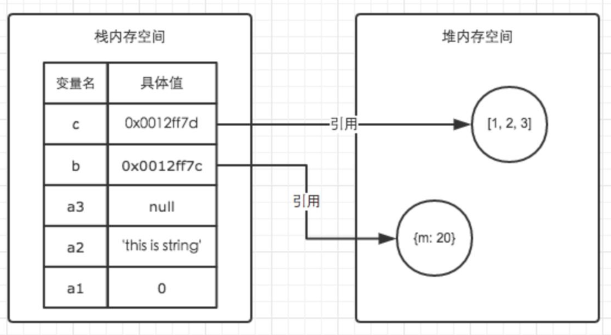

## 数据类型

- 基本数据类型： Number、String、Null、Undefined、Boolean、Symbol
- 引用数据类型： Object、Array、Function、Date、RegExp...

**在 JS 中，每一个数据都需要一个内存空间。内存空间又被分为两种，栈(stack) 和 堆(heap)**

- 栈：由系统自动分配，自动回收，效率高，但容量小。
- 堆：由程序员手动分配内存，并且手动销毁，效率不如栈，但容量大。

简单来说：**基本类型**就是保存在**栈**中的简单数据段，而**引用类型**指的是保存在**堆**中的对象。<br>


JS 中的**基本数据**类型一般是存储**栈**中，这是由于这些基本类型在内存中占有大小固定的空间，即值的大小一定，所以这些具体的值往往保存在栈空间（闭包除外），我们可以直接操作保存在栈的值，如字面意思，这种访问方式为按值访问。<br>

而**引用类型**的值大小不固定，但是，他们的地址大小是固定的，所以，为了存储这个类型，系统将能够访问这个类型的**地址**存储在栈中，并给这个变量的本身进行赋值，并将其具体的内容存入**堆**中。引用数据的访问方式类似于**指针**，通过栈中访问对象的地址，并按照这个地址在堆中找到对象具体的内容。

## 浅拷贝

:::tip
浅拷贝只是复制基本类型的数据或者指向某个对象的指针，而不是复制整个对象，如果修改目标对象，那么，源对象会有被修改的可能
:::

实现浅拷贝的几种常见方法

- 循环

```js
function shallowCopy(obj) {
  var objCopy = {}
  for (var key in obj) {
    objCopy[key] = obj[key]
  }
  return objCopy
}

var person = { name: 'Jack', age: 18, car: { brand: 'Ferrari', type: '430' } }
var personCopy = shallowCopy(person)
personCopy.car.brand = 'newCar'
console.log(person.car.brand) // newCar
console.log(person.car === personCopy.car) // true
```

- Object.assign()

```js
let person = { name: 'Jack', age: 18, car: { brand: 'Ferrari', type: '430' } }

let personCopy = Object.assign({}, person)

personCopy.car.brand = 'newCar'
console.log(person.car.brand) // newCar
console.log(person.car === personCopy.car) // true
```

**注意：** 有一个特殊情况，当 Object 只有单层属性的时候，是深拷贝

- Array.prototype.concat()

```js
let arr = [1, 2, { username: 'www' }]

let arrCopy = arr.concat()

arrCopy[2].username = 'qqq'
console.log(arr) // [1, 2, { username: 'qqq' }]
console.log(arr[2] === arrCopy[2]) // true
```

- Array.prototype.slice()

```js
let arr = [1, 2, { username: 'www' }]

let arrCopy = arr.slice()

arrCopy[2].username = 'qqq'
console.log(arr) // [1, 2, { username: 'qqq' }]
console.log(arr[2] === arrCopy[2]) // true
```

## 深拷贝

:::tip
和浅拷贝只复制对象指针不同，深拷贝会另外创造一个一模一样的对象，新对象和源对象不会互相干扰，修改新对象不会影响源对象。
:::

实现深拷贝的几种常见方法

- JSON.parse() 和 JSON.stringify()

```js
let obj = { name: '张三', age: 18, friend: { name: '李四', age: 20 } }

let copyObj = JSON.parse(JSON.stringify(obj))
console.log(obj.friend === copyObj.friend) // false

copyObj.name = '小明'
obj.friend.name = '小红'
console.log(obj) // { name: '张三', age: 18, friend: { name: '小红', age: 20 } };
console.log(copyObj) // { name: '小明', age: 18, friend: { name: '李四', age: 20 } };
```

- 递归

```js
function deepCopy(obj) {
  if (!obj && typeof obj !== 'object') {
    throw new Error('error arguments')
  }
  // const targetObj = obj.constructor === Array ? [] : {};
  const targetObj = Array.isArray(obj) ? [] : {}
  for (let key in obj) {
    //只对对象自有属性进行拷贝
    if (obj.hasOwnProperty(key)) {
      if (obj[key] && typeof obj[key] === 'object') {
        targetObj[key] = deepCopy(obj[key])
      } else {
        targetObj[key] = obj[key]
      }
    }
  }
  return targetObj
}
```

## 第三方库实现深拷贝与浅拷贝

- jQuery 的\$.extend()

```js
let obj = { name: '张三', age: 18, friend: { name: '李四', age: 20 } }
let shallowCopyObj = $.extend({}, obj) // 浅拷贝
let deepCopyObj = $.extend(true, {}, obj) // 深拷贝

console.log(obj.friend === shallowCopyObj.friend) // true
console.log(obj.friend === deepCopyObj.friend) // false
```

- Lodash 的 clone()和 cloneDeep()

```js
var objects = [{ a: 1 }, { b: 2 }]

var shallow = _.clone(objects) // 浅拷贝
var deep = _.cloneDeep(objects) // 深拷贝

console.log(shallow[0] === objects[0]) // true
console.log(deep[0] === objects[0]) // false
```
