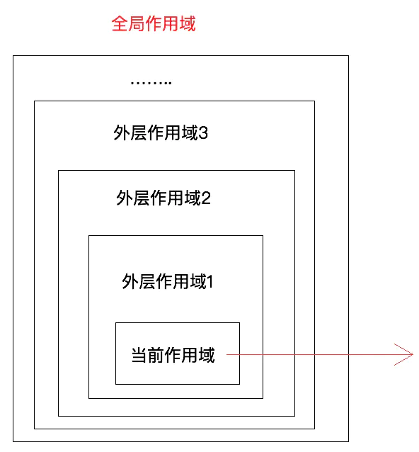
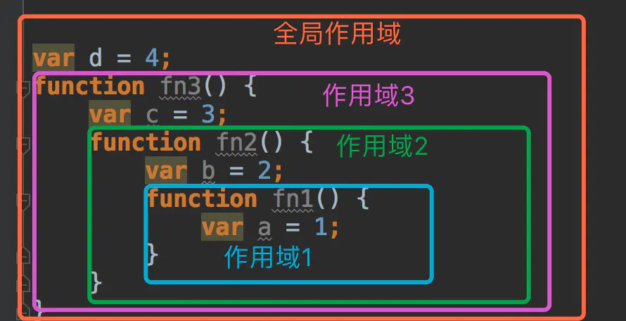
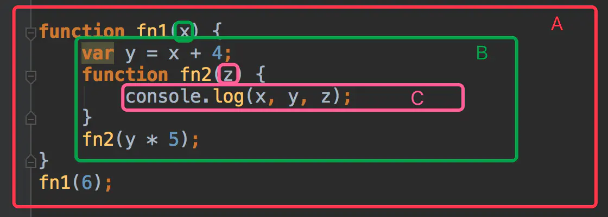

## 作用域
:::tip
通俗的讲，作用域就是查找变量的地方。在某函数中找到该变量，就可以说在该函数作用域中找到了该变量；在全局中找到该变量，就可以说在全局作用域中找到了该变量！
:::

## 作用域链
在还没有接触到ES6的let、const之前，只有函数作用域和全局作用域，函数作用域肯定是在全局作用域里面的，而函数作用域中又可以继续嵌套函数作用域，如图：<br>

<br>
用代码表示：<br>


:::tip
在查找变量的时候，先从当前作用域开始找，如果没找到再到父级作用域中找，一层层往外找，没有找到，再去全局作用域中查找，有一个往外层查找的过程。我们好像是顺着一条链条从下往上查找变量，这条链条，我们就称之为**作用域链**。<br>

如果在全局作用域如果还没找到的话，就会报错了：**ReferenceError: 某变量 is not defined**
:::

## 词法作用域
:::tip
所谓的词法作用域就是在你写代码时将变量和块作用域写在哪里来决定，也就是词法作用域是静态的作用域，在你书写代码时就确定了。<br>
表现出来的规则就是：外部无法访问内部变量，而内部可以访问外部定义的变量。而实现这一机制和规则的就是 **闭包**。
:::

这个例子中有个三个嵌套的作用域，如图：


- A 为全局作用域，有一个标识符：fn1
- B 为fn1所创建的作用域，有三个标识符：x、y、fn2
- C为fn2所创建的作用域，有一个标识符：z
作用域是由期代码写在哪里决定的，并且是逐级包含的。<br>
在此强调，词法作用域就是作用域是由书写代码时函数声明的位置来决定的。编译阶段就能够知道全部标识符在哪里以及是如何声明的，所以词法作用域是静态的作用域，也就是词法作用域能够预测在执行代码的过程中如何查找标识符。

## 闭包
:::tip
一个函数和对其周围状态（lexical environment，词法环境）的引用捆绑在一起（或者说函数被引用包围），这样的组合就是闭包（closure）。也就是说，闭包让你可以在一个内层函数中访问到其外层函数的作用域。在 JavaScript 中，每当创建一个函数，闭包就会在函数创建的同时被创建出来
- 闭包是指有权访问另一个函数作用域中的变量的函数；
- 从技术的角度讲，所有的JavaScript函数都是闭包：它们都是对象，它们都关联到作用域链。
- 当函数可以记住并访问所在的词法作用域时，就产生了闭包，即使函数是在当前词法作用域之外执行。
:::

```js
function fn1() {
	var name = '张三';
	function fn2() {
		console.log(name);
	}
	fn2();
}
fn1();
```
上面的代码已经产生闭包了。fn2访问到了fn1的变量，满足了条件“有权访问另一个函数作用域中的变量的函数”，fn2本身是个函数，所以满足了条件“所有的JavaScript函数都是闭包”。
```js
function fn1() {
	var name = '张三';
	function fn2() {
		console.log(name);
	}
	return fn2;
}
var fn3 = fn1();
fn3();
```
这样就清晰地展示了闭包
- fn2的词法作用域能访问fn1的作用域
- 将fn2当做一个值返回
- fn1执行后，将fn2的引用赋值给fn3
- 执行fn3，输出了变量name
正常来说，当fn1函数执行完毕之后，其作用域是会被销毁的，然后垃圾回收器会释放那段内存空间。而闭包却很神奇的将fn1的作用域存活了下来，fn2依然持有该作用域的引用，这个引用就是闭包。<br>
**总结：**某个函数在定义时的词法作用域之外的地方被调用，闭包可以使该函数极限访问定义时的词法作用域。<br>
注意：对函数值的传递可以通过其他的方式，并不一定值有返回该函数这一条路，比如可以用回调函数：
```js
function fn1() {
	var name = '张三';
	function fn2() {
		console.log(name);
	}
	fn3(fn2);
}
function fn3(fn) {
	fn();
}
fn1();
```
本例中，将内部函数fn2传递给fn3，当它在fn3中被运行时，它是可以访问到name变量的。<br>
所以无论通过哪种方式将内部的函数传递到所在的词法作用域以外，它都回持有对原始作用域的引用，无论在何处执行这个函数都会使用闭包。

## 闭包举例
你写过的代码当中肯定有闭包的身影，比如类似如下的代码：
```js
function waitSomeTime(msg, time) {
	setTimeout(function () {
		console.log(msg)
	}, time);
}
waitSomeTime('hello', 1000);
```
定时器中有一个匿名函数，该匿名函数就有涵盖waitSomeTime函数作用域的闭包，因此当1秒之后，该匿名函数能输出msg。<br>

另一个很经典的例子就是for循环中使用定时器延迟打印的问题：
```js
for (var i = 1; i <= 10; i++) {
	setTimeout(function () {
		console.log(i);
	}, 1000);
}
```
在这段代码中，我们对其的预期是输出1~10，但却输出10次11。这是因为setTimeout中的匿名函数执行的时候，for循环都已经结束了，for循环结束的条件是i大于10，所以当然是输出10次11咯。<br>
究其原因：i是声明在全局作用中的，定时器中的匿名函数也是执行在全局作用域中，那当然是每次都输出11了。<br>
原因知道了，解决起来就简单了，我们可以让i在每次迭代的时候，都产生一个私有的作用域，在这个私有的作用域中保存当前i的值。
```js
for (var i = 1; i <= 10; i++) {
	(function () {
		var j = i;
		setTimeout(function () {
			console.log(j);
		}, 1000);
	})();
}
```
让我们用一种比较优雅的写法改造一些，将每次迭代的i作为实参传递给自执行函数，自执行函数中用变量去接收：
```js
for (var i = 1; i <= 10; i++) {
	(function (j) {
		setTimeout(function () {
			console.log(j);
		}, 1000);
	})(i);
}
```

## 闭包的应用
闭包的应用比较典型是定义模块，我们将操作函数暴露给外部，而细节隐藏在模块内部：
```js
function module() {
	var arr = [];
	function add(val) {
		if (typeof val == 'number') {
			arr.push(val);
		}
	}
	function get(index) {
		if (index < arr.length) {
			return arr[index]
		} else {
			return null;
		}
	}
	return {
		add: add,
		get: get
	}
}
var mod1 = module();
mod1.add(1);
mod1.add(2);
mod1.add('xxx');
console.log(mod1.get(2)); // null
```

