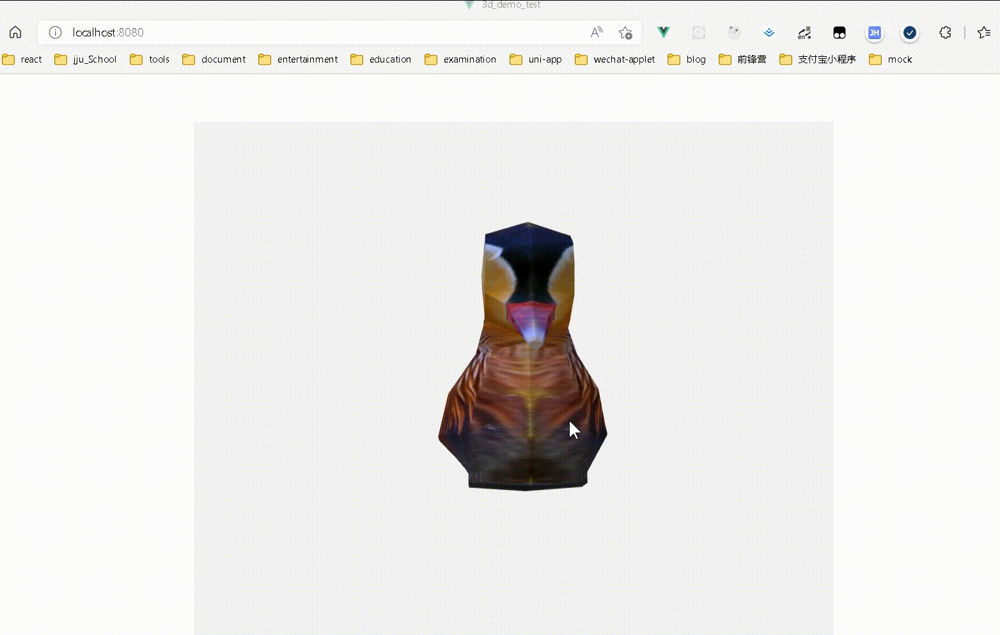
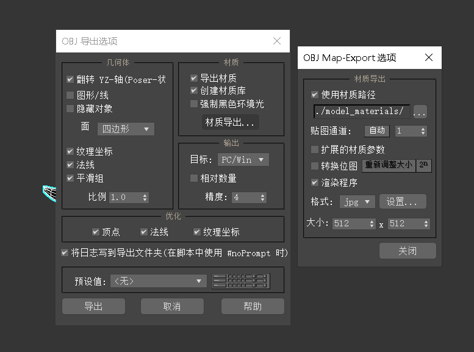
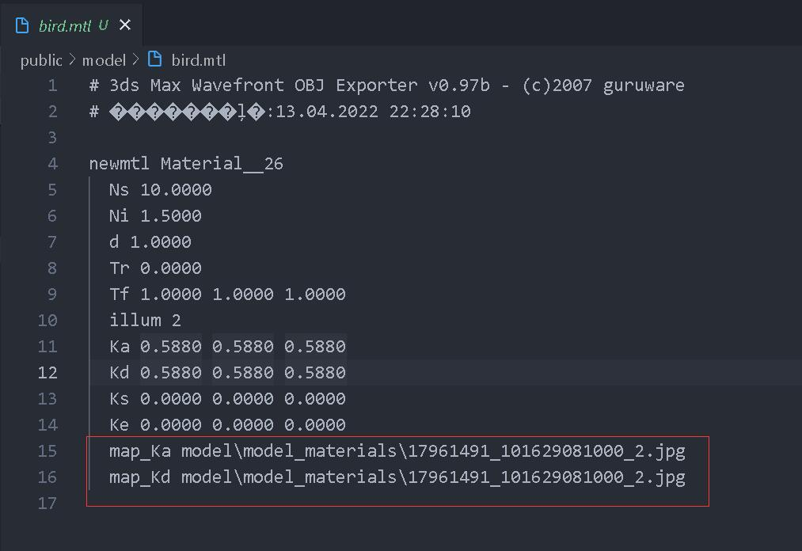
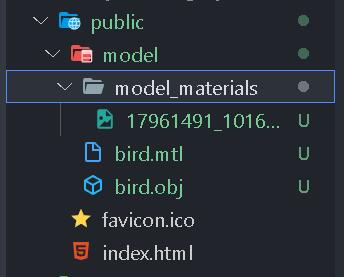
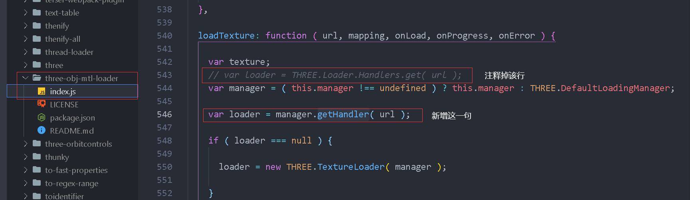

::: tip
[参考文章](https://juejin.cn/post/6904899502923055117)<br>
记录一下初次使用 threejs 展示 3d 模型的过程
:::



## 安装

```shell
npm install three three-orbitcontrols three-obj-mtl-loader
```

- three：核心库
- three-orbitcontrols：控制器，使用鼠标旋转 3D 模型
- three-obj-mtl-loader：obj 模型导入加载器

## 引入

```js
import * as THREE from 'three'
import { MTLLoader, OBJLoader } from 'three-obj-mtl-loader'
import { OrbitControls } from 'three/examples/jsm/controls/OrbitControls.js'
```

## 使用

详见[参考文章](https://juejin.cn/post/6904899502923055117)

### 一个模型能显示在屏幕上的必然条件

- **容器**：需要一个 cavnas 作为 3D 渲染的空间;
- **场景**： 用来放置各种模型，相机或者光源的;
- **相机**： 用来观看场景； 相机分为透视相机和正视相机;
- **光源**： 用来照亮场景，以及物体;
- **模型**： 模型可以自己通过 three.js 构建，也可以采用 3D 建模软件建立好的模型进行导入，本文采用的是.Obj 格式的模型文件导入。

## 模型注意点

### 贴图材质路径问题

- 贴图材质要导出到指定文件夹，便于管理
  

- 也可打开`.mtl`文件手动修改贴图路径



:::warning
tga 格式的图片无法加载的，
使用 http 方式访问，支持的图片类型文档中有写： PNG、JPG、GIF
:::

### 模型存放位置



- 由于是服务器环境，需要放到 `public` 目录下

## 加载模型注意点

### 模型路径

加载本地服务器目录下存放的模型，使用的相对路径，如果是其他服务器上的模型，可以使用 `url`

```js {6,8,14}
    // 加载模型
    createModel() {
      let mtlLoader = new MTLLoader()
      let objloader = new OBJLoader(this.manager);
      // 加载材质.mtl和模型.obj文件，注意路径
      mtlLoader.load(`./model/bird.mtl`, (materials) => {
        materials.preload();
        objloader.setMaterials(materials) // !!! 给模型设置材质
        objloader.load(`./model/bird.obj`, (obj) => {
          this.object = obj;
          // 设置模型中心点居中
          this.object.children[0].geometry.center()
          this.object.children[0].geometry.computeBoundingBox();
          this.scene.add(this.object) // !!! 将模型添加进场景中
        }
        );
      })
    },
```

### 加载材质时的错误处理

::: tip
MTLLoader 报 Handlers.get() has been removed. Use LoadingManager.getHandler() instead 错误处理
:::

- npm 包中定义错误， 找到 `/node_modules/three-obj-mtl-loader/index.js`
- 注释第 543 行，然后在 544 行后面插入：`var loader = manager.getHandler( url )`;



## 完整示例代码如下

::: details

```vue
<style scoped>
  #canvas {
    /* width: 100vw; */
    height: 100%;
    display: flex;
    justify-content: center;
    align-items: center;
  }
</style>
<template>
  <div id="canvas"></div>
</template>

<script>
  import * as THREE from 'three'
  import { MTLLoader, OBJLoader } from 'three-obj-mtl-loader'
  import { OrbitControls } from 'three/examples/jsm/controls/OrbitControls.js'

  export default {
    data() {
      return {
        container: null,
        scene: null,
        camera: null,
        renderer: null,
        controls: null,
        object: null,
        windowHalfX: null,
        windowHalfY: null,
      }
    },
    created() {},
    mounted() {
      this.loding()
    },
    methods: {
      // 创建场景
      createScene() {
        this.container = document.getElementById('canvas')
        // 创建场景（所有的模型，相机，灯光，都需要通过add方法添加到场景中）
        this.scene = new THREE.Scene()
        // 添加场景背景色
        this.scene.background = new THREE.Color(0xf3f3f3)
        // 创建渲染函数
        this.renderer = new THREE.WebGLRenderer({
          // 抗锯齿 模型质量更高 消耗性能越大
          antialias: true,
          // 开启透明度
          alpha: true,
        })
        this.renderer.setPixelRatio(window.devicePixelRatio)
        this.renderer.setSize(this.windowHalfX, this.windowHalfY)
        // 将渲染的3d场景挂载到指定的DOM上
        this.container.appendChild(this.renderer.domElement)
      },
      // 创建相机
      createCamera() {
        this.camera = new THREE.PerspectiveCamera(
          // 摄像机视锥体垂直视野角度
          45,
          // 摄像机视锥体长宽比 (要渲染区域的 长 / 宽 ,如果不对渲染会出现变形效果)
          this.windowHalfX / this.windowHalfY,
          // 摄像机视锥体远端面 (最近能看到的距离)
          1,
          // 摄像机视锥体近端面 （最远能看到的距离）
          2000
        )
        // 设置相机距离屏幕的距离
        this.camera.position.z = 50
        // 将相机添加到场景中
        this.scene.add(this.camera)
      },
      // 创建灯光
      createLight() {
        let color = 0xf9f9f9
        // 创建环境光，环境光没有投影，会均匀的照亮环境中所有的物体
        let ambientLight = new THREE.AmbientLight(color)
        // 将环境光添加到场景中
        this.scene.add(ambientLight)
        // 创建聚光灯光源，有投影
        let directionalLight = new THREE.DirectionalLight(0xb4b6fd)
        directionalLight.position.set(40, 60, 20)
        directionalLight.castShadow = true
        directionalLight.shadowCameraNear = 2
        directionalLight.shadowCameraFar = 100
        directionalLight.shadowCameraLeft = -50
        directionalLight.shadowCameraRight = 50
        directionalLight.shadowCameraTop = 50
        directionalLight.shadowCameraBottom = -50
        // 将聚光灯添加到场景中
        this.scene.add(directionalLight)
      },
      // 加载模型
      createModel() {
        let mtlLoader = new MTLLoader()
        let objloader = new OBJLoader(this.manager)
        // 加载材质.mtl和模型.obj文件，注意路径
        mtlLoader.load(`./model/bird.mtl`, materials => {
          materials.preload()
          objloader.setMaterials(materials) // !!! 给模型设置材质
          objloader.load(`./model/bird.obj`, obj => {
            this.object = obj
            // 设置模型中心点居中
            this.object.children[0].geometry.center()
            this.object.children[0].geometry.computeBoundingBox()
            this.scene.add(this.object) // !!! 将模型添加进场景中
          })
        })
      },
      // 添加控制器等
      createOther() {
        // 辅助对象，三维坐标线
        // var AxesHelper = new THREE.AxesHelper(150);
        // this.scene.add(AxesHelper);
        // 控制器
        this.controls = new OrbitControls(this.camera, this.renderer.domElement)
        this.renderer.domElement.removeAttribute('tabindex')
        this.controls.addEventListener('change', this.render)
        this.render()
      },

      // 模型动画
      animate() {
        if (this.object) {
          this.object.children[0].rotation.y += 0.001
        }
        // 原生js动画函数
        requestAnimationFrame(this.animate)
        this.renderer && this.render()
      },
      // 渲染
      render() {
        this.camera.lookAt(this.scene.position)
        this.renderer.render(this.scene, this.camera)
      },
      // 初始化
      init() {
        this.createScene()
        this.createCamera()
        this.createLight()
        // this.createTexture()
        this.$nextTick(() => {
          this.createModel()
        })
        this.createOther()
      },
      // 开始加载
      loding() {
        // this.windowHalfX = this.$refs.three.offsetWidth;
        // this.windowHalfX = window.innerWidth / 2;
        this.windowHalfX = 800
        this.windowHalfY = window.innerHeight - 80
        this.init()
        this.animate()
      },
      // 清除缓存
      clearCache(obj) {
        let mesh = obj
        mesh.geometry.dispose()
        if (mesh.material instanceof Array) {
          mesh.material.forEach(item => {
            item.dispose()
          })
        } else {
          mesh.material.dispose()
        }
      },
      // 清空渲染器缓存
      clearRenderer() {
        this.object && this.clearCache(this.object.children[0])
        this.renderer.forceContextLoss()
        // this.currentModelTexture = null
        this.renderer.dispose()
        this.renderer.domElement = null
        this.renderer = null
      },
    },
    // 在vue的销毁钩子中调用
    destroyed() {
      this.clearRenderer()
    },
  }
</script>
```

:::
