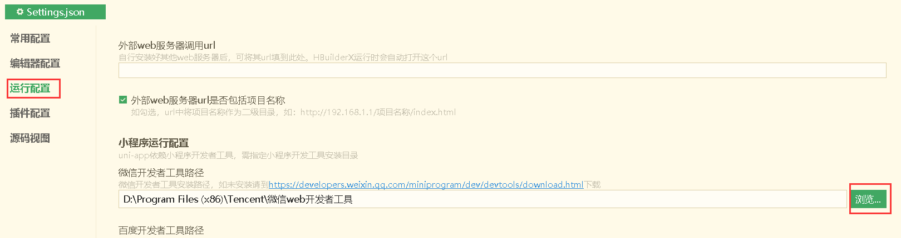
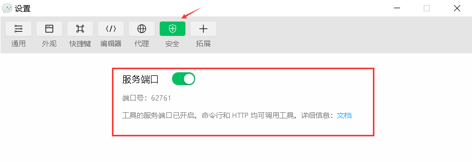
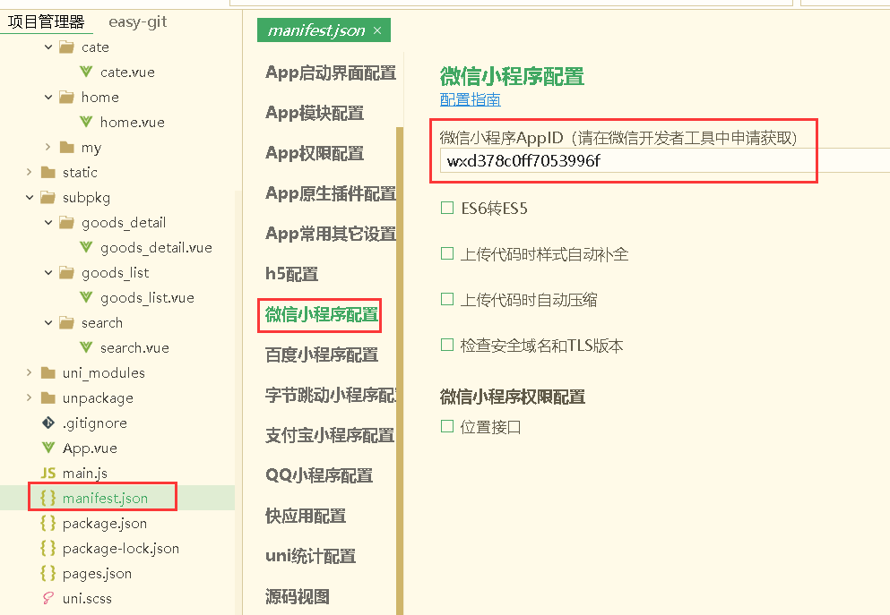

:::tip
uni-app 是一个使用 Vue.js 开发所有前端应用的框架，开发者编写一套代码，可发布到 iOS、Android、Web（响应式）、以及各种小程序（微信/支付宝/百度/头条/QQ/钉钉/淘宝）、快应用等多个平台。
:::
[官网](https://uniapp.dcloud.net.cn/README)

## 运行调试 uni-app 项目

### 1. 运行到微信开发者工具

1. 配置微信开发者工具路径。
   
2. 在微信开发者工具中开启服务端口。
   
3. 填写微信小程序 AppID。
   

- 即可运行到微信开发者工具，实时编译查看效果。
