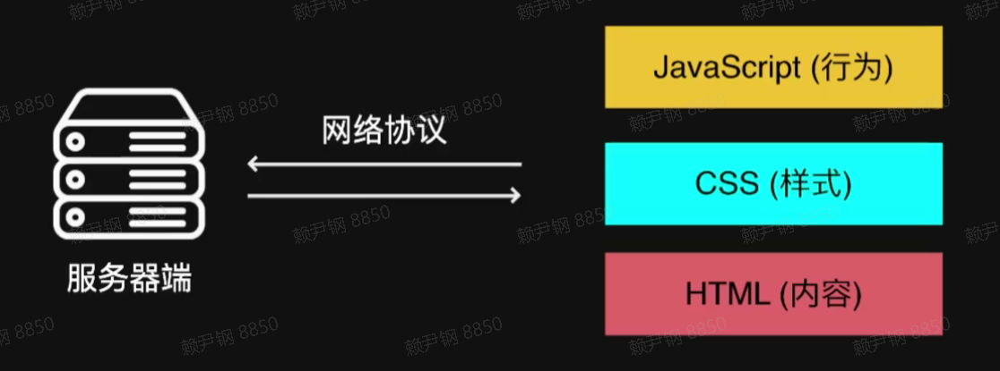
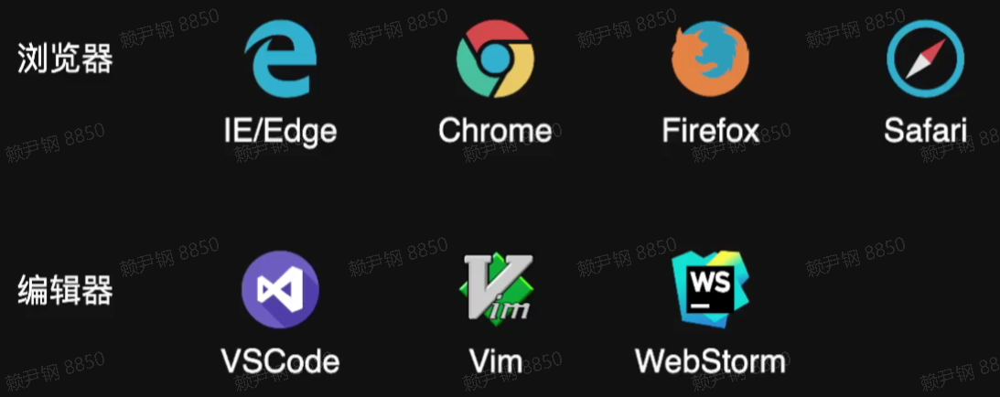

## 前端概述

### 什么是前端

- 解决图形界面（GUI）人机交互的问题
- 跨终端
  - PC/移动浏览器
  - 客户端/小程序
  - VR/AR 等
- Web 技术栈

> 总结：前端是用 web 技术栈，解决多端，图形界面人机交互的问题。

### 前端技术栈

> HTML 是界面的结构和内容，CSS 是美化这些内容，JavaScript 实现功能，交互。
>
> 这些运行在浏览器，浏览器通过网络协议与服务器进行数据交互。

### 前端应该关注哪些方面？

- 功能：产品满足用户的需求
- 美观：界面美观
- 无障碍：产品是否适合所有人群，所有场合等，比如说有色盲症的人能不能正常使用
- 安全：产品要保证用户数据的安全
- 性能：系统流畅，响应快速
- 兼容性：兼容多端
- 体验：产品，用户体验好

### 前端的边界

- node.js：开发服务器端
- electron：客户端应用
- react-native：手机客户端应用
- web-RTC：p2p 在线传输，如实现多人会议
- WebGL：开发 3d 应用
- web-assembly：将其他语言的代码，编译成浏览器在运行

> 总结：前端技术更新迭代快，我们需要不断的学习才能跟上技术的发展

### 开发环境

> 入门门槛低，只要有一个编辑器和一个浏览器就能上手。
