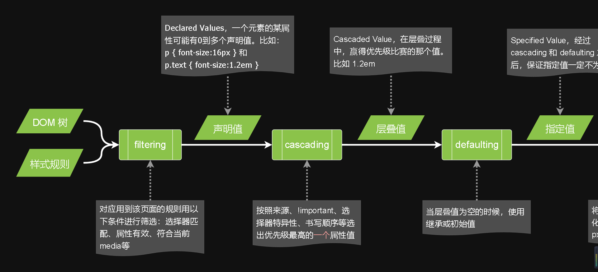
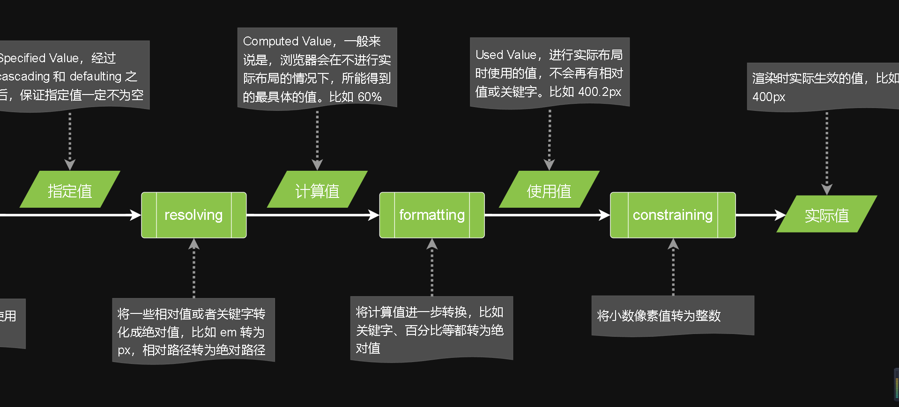
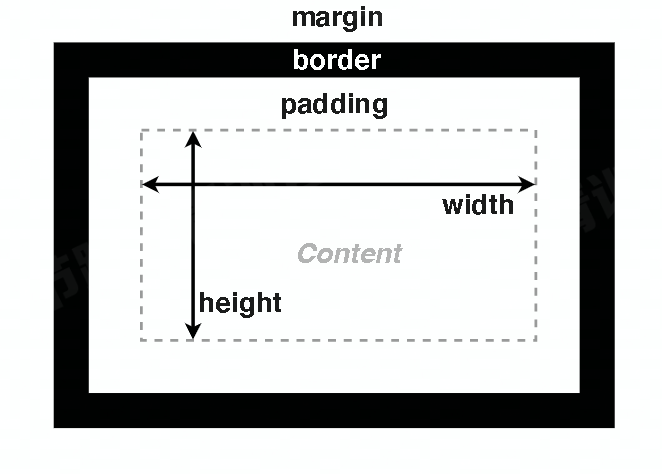
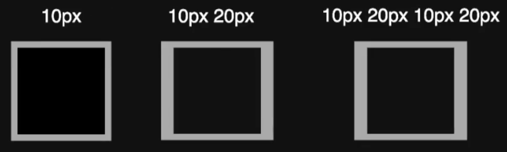
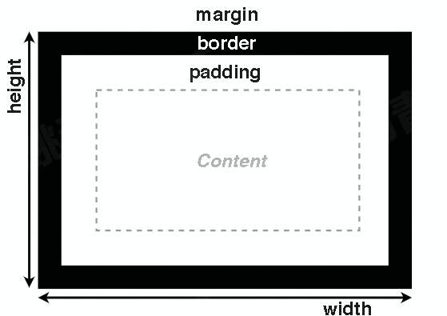
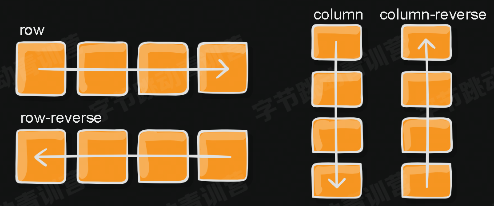
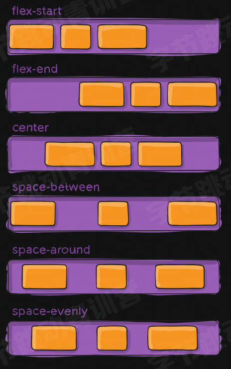
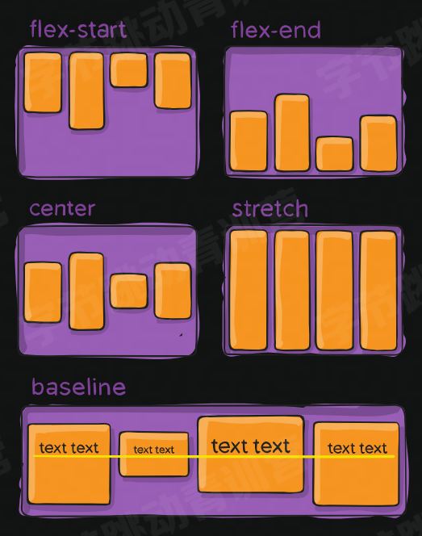
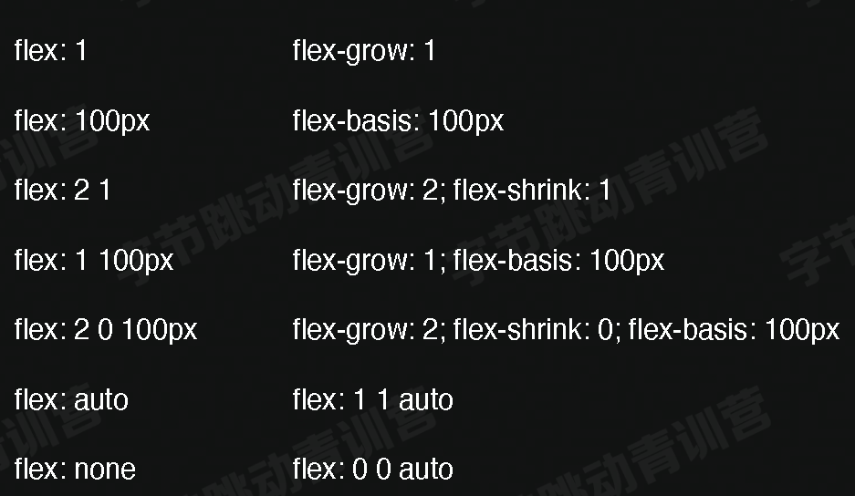

### 选择器的特异度(Specificity)

| #   | .      | E    |
| --- | ------ | ---- |
| id  | (伪)类 | 标签 |

- `# > . > E`
- 计算选择器中的每个种类个数确定优先级

#### 样式复用

- 使用优先级覆盖达到样式复用

- 如下普通按钮和主要按钮基础样式相同

  ```html
  <button class="btn">普通按钮</button>
  <button class="btn primary">主要按钮</button>
  <style>
    .btn {
      display: inline-block;
      padding: 0.36em 0.8em;
      margin-right: 0.5em;
      line-height: 1.5;
      text-align: center;
      cursor: pointer;
      border-radius: 0.3em;
      border: none;
      background: #e6e6e6;
      color: #333;
    }
    .btn.primary {
      color: #fff;
      background: #218de6;
    }
  </style>
  ```

  

### 继承

- 某些属性会自动继承其父元素的**计算值**，除非显式指定一个值。

#### 显式继承

- inherit：指定该值去父元素继承，把不能继承的属性变成可继承的属性

- 如下指定所有为 border-box

  ```css
  * {
    box-sizing: inherit;
  }
  html {
    box-sizing: border-box;
  }
  .some {
    box-sizing: content-box;
  }
  ```

### 初始值

- css 中，每个属性都有一个初始值
  - background-color 初始值是 transparent
  - margin-left 初始值为 0
- 可以使用 **initial** 关键字显式重置为初始值
  - `background-color: initial;`

### css 求值过程





### 布局(Layout)

- 确定内容大小和位置的算法
- 依据元素、容器、兄弟节点和内容等信息来计算

#### 布局相关技术

##### 常规流

###### 行级

###### 块级

###### 表格布局

###### flexbox

###### grid 布局

##### 浮动

##### 绝对定位

### 盒模型



#### width

- 指定 content-box 宽度
- 取值为 **长度、百分数、auto**
- auto 由浏览器根据其他属性确定
- 百分数相对于容器的 content-box 宽度

#### height

- 指定 content-box 高度
- 取值为 **长度、百分数、auto**
- auto 取值由内容计算得来
- 百分数相对于容器的 content-box 宽度
- **容器有指定高度时，百分数才生效**

#### padding

- 指定元素 4 个方向的内边距

- **百分数**相对于容器 **宽度**

  - 一个 1:1 的盒子，即高度和宽度相等，可设置高度为 0，padding 为 100%

- 1 个值，四个方向

- 2 个值，左右

- 4 个值，顺时针，上右下左赋值

  

#### border

- 指定容器边框样式、粗细和颜色

- 三种属性

  - border-width
  - border-style：none、solid、dashed、dotted
  - border-color

- 四个方向

  - border-top
  - border-right
  - border-bottom
  - border-left

- ```css
  border: 1px solid#ccc;
  border-left: 1px solid #ccc;
  border-right: 2px dotted red;
  border-width: 1px 2px 3px 4px;
  border-style: solid;
  border-color: green blue;
  border-left-width: 3px;
  border-top-color: #f00;
  ```

##### 使用 border 制作三角形

- 元素不设宽高，设置 border 的宽。

#### margin

- 指定元素四个方向的外边距

- 取值可以是**长度、百分数、auto**

- 百分数相对于容器**宽度**
- 使用 `margin: auto` 水平居中

##### margin collapse

- 边距合并折叠问题，上下即垂直方向上 margin 会取**最大值**生效，不会叠加
- 水平方向不会合并

#### box-sizing：border-box

- 宽高包含 border 和 padding



#### overflow

- visible：默认，内容溢出显示
- hidden：溢出隐藏
- scroll：一直显示滚动条
- auto：溢出才显示滚动条

### 块级 vs 行级

- block level box：块级盒子
  - 不和其他盒子并列摆放
  - 适用所有的盒模型属性
- inline level box：行级盒子
  - 和其它行级盒子一起放在一行或拆开成多行
  - 盒模型中的 width、height 不适用

| 块级元素                                              | 行级元素                                     |
| :---------------------------------------------------- | :------------------------------------------- |
| 生成块级盒子                                          | 生成行级盒子，内容分散在多个行盒(line box)中 |
| body、article、div、main、section、h1-6、p、ul、li 等 | span、em、strong、cite、code 等              |
| display：block                                        | display：inline                              |

#### display

- block：块级盒子
- inline：行级盒子
- inline-block：本身是行级，可以放在行盒中；可以设置宽高；作为一个整体不会被拆散成多行
- none：排版时完全被忽略，即不会显示

### 常规流

- 根元素、浮动和绝对定位的元素会脱离常规流
- 其它元素都在常规流之内(in-flow)
- 常规流中的盒子，在某种**排版上下文**中参与布局
- 行级排版上下文、块级排版上下文、table 排版上下文、flex 排版上下文、grid 排版上下文

#### 行级排版上下文

- Inline Formatting Context (IFC)
- 只包含行级盒子的容器会创建一个 IFC
- IFC 内的排版规则
  - 盒子在一行内水平摆放一行放不下时，换行显示
  - text-align 决定一行内盒子的水平对齐
  - vertical-align 决定一个盒子在行内的垂直对齐，即更改盒子内的基线位置，top、middle、bottom
  - 避开浮动(float)元素\*

#### 块级排版上下文

- Block Formatting Context (BFC)
- 某些容器会创建一个 BFC
  - 根元素
  - 浮动、绝对定位、inline-block
  - Flex 子项和 Grid 子项
  - overflow 值不是 visible 的块盒
  - display: flow-root;
- BFC 内的排版规则
  - 盒子从上到下摆放
  - 垂直 margin 合并
  - BFC 内盒子的 margin 不会与外面的合并
  - BFC 不会和浮动元素重叠

#### flex box

- 一种新的排版上下文
- 它可以控制子级盒子的:
  - 摆放的流向(→←↑↓)
  - 摆放顺序
  - 盒子宽度和高度
  - 水平和垂直方向的对齐
  - 是否允许折行

##### 主轴方向 flex-direction

- row、row-reverse、column、column-reverse

  

- 指定的为主轴，另一侧则为侧轴

##### 主轴元素对齐方式：justify-content

- flex-start、flex-end、center、space-between、space-around、space-evenly

  

##### 侧轴对齐方式：align-items

- flex-start、flex-end、center、stretch、baseline...

  

##### 元素单独对齐方式：align-self

##### 单个元素指定顺序：order

- 默认 order 都为 0，按元素书写顺序摆放
- 设置了值后，按值从小到大摆放

#### flexibility

- 可以设置子项的弹性：当容器有剩余空间时，会伸展，容器空间不够时，会收缩。
- flex-grow：有剩余空间时的伸展能力
- flex-shrink：容器空间不足时收缩的能力
- flex-basis：没有伸展或收缩时的基础长度

##### flex-grow

- 容器的宽度 - 元素的宽度，得到的**剩余宽度**再按写得比例分配给元素

##### flex-shrink

- 0 表示元素不压缩，默认为 1，即元素可压缩

##### flex 缩写



#### grid 布局

- display: grid 使元素生成一个块级的 Grid 容器
- 使用 grid-template 相关属性将容器划分为网格
- 设置每一个子项占哪些行/列
  - grid-template-columns
  - grid-template-rows
- grid-area，元素跨行列

### 浮动：float

- 制作图文环绕时使用，更方便

### 定位：position

- static：默认值，非定位元素
- relative：相对定位，相对自身原位置偏移，不脱离文档流
  - 流内其他元素当它没有偏移一样布局
- absolute：绝对定位，相对**非 static 祖先元素**定位，一直往上找
  - 脱离常规流
  - 不会对流内元素布局造成影响
- flxed：相对于视口绝对定位

### 学习 css 的建议

- 查阅文档，充分利用 [MDN]([CSS（层叠样式表） | MDN (mozilla.org)](https://developer.mozilla.org/zh-CN/docs/Web/CSS)) 和 [W3C CSS 规范](https://www.w3.org/Style/CSS/)
- 保持好奇心，浏览网页时看到不错的效果，可以去了解实现
- 持续学习，css 的新特性还在不断地出现
