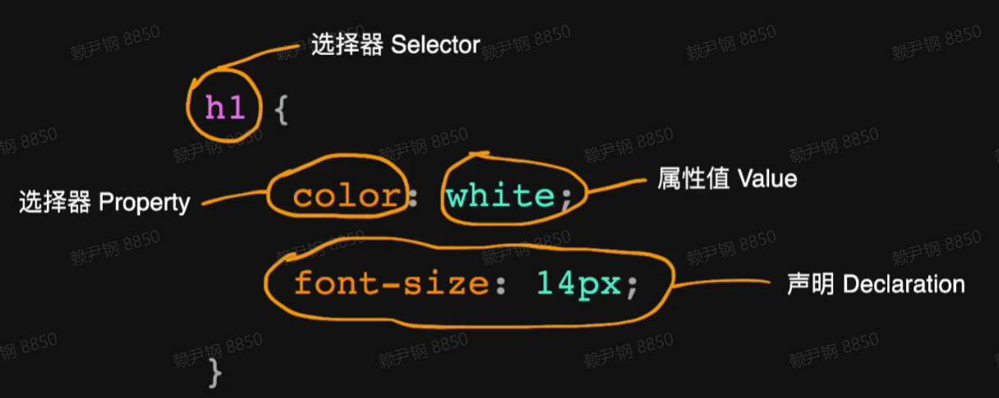
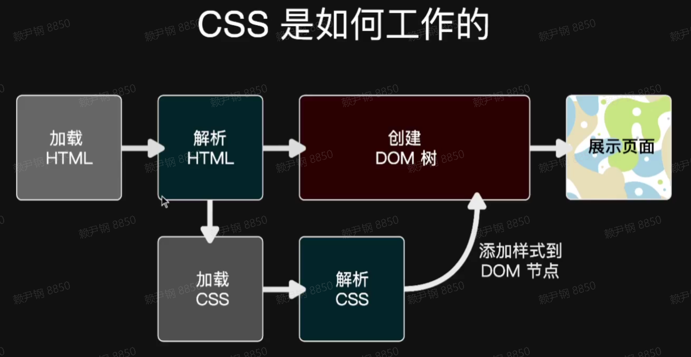
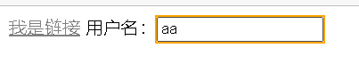
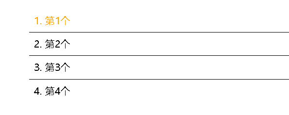
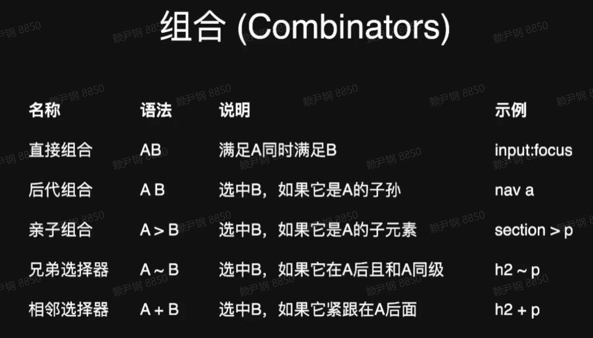
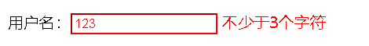
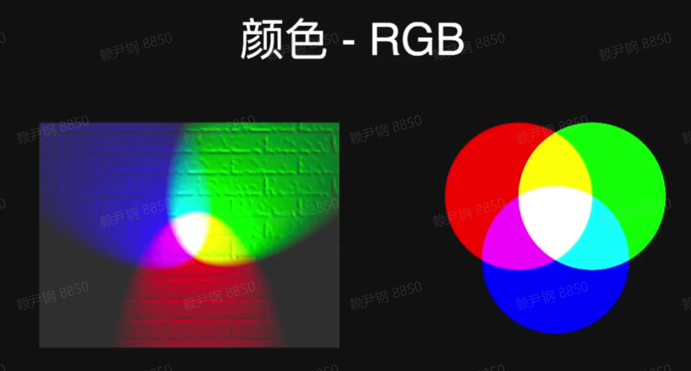
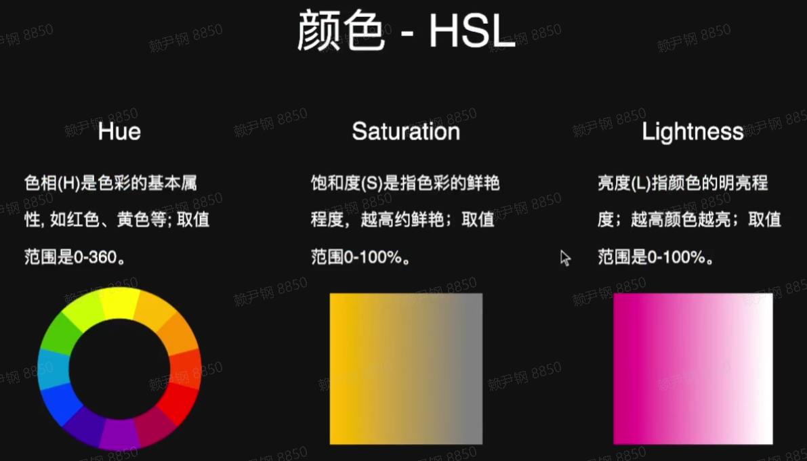
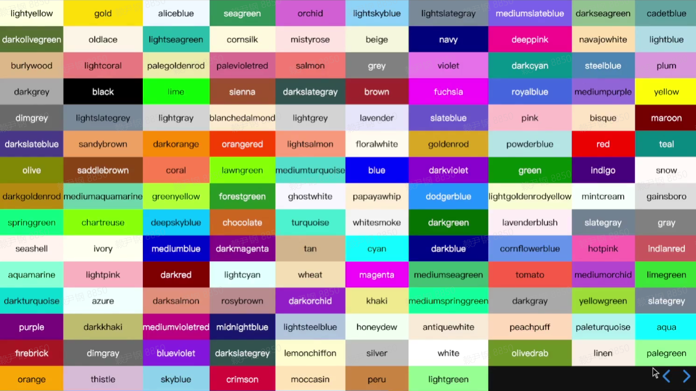
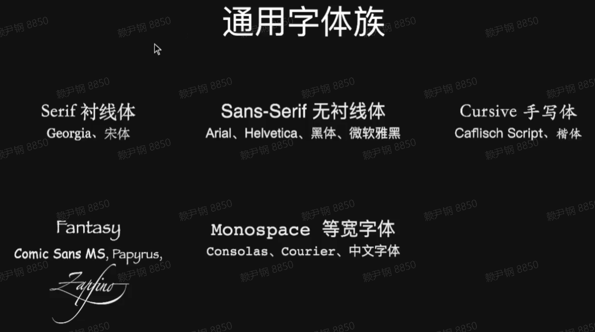

## 理解 CSS

### css 是什么

- Cascading Style Sheets：层叠样式表
- 用来定义页面元素的样式

  - 设置字体和颜色
  - 设置位置和大小
  - 添加动画效果

- 

### 页面中使用 css

- 外链：`<link rel="stylesheet" href="/assets/style.css">`

- 嵌入：

  ```html
  <style>
    h1 {
      color: red;
    }
  </style>
  ```

- 内联：`<p style="font-size:16px">text</p>`

### css 是如何工作的



### 选择器

- 找出页面的元素，以便给他们设置样式

- 使用多种方式选择元素

  - 按照标签名、类名（.class 名）或 id（#id 名）

  - 按照属性：[disabled] {...}、input[type="password"] {...}，^以什么开头，\$以什么结尾

    ```css
    a[href^='#'] {
      color: #f00;
    }
    a[href$='.jpg'] {
      color: pink;
    }
    ```

* 按照 DOM 树中的位置

* 通配选择器：\*

### 伪类 pseudo-classes

- 不基于标签和属性定位元素

- 状态伪类：交互状态样式设置

  ```html
  <style>
    a:link {
      color: black;
    }

    a:visited {
      color: gray;
    }

    a:hover {
      color: orange;
    }

    a:active {
      color: red;
    }

    :focus {
      outline: 2px solid orange;
    }
  </style>
  <a href="#">我是链接</a>
  <label>用户名：<input type="text"/></label>
  ```

  

- 结构性伪类：元素位置选择

  ```html
  <ol>
    <li>第1个</li>
    <li>第2个</li>
    <li>第3个</li>
    <li>第4个</li>
  </ol>
  <style>
    li {
      list-style-position: inside;
      border-bottom: 1px solid #000;
      padding: 0.5em;
    }

    li:first-child {
      color: orange;
    }

    li:last-child {
      border-bottom: none;
    }
  </style>
  ```

  

## 组合类型



### 直接组合

- input.error：选择 error 这个类的 input 元素

```html
<label>用户名：<input class="error" value="123"/></label>
<span class="error">不少于3个字符</span>

<style>
  .error {
    color: red;
  }

  input.error {
    border-color: red;
  }
</style>
```



## 选择器组

- 通过逗号隔开选择器：h1, p, a {...}

## 颜色

### RGB



- rgb(0, 0, 0)：范围 0~255
- #000000：每一位十进制转为十六进制

### HSL



- hsl(0, 100%, 50%)

### 颜色关键字

- 不用记



### alpha 透明度

- 第四个参数表示透明度，0~1
  - #ff0000**ff**
  - rgb**a**(255, 0, 0, **1**)
  - hsl**a**(0, 100%, 50%, **1**)

## 字体

### font-family

- 值为字体名称，用逗号分隔多个字体，按顺序选用，不同用户计算机安装的字体不同，需多指定一些

  

  保证页面风格，如果字体都没有，能让浏览器选择本地风格一样的字体，保证页面整体效果

#### 使用建议

- 字体列表最后写上通用字体族
- 英文字体放在中文字体前面

### 使用 Web Fonts

- 将字体文件放在服务器上，完整的中文字符太多，可抽出页面用到的中文字符单独制成字体包。

- 使用@font-face 引人自定义字体

  ```css
  @font-face {
    font-family: 'xxx';
    src: 'xxx';
  }
  h1 {
    font-family: 'xxx';
  }
  ```

### font-size

- 关键字：small、medium、large
- 长度：px、em、%
- em、百分数：相对于父元素字体大小

### font-style

- normal：正常
- italic：斜体

### font-weight

- 100~900：9 种级别
- 400：normal
- 700：bold

字体不一定设计出这么多种级别的字重，安全来说使用 400 or 700，如果设置的值本地没有，就会找最接近的字体大小显示

### line-height

- 字体基线直接的距离
- 如果值为**没有单位**的数字，就等于该数字乘以该元素的字体大小

### 属性组合 font

- `font: style weight size/height family`不必全写

  ```css
  p {
    font: bold 14px/1.6 Helvetica, sans-serif;
  }
  ```

### text-align

- left、center、right、justify
- justify：不会对最后一行生效

### 字间距 spacing

- letter-spacing：字符之间的间距
- word-spacing：单词之间的间距，即空格之间的距离

### 缩进 text-indent

- 正负相反

### 下划线 text-decoration

- none、underline
- line-through：删除线
- overline：顶部线

默认情况下，HTML 里面多个连续的空格符会被合并成一个空格

### white-space

控制空格符如何展示

- normal
- nowrap：不换行，合并多个空格
- pre：保留所有格式
- pre-wrap：一行内显示不下，自动换行
- pre-line：保留换行

## 调试 css

- 右键->检查
- Ctrl+Shift+I
