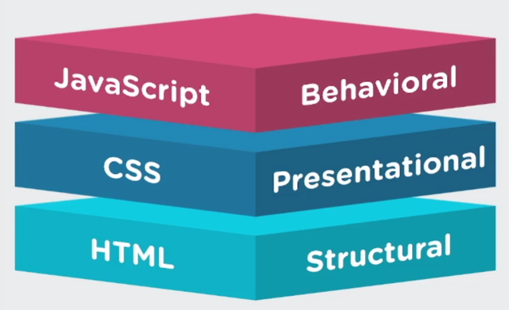

## 各司其责

- HTML：结构
- css：表现
- JavaScript：行为



## 案例：深色浅色切换

> - 深色：黑底白字
> - 浅色：白底黑字

### 版本一

- js 直接控制更改元素样式**style** [代码](https://code.h5jun.com/hefaj/edit?js,output)

```js
const btn = document.getElementById('modeBtn')
btn.addEventListener('click', (e) => {
  const body = document.body
  if (e.target.innerHTML === '🌞') {
    body.style.backgroundColor = 'black'
    body.style.color = 'white'
    e.target.innerHTML = '🌜'
  } else {
    body.style.backgroundColor = 'white'
    body.style.color = 'black'
    e.target.innerHTML = '🌞'
  }
})
```

> js 写样式，做了 css 做的事情。不推荐。

### 版本二

- js 控制切换类样式，[代码](https://code.h5jun.com/fapaz/edit?js,output)

```js
const btn = document.getElementById('modeBtn')
btn.addEventListener('click', (e) => {
  const body = document.body
  if (body.className !== 'night') {
    body.className = 'night'
  } else {
    body.className = ''
  }
})
```

> 用 css 表示状态，js 来切换控制。适用性广。

### 版本三

- 使用 css，**CheckBox**和伪类**:checked**，来实现切换不同的样式，[未使用 js](https://code.h5jun.com/qofoz/edit?html,css,output)

```css
#modeCheckBox {
  display: none;
}

#modeCheckBox:checked + .content {
  background-color: black;
  color: white;
  transition: all 1s;
}

#modeBtn {
  font-size: 2rem;
  float: right;
}

#modeBtn::after {
  content: '🌞';
}

#modeCheckBox:checked + .content #modeBtn::after {
  content: '🌜';
}
```

> 纯展示性效果使用 css 实现。

## 结论

- HTML、css、js 三者各司其职
- 应当避免不必要的由 js 直接操作样式
- 可以用 css 表示状态
- 纯展示类交互寻求零 js 方案
