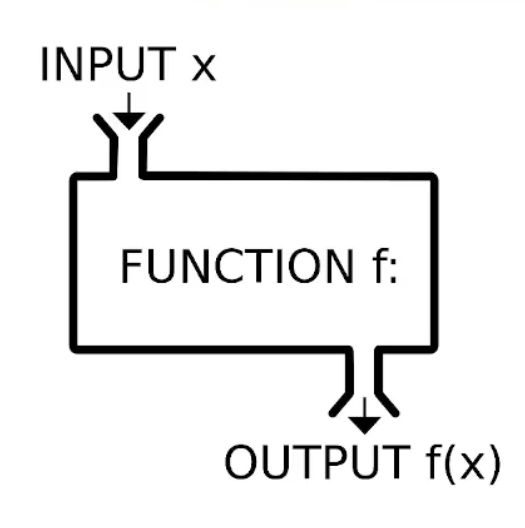
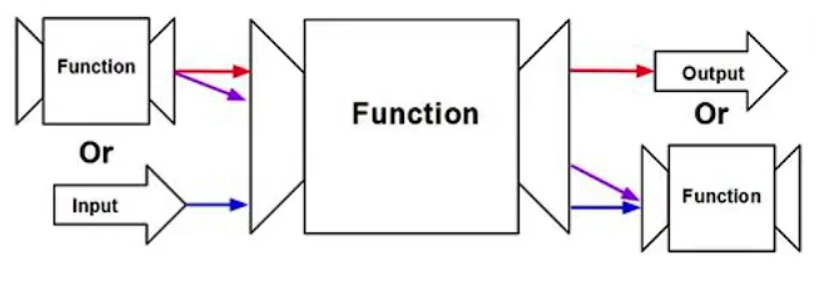
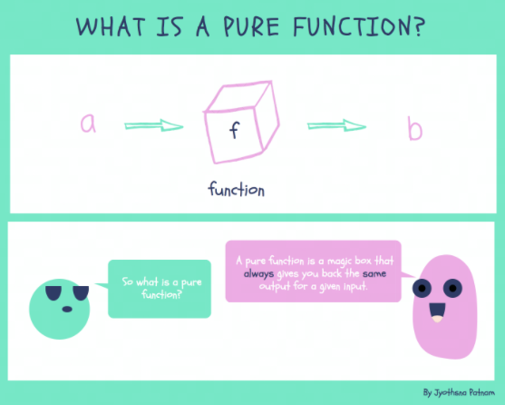

## 过程抽象

- 用来处理局部细节控制的一些方法，抽离出来

* 函数式编程思想的基础应用



> 场景：
>
> - 一些异步交互
> - 一次性的 HTTP 请求

## Once

为了能够让**只执行一次**的需求覆盖不同的事件处理,我们可以将这个需求剥离出来。这个过程我们称为过程抽象。

```js
function once(fn) {
  return function(...args) {
    if (fn) {
      const ret = fn.apply(this, args)
      fn = null
      return ret
    }
  }
}
```

## 高阶函数 HOF(high order function)

- 以函数作为参数
- 以函数作为返回值
- 常用于作为函数装饰器



```js
// 等价范式，包装后调用函数和直接调用函数一样
function HOFO(fn) {
  return function(...args) {
    return fn.apply(this, args)
  }
}
```

## Throttle

> 节流函数：连续触发相同事件，但每隔指定时间才会调用一次。

```js
function throttle(fn, time = 500) {
  let timer
  return function(...args) {
    if (timer == null) {
      fn.apply(this, args)
      timer = setTimeout(() => {
        timer = null
      }, time)
    }
  }
}
```

## Debounce

> 防抖函数：在限制的时间范围内连续触发相同事件，函数不会执行，直到间隔大于限制时间才执行。

```js
function debounce(fn, dur) {
  dur = dur || 500
  var timer
  return function() {
    clearTimeout(timer)
    timer = setTimeout(() => {
      fn.apply(this, arguments)
    }, dur)
  }
}
```

## Consumer

> 连续触发事件，将事件按顺序放入列表，按指定时间间隔，触发事件顺序执行。

```js
function consumer(fn, time) {
  let tasks = [],
    timer

  return function(...args) {
    tasks.push(fn.bind(this, ...args))
    if (timer == null) {
      timer = setInterval(() => {
        tasks.shift().call(this)
        if (tasks.length <= 0) {
          clearInterval(timer)
          timer = null
        }
      }, time)
    }
  }
}
```

## Iterative

> 可迭代：迭代执行函数，实现批量操作。类似数组的 map，迭代调用方法

```js
// 判断是否是可迭代的
const isIterable = (obj) =>
  obj != null && typeof obj[Symbol.iterator] === 'function'

function iterative(fn) {
  return function(subject, ...rest) {
    if (isIterable(subject)) {
      const ret = []
      for (let obj of subject) {
        ret.push(fn.apply(this, [obj, ...rest]))
      }
      return ret
    }
    return fn.apply(this, [subject, ...rest])
  }
}
```

## 为什么要使用高阶函数？

> - 纯函数（pure function）：当输入的值是确定的，他的输出的值也是确定的，跟状态、环境等都无关。
>   - 比如说 add 方法实现两个数相加，不管在任何时候，以任何顺序调用它，调用几次，结果都是一样的，不依赖外部环境等。
>   - 纯函数便于单元测试，只需要给定值测试就行了。
> - 非纯函数（impure function）：和纯函数相反。



```js
// 求和函数
const add = (x, y) => x + y

const isIterable = (obj) =>
  obj != null && typeof obj[Symbol.iterator] === 'function'

function iterative(fn) {
  return function(subject, ...rest) {
    if (isIterable(subject)) {
      const ret = []
      for (let obj of subject) {
        ret.push(fn.apply(this, [obj, ...rest]))
      }
      return ret
    }
    return fn.apply(this, [subject, ...rest])
  }
}
const addList = iterative(add)
console.log(addList([1, 2, 3, 4], 1)) // [2, 3, 4, 5]
```

> 结论：用纯函数 add() 测试，addList() 结果是正确的，就能保证 iterative() 是正确的。那么用 iterative() 即**高阶函数**包装的函数都是正确的，就减少了非纯函数的数量，便于测试。

## 编程范式

即代码风格，各有利弊

### 命令式

> 强调执行的过程，怎么做。

```js
let list = [1, 2, 3, 4]
let mapl = []
for (let i = 0; i < list.length; i++) {
  mapl.push(list[i] * 2)
}
```

### 声明式

> 强调是什么，要做什么事情，过程抽象。

```js
let list = [1, 2, 3, 4]
const = double = x => x * 2
list.map(double)
```

### 案例：Toggle

> 状态的切换

#### [命令式](https://code.h5jun.com/mapey/edit?js,output)

```js
switcher.onclick = function(evt) {
  if (evt.target.className === 'on') {
    evt.target.className = 'off'
  } else {
    evt.target.className = 'on'
  }
}
```

#### [声明式](https://code.h5jun.com/foqo/2/edit?js,output)

```js
function toggle(...actions) {
  return function(...args) {
    let action = actions.shift()
    actions.push(action)
    return action.apply(this, args)
  }
}
// 扩展多种状态切换
switcher.onclick = toggle(
  (evt) => (evt.target.className = 'warn'),
  (evt) => (evt.target.className = 'off'),
  (evt) => (evt.target.className = 'on')
)
```

> - 如果要增加一种状态的切换，命令式需要增加 if-else，声明式只需要往里面添加新状态就行了。
>
> - 声明式可扩展性更好，
