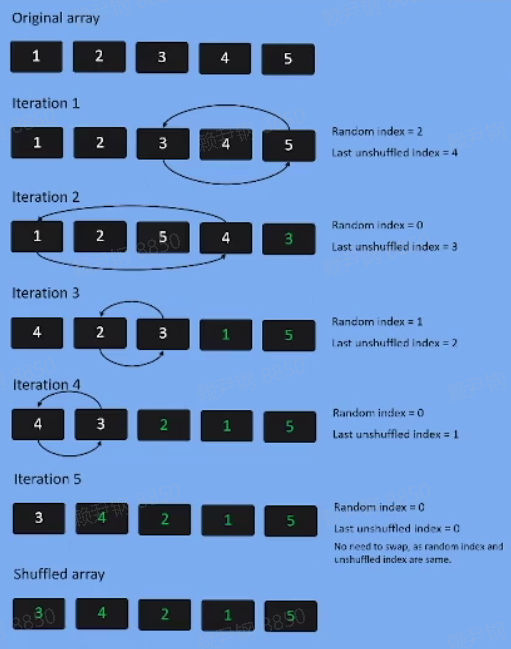

## 写代码应该关注什么

- 风格
- 效率
- 约定
- 使用场景
- 设计

## Left-pad

> npm 的一个模块 left-pad，字符串补空格方法

```js
function leftpad(str, len, ch) {
  str = String(str)
  var i = -1
  if (!ch && ch !== 0) ch = ' '
  len = len - str.length
  while (++i < len) {
    str = ch + str
  }
  return str
}
```

> 槽点（吹毛求疵）
>
> - NPM 模块粒度
> - 代码风格
> - 代码质量、效率

改进

```js
function leftpad2(str, len, ch = ' ') {
  str = ' ' + str
  const padLen = len - str.length
  if (padLen <= 0) {
    return str
  } else {
    return (' ' + ch).repeat(padLen) + str
  }
}
```

> - 代码更简洁
> - 效率提升

- [Repeat polyfill /MDN](https://developer.mozilla.org/en-US/docs/Web/JavaScript/Reference/Global_Objects/String/repeat)
- 性能更好

```js
// 核心代码
for (;;) {
  if ((count & 1) == 1) {
    rpt += str
  }
  count >>>= 1
  if (count == 0) {
    break
  }
  str += str
}
```

> 转成二进制用二次幂的方法进行按位与，将时间复杂度从 O(n)降到 O(logn)

再次优化

```js
var rpt = ' '
do {
  rpt += str
  str += str
  count &= count - 1
} while (count)
```

> 进一步减少循环次数，提升性能

### 总结

- left-pad 补齐字符串现实使用场景是很小的，在这种问题规模下是没有必要做性能提升。
- 在写代码时要考虑代码的使用场景，不去做过度的优化，和过度的设计，会提升代码的复杂度，让人难以理解。

## 案例：交通灯状态切换

> 实现一个切换多个交通信号灯状态切换的功能

### [版本一](https://code.h5jun.com/jezew/2/edit?js,output)

```js
const traffic = document.getElementById('traffic')

;(function reset() {
  traffic.className = 's1'

  setTimeout(function() {
    traffic.className = 's2'
    setTimeout(function() {
      traffic.className = 's3'
      setTimeout(function() {
        traffic.className = 's4'
        setTimeout(function() {
          traffic.className = 's5'
          setTimeout(reset, 1000)
        }, 1000)
      }, 1000)
    }, 1000)
  }, 1000)
})()
```

> 异步嵌套（callback hell）问题，不好

### [版本二](https://code.h5jun.com/meyif/edit?js,output)

```js
const traffic = document.getElementById('traffic')

const stateList = [
  { state: 'wait', last: 1000 },
  { state: 'stop', last: 3000 },
  { state: 'pass', last: 3000 },
]

function start(traffic, stateList) {
  function applyState(stateIdx) {
    const { state, last } = stateList[stateIdx]
    traffic.className = state
    setTimeout(() => {
      applyState((stateIdx + 1) % stateList.length)
    }, last)
  }
  applyState(0)
}

start(traffic, stateList)
```

> 实现了数据抽象，便于扩展

### [版本三](https://code.h5jun.com/bodul/2/edit?js,output)

```js
const traffic = document.getElementById('traffic')

function wait(ms) {
  return new Promise((resolve) => setTimeout(resolve, ms))
}

function poll(...fnList) {
  let stateIndex = 0

  return async function(...args) {
    let fn = fnList[stateIndex++ % fnList.length]
    return await fn.apply(this, args)
  }
}

async function setState(state, ms) {
  traffic.className = state
  await wait(ms)
}

let trafficStatePoll = poll(
  setState.bind(null, 'wait', 1000),
  setState.bind(null, 'stop', 3000),
  setState.bind(null, 'pass', 3000)
)

;(async function() {
  // noprotect
  while (1) {
    await trafficStatePoll()
  }
})()
```

> 实现了过程抽象，poll 轮询方法，抽象程度高，不容易理解。

### [版本四](https://code.h5jun.com/xuveq/edit?html,css,js,output)

```js
const traffic = document.getElementById('traffic')

function wait(time) {
  return new Promise((resolve) => setTimeout(resolve, time))
}

function setState(state) {
  traffic.className = state
}

async function start() {
  //noprotect
  while (1) {
    setState('wait')
    await wait(1000)
    setState('stop')
    await wait(3000)
    setState('pass')
    await wait(3000)
  }
}

start()
```

> 对问题直接的理解和抽象，符合现实常识习惯的方式，容易理解，推荐。

### 总结

- 抽象程度高，代码复用性好，但是理解成本高
- 不做过度抽象，考虑问题追求平衡，要既是一个优雅的代码，同时符合我们的思维习惯，才是最好的解决方案。

## 案例：判断是否是 4 的幂

```js
function isPowerOfFour(num) {
  num = parseInt(num)

  // O(logn)
  while (num > 1) {
    if (num % 4) return false
    num /= 4
  }
  return true

  // O(logn)
  // 能被4整除的数二进制最后两位一定是0，按位与来判断
  while (num > 1) {
    if (num % 0b11) return false
    num >>>= 2
  }
  return true

  // 取巧，转换为二进制字符串，再用正则去匹配
  num = parseInt(num).toString(2)
  return /^1(?:00)*$/.test(num)

  // O(n)
  // 能被4整除的数二进制首位是1，后面偶数个0
  return num > 0 && (num & (num - 1)) === 0 && (num & 0xaaaaaaaa) === 0
}
```

> 一步步的去优化代码的执行效率和性能。

## 洗牌

```js
const cards = [0, 1, 2, 3, 4, 5, 6, 7, 8, 9]

function shuffle(cards) {
  return [...cards].sort(() => (Math.random() > 0.5 ? -1 : 1))
}

console.log(shuffle(cards))
```

> 通常的版本，使用随机数重新排序，不是一个等概率分布的算法，对每一位的概率进行数据统计分析，越小的数出现在前面的概率越大，越大的数出现在后面概率越大。

### 正确性

- 将上面的算法进行 100 万次的执行，每一位的数字累加，发现前面的数总小于后面的数，不是均匀分布的，不能保证正确性。

```js
const cards = [0, 1, 2, 3, 4, 5, 6, 7, 8, 9]

function shuffle(cards) {
  return [...cards].sort(() => (Math.random() > 0.5 ? -1 : 1))
}

const result = Array(10).fill(0)

for (let i = 0; i < 1000000; i++) {
  const c = shuffle(cards)
  for (let j = 0; j < 10; j++) {
    result[j] += c[j]
  }
}

console.log(result)
// [243694, 243624, 286031, 294867, 294740, 275996, 274449, 297545, 305843, 322171]
// [254550, 255473, 299727, 306220, 307522, 287562, 288241, 311689, 319921, 338420]
// [273115, 273401, 321438, 328695, 329335, 307595, 308524, 332877, 342671, 359619]
```

### [洗牌](https://code.h5jun.com/huqi/edit?js,console)

> - 抽牌交换的方式实现均匀洗牌
>
> - 第一次在除第一张牌外的剩余牌中抽一张和第一张交换位置
> - 第二次从第一和二张牌外的牌里抽一张和第二张牌交换位置...
> - ~~即每次在剩余的牌中随机抽一张交换位置。~~



```js
const cards = [0, 1, 2, 3, 4, 5, 6, 7, 8, 9]

function shuffle(cards) {
  const c = [...cards]
  for (let i = c.length; i > 0; i--) {
    const pIdx = Math.floor(Math.random() * i)
    ;[c[pIdx], c[i - 1]] = [c[i - 1], c[pIdx]]
  }
  return c
}

const result = Array(10).fill(0)

for (let i = 0; i < 10000; i++) {
  const c = shuffle(cards)
  for (let j = 0; j < 10; j++) {
    result[j] += c[j]
  }
}

console.log(shuffle(cards))
console.log(result)
// [5, 3, 1, 8, 9, 0, 4, 7, 6, 2]
// [44662, 45062, 45280, 44978, 44516, 45476, 44922, 45035, 44558, 45511]
```

### [抽牌](https://code.h5jun.com/zamuv/edit?js,console)

> ~~实现均匀洗牌后，考虑既然每次抽牌是公平的，那就不用洗牌了，直接抽取多少牌。比如说抽奖，10 万个人不是每个人都有奖的，前 10%才有奖，那就只抽取 10%的人出来，提高效率。~~

```js
const cards = [0, 1, 2, 3, 4, 5, 6, 7, 8, 9]

function* draw(cards) {
  const c = [...cards]

  for (let i = c.length; i > 0; i--) {
    const pIdx = Math.floor(Math.random() * i)
    ;[c[pIdx], c[i - 1]] = [c[i - 1], c[pIdx]]
    yield c[i - 1]
  }
}

const result = draw(cards)
console.log([...result])
```

## 案例：分红包

### 切蛋糕、切西瓜算法[分红包](https://code.h5jun.com/wuv/1/edit?js,output)

> 每次切最大的，这样比较均匀。但是趣味性不够，大家分到的都差不多。

```js
function generate(amount, count) {
  let ret = [amount]

  while (count > 1) {
    //挑选出最大一块进行切分
    let cake = Math.max(...ret),
      idx = ret.indexOf(cake),
      part = 1 + Math.floor((cake / 2) * Math.random()),
      rest = cake - part

    ret.splice(idx, 1, part, rest)

    count--
  }
  return ret
}
```

### 洗牌算法思路[分红包](https://code.h5jun.com/luba/edit?js,output)

> 随机性，更容易得到特别大的值。
>
> - ~~抽一张牌，把前一张牌到抽到的这张牌中间的点数都给抽到的人。不会出现不够分的情况。比如说抽到 5，那就把 0-5 都给它~~

```js
function* draw(cards) {
  const c = [...cards]

  for (let i = c.length; i > 0; i--) {
    const pIdx = Math.floor(Math.random() * i)
    ;[c[pIdx], c[i - 1]] = [c[i - 1], c[pIdx]]
    yield c[i - 1]
  }
}

function generate(amount, count) {
  if (count <= 1) return [amount]
  const cards = Array(amount - 1)
    .fill(0)
    .map((_, i) => i + 1)
  const pick = draw(cards)
  const result = []
  for (let i = 0; i < count; i++) {
    result.push(pick.next().value)
  }
  result.sort((a, b) => a - b)
  for (let i = count - 1; i > 0; i--) {
    result[i] = result[i] - result[i - 1]
  }
  return result
}
```

## 总结

- 多实践，多写、多练、多思考
- 定期 review 复习
