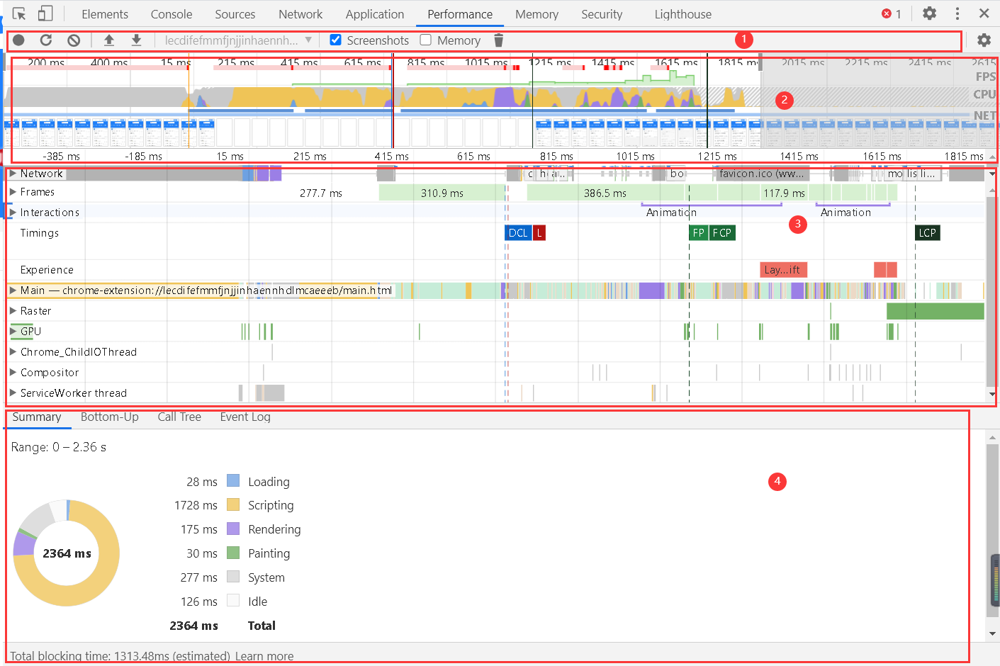

## 开发调试方法

## 前端 Debug 的特点

### 01.多平台

- 浏览器、Hybrid、NodeJs、小程序、桌面应用...

### 02.多环境

- 本地开发环境、线上环境

### 03.多工具

- Chrome DevTools、Charles、Spy-Debugger、Whistle、vConsole...

### 04.多技巧

- Console、BreakPoint、sourceMap、代理...

## PC 端调试：Chrome devTools

## Elements

> 查看网页 DOM 内容和样式

### 动态修改元素和样式

> Elements --> Styles、Computed

- 点击 `.cls` 开启动态修改元素的 `class`
  - 输入字符串可以动态的给元素添加类名
  - 勾选/取消 类名可以动态查看类名生效效果
- 点击具体的样式值(字号、颜色、宽度高度等)可以进行编辑，浏览器内容区域实时预览
- Computed 下点击样式里的箭头可以跳转到 styles 面板中的 css 规则

### **可以用以下两种方式强制激活伪类**

- 选中具有伪类的元素，点击 `:hov`
- DOM 树在元素上右键菜单，选择 `Force State`


## Console

- console.log
- console.warn
- console.error
- console.debug
- console.info
- console.table：具象化展示 `JSON` 和 数组数据
- console.dir：显示 JavaScript 对象的属性，并通过类似文件树样式的交互列表显示。
- 占位符：给日志添加样式，可突出重要信息
  - %s：字符串
  - %o：对象
  - %c：样式
  - %d：数字

```js
console.log('welcome to bytedance!')
console.warn('welcome to bytedance!')
console.error('welcome to bytedance!')
console.debug('welcome to bytedance!')
console.info('welcome to bytedance!')
let obj = { name: 'tom', age: 18 }
console.log(
  '%s %o %c %s',
  'hello',
  obj,
  'font-size:16px;color:red',
  'welcome to bytedance'
)
console.table(obj)
const body = document.body
console.dir(body)
```


## Scource


- 1.页面资源文件目录树
- 2.代码预览区域
- 3.Debug 工具栏：从左到右依次为
  - 暂停（继续）
  - 单步跳过
  - 进入函数
  - 跳出函数
  - 单步执行
  - 激活（关闭）所有断点
  - 代码执行异常处自动 **断点**
- 4.断点调试器

### breakpoint 和 watch

- 代码内使用关键字 debugger 或 单击代码预览区域的行号可以设置断点
- 执行到断点处时代码暂停执行
- 展开 Breakpoints 列表可以查看断点列表,勾选/取消可以激活/禁用对应断点
- 暂停状态下，鼠标 hover 变量可以查看变量的值
- 在调试器 Watch 右侧点击＋可以添加对变量的监控，查看该变量的值

### scope 和 call stack

- 展开 scope 可以查看作用域列表（包含闭包）
- [闭包参考文档](https://developer.mozilla.org/zh-CN/docs/Web/JavaScript/Closures)
- 展开 call stack 可以查看当前 JavaScript 代码的调用栈
- [调用栈参考文档](https://developer.mozilla.org/zh-CN/docs/Glossary/Call_stack)

## 压缩后的代码的调试

> 前端代码天生具有“开源"属性，出于安全考虑，JavaScript 代码通常会被压缩,压缩后的代码只有一行，变量使用'a'、'b'等替换，整体变得不可阅读。


### source map

> source map 文件包含了源码的映射信息，就能和没压缩之前一样调试了。
>
> 项目实际部署上线后会删除 source map 文件，保证安全。

- mappings 字段存储了源文件和 source map 的 [映射](https://www.murzwin.com/base64vlq.html)
  - 英文,表示源码及压缩代码的位置关联
  - 逗号，分隔一行代码中的内容。
  - 分号，代表换行。之所以没有显示分号是因为压缩后的代码就只有一行。

## Performance

> 查看网页的性能



- 1.控制面板
- 2.概览面板
  - FPS：每秒帧数
  - CPU：处理各个任务花费的时间
  - NET：各个请求花费的时间
- 3.线程面板
  - Frames：帧线程
  - Main：主线程，负责执行 JavaScript，解析 HTML/CSS，完成绘制
  - Raster：负责完成某个 layer 或者某些块（tile）的绘制
- 4.统计面板

## Network

> 页面所有请求相关的信息


- 1.控制面板
- 2.过滤面板
- 3.概览区域
- 4.Request Table 面板
- 5.请求详情面板
- 6.总结面板

## Application

> 展示本地存储相关的信息


- 点击 `clear site data` 可以清除网页在本地存储的数据

## 移动端 H5 调试

## 真机调试

### iOS

1. 使用 Lightning 数据线将 iPhone 和 Mac 相连
2. iPhone 开启 web 检查器（设置->Safari->高级->开启 web 检查器）
3. iPhone 使用 Safari 浏览器打开要调试的页面
4. Mac 打开 Safari 浏览器调试（菜单栏 -> 开发 -> iPhone 设备名 -> 选择调试页面
5. 在弹出的 Safari Developer Tools 中调试

> 没有 iPhone 设备可以在 Mac APP store 安装 Xcode 使用其内置的 iOS 模拟器

### Android

1. 使用 USB 数据线与电脑相连
2. 手机进入开发者模式，勾选 USB 调试 ，并允许调试
3. 电脑打开 Chrome 浏览器，在地址栏中输入 `chrome://inspect/#devices` 并勾选 `Discover USB devices` 选项
4. 手机允许远程调试，并访问调试页面
5. 电脑点击 inspect 按钮
6. 进入调试界面

> 将页面地址生成二维码，直接使用手机扫码查看，体验更好

### 使用代理工具调试

原理

- 电脑作为代理服务器
- 手机通过 HTTP 代理连接到电脑
- 手机上的请求都经过代理服务器

以 Charles 为例

1. 安装 Charles
2. 查着电脑 IP 和端口
3. 将 IP、端口号镇入手机 HTTP 代理
4. Charles 允许授权
5. 使用 SwitchHosts!软件给 Mac 电脑配 Hosts
6. 手机访问开发环境页面的 iOS 模拟器

> 默认情况下，Charles 无法抓取到 HTTPS 的请求，需要安装证书。

### 常用工具


- Charles 是收费软件

## 常用开发调试技巧

### Overrides 线上即时修改

1. 打开 source 面板下的 overrides
2. 点击 select folders for overrides，选择一个本地的空文件夹目录
3. 允许授权
4. 在 page 中修改代码，修改完成后 Ctrl + s 保存
5. 打开 devTools，点击右上角三个小点——>more tools ——> changes 就能看到所有的修改了

### 利用代理解决解决开发阶段的跨域问题


### 启用本地 source map

> 线上不存在 Source Map 时可以使用代理工具 Map Local 网络映射功能，来访问**本地**的 Source Map 文件。

## 小黄鸭调试大法


> 传说中程序大师随身携带一只小黄鸭，在调试代码的时候会在桌上放上这只小黄鸭，然后详细地向鸭子解释每行代码，然后很快就将问题定位修复了。——《程序员修炼之道》

~~建议不要对身边的人使用，不然你可能会失去一个朋友。~~:smile:
