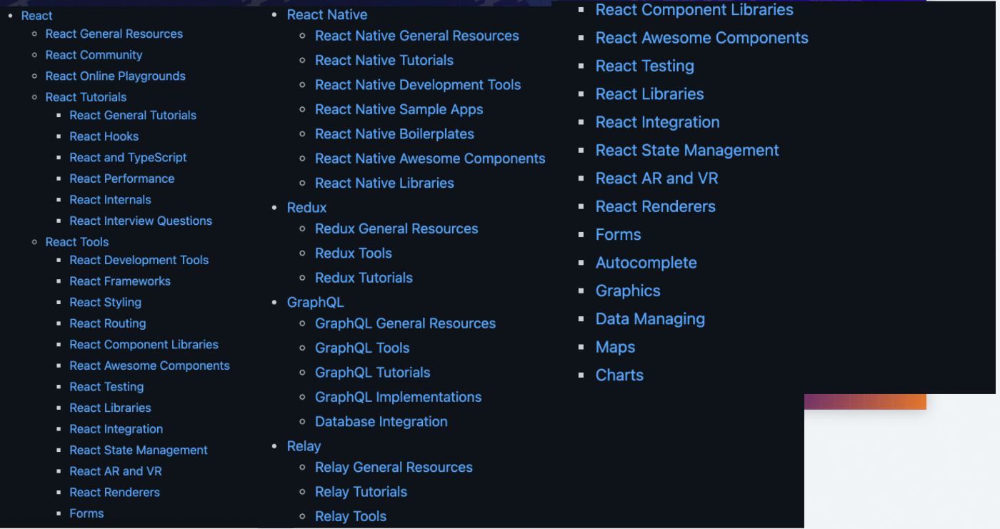
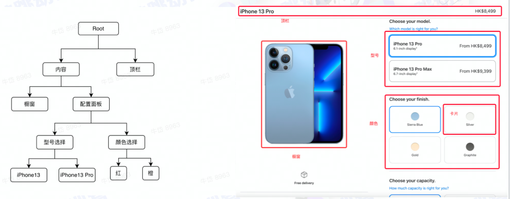
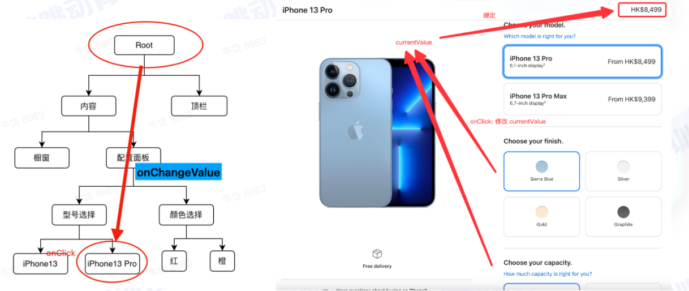
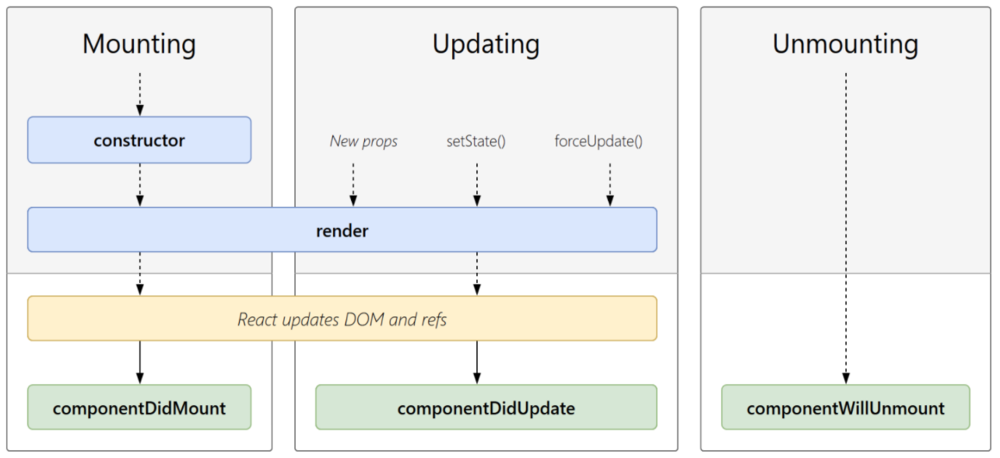
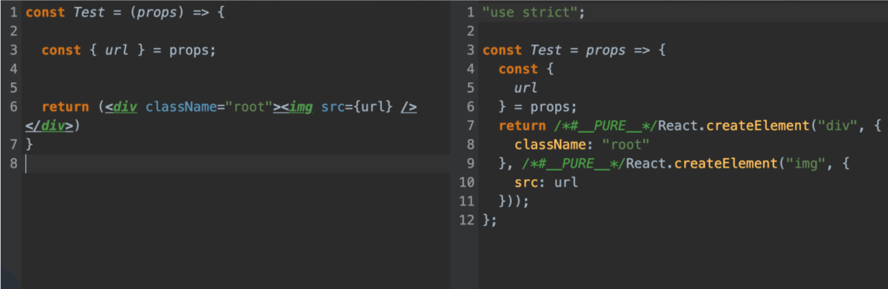
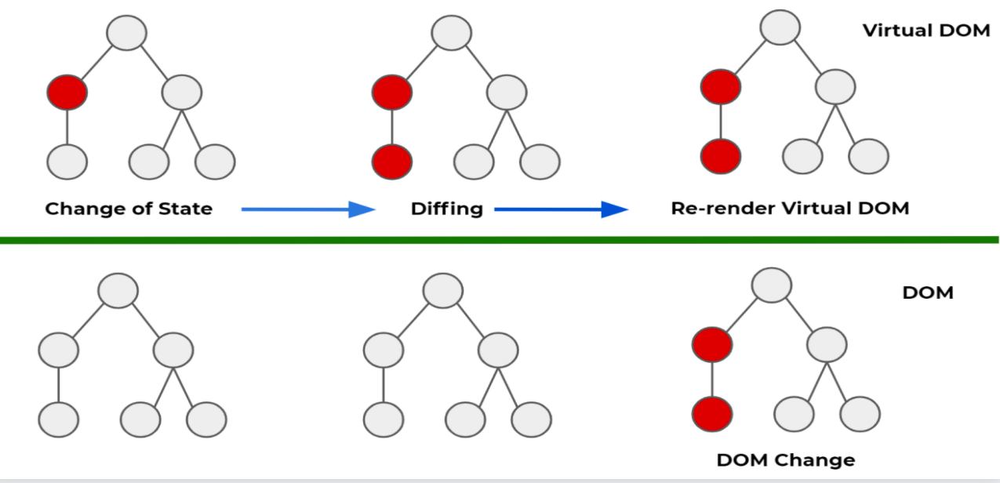
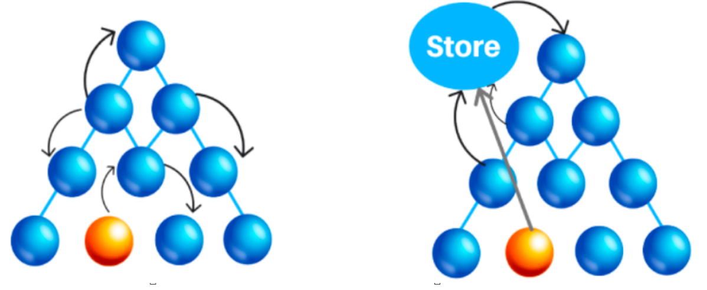
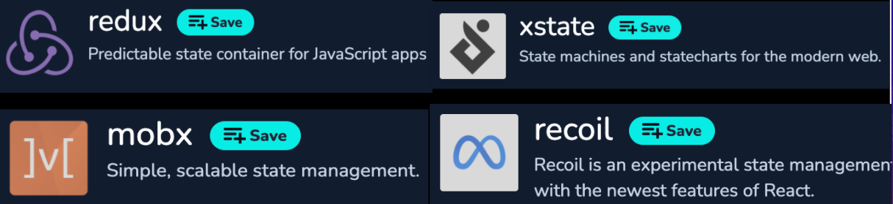
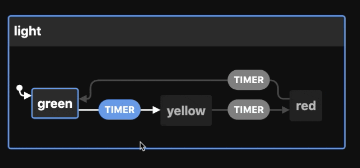
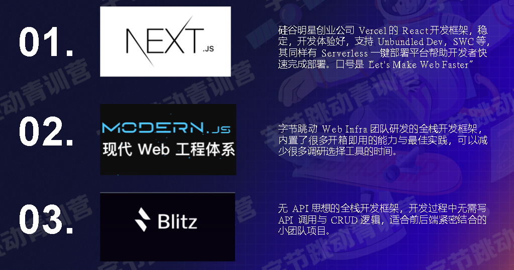

## React 历史与应用

1. 前端应用开发，如 Facebook、Instagram、Netflix 网页版
2. 移动原生应用开发，如 Instagram、Discord、Oculus
3. 结合 Electron ，进行桌面应用开发
4. 基于 webGL 开发 3D 应用

- 2010 年，Facebook 在其 php 生态中，引入了 xhp 框架，首次引入了组合式组件的思想，启发了后来的 React 的设计。
- 2011 年，Jordan Walke 创造了 FaxJS，也就是后来的 React 原型:
- 2012 年，在 Facebook 收购 Instagram 后，该 FaxJS 项目在内部得到使用，Jordan Walke 基于 FaxJS 的经验，创造了 React。
- 2013 年，React 正式开源，在 2013 JSConf 上 Jordan Walke 介绍了这款全新的框架:

> React —— A **JavaScript library** for building user interfaces.

- 2014 年—今，生态大爆发，各种围绕 React 的新工具/新框架开始涌现



## React 的设计思路

### UI 编程痛点


1. 状态更新，UI 不会自动更新，需要手动的调用 DOM 进行更新
2. 欠缺基本的代码层面的封装和隔离，代码层面没有组件化。
3. UI 之间的数据依赖关系，需要手动维护，如果依赖链路长，则会遇到 callback hell

### 响应式与转换式

- **转换式**系统：给定 **输入** 求解 **输出**
  - 编译器、数值计算
- **响应式**系统：**监听事件**、**消息驱动**
  - 监控系统、UI 界面

**响应式系统：事件 ——> 执行既定的回调 ——> 状态变更 ——> UI 更新**

### 响应式编程

1. 状态更新，UI 自动更新
2. 前端代码组件化，可复用、可封装
3. 状态之间的互相依赖关系，只需声明即可

### 组件化



1. 组件是 组件的组合/原子组件
2. 组件内拥有状态，外部不可见
3. 父组件可将状态传入组件内部

### 状态归属

- 当前价格属于 **root** 节点

- 状态归属于两个节点向上寻找到最近的祖宗节点

- 改变当前价格，将 root 节点的 改变价格函数向下传递到子组件，子组件只是调用函数。

  

- react 是单向数据流，只能由父传子，如果子要改变父的状态，可调用父传过来的函数。

### 组件设计

1. 组件声明了状态和 UI 的映射。

2. 组件有 Props/State 两种状态。

   - 组件内部拥有私有状态 State。

   - 组件接受外部的 Props 状态提供复用性。

   - 根据当前的 State/Props,返回一个 UI。

3. “组件”可由其他组件拼装而成。

想象的组件代码的样子（语法不一定是对的）

```jsx
function Component(props) {
  // props 是父组件传入的状态
  const { url } = props
  this.text = '点击我' // 私有状态

  // 返回一个UI
  return (
    <div>
      <SubComponent props="{{ color: 'red' }}"></SubComponent>
      </img>
      <button>{text}</button>
    </div>
  )
}
```

### 生命周期



## React（hooks）写法

```jsx
import React, { useState, useEffect } from 'react'

function Example() {
  // 声明一个新状态，需要调用useState，返回一个状态和一个改变状态的函数
  const [count, setCount] = useState(0)

  // 副作用，影响组件外部的操作，挂载时执行和状态改变时执行
  useEffect(() => {
    // 改变网页标题
    document.title = `you clicked ${count} times`
  })

  return (
    <div>
      <p>clicked {count} times</p>
      <button onClick={() => setCount(count + 1)}>Click me</button>
    </div>
  )
}
```

## React 的实现

### Problems

1. JSX 不符合 JS 标准语法
2. 返回的 JSX 发生改变时，如何更新 DOM
3. State/ props 更新时要重新触发 render 函数（就是组件本身函数重新执行）

### 问题 1：JSX 不符合 JS 标准语法

- 语法转译



### 问题 2：如何更新 DOM

**Virtual DOM（虚拟 DOM）**

- Virtual DOM 是一种用于和真实 DOM 同步，而在 JS 内存中维护的一个对象，它具有和 DOM 类似的树状结构，并和 DOM 可以建立一一对应的关系。
- 它赋予了 React 声明式的 API：您告诉 React 希望让 UI 是什么状态，React 就确保 DOM 匹配该状态。
- 这使您可以从属性操作、事件处理和手动 DOM 更新这些在构建应用程序时必要的操作中解放出来。

### 问题 3：State/ props 更新时重新触发 render 函数



**Diff** 权衡

- 更新次数少
- 计算速度快

> 完美的最小 Diff 算法，需要 O(n^3) 的复杂度
>
> 牺牲理论最小 Diff ，换取时间，得到 O(n) 复杂度的算法：
>
> Heuristic O(n) Algorithm

**How to Diff：**

| 不同类型的元素    | 替换 |
| ----------------- | ---- |
| 同类型的 DOM 元素 | 更新 |
| 同类型的组件元素  | 递归 |

## React 状态管理库

### 核心思想

**将状态抽离到 UI 外部进行统一管理**

- 类似于页面所有组件整合是一个组件，store 是这个组件的状态

> 弊端：会降低组件的复用性。
>
> 业务代码使用，比如说用户信息
>
> 库不会使用



### 推荐库



- xstate 是基于 **状态机** 设计的

### 状态机

> 当前状态，收到外部事件,迁移到下一个状态



字节的 Modern.js 的状态管理库 reduck

## 应用级框架科普


