## 初识 HTTP

> 打开浏览器，在地址栏输入网址，访问一个网页

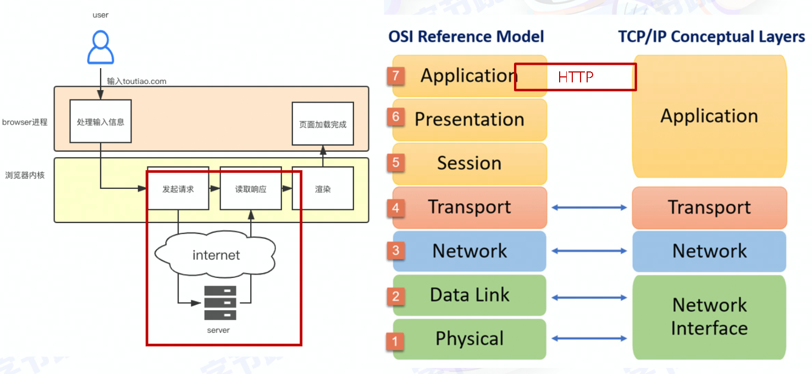

### 超文本传输协议（Hyper Text Transfer Protocol）

- 应用层协议，基于 TCP
- 请求 响应
- 简单可扩展
- 无状态，每个请求是孤立的

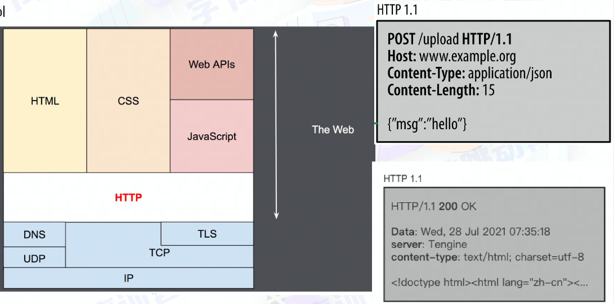

## 协议分析

### 发展

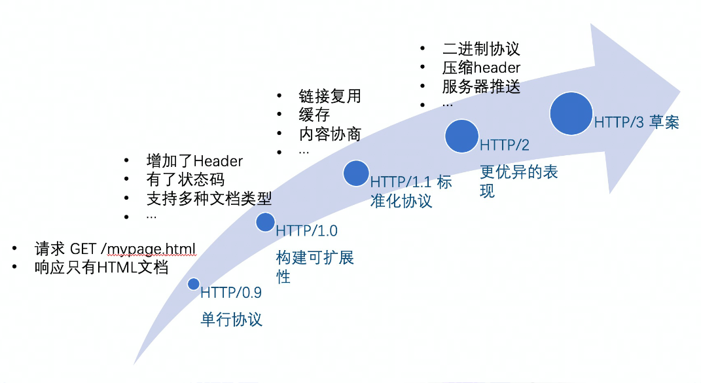

### 报文

**HTTP/1.1 报文结构**

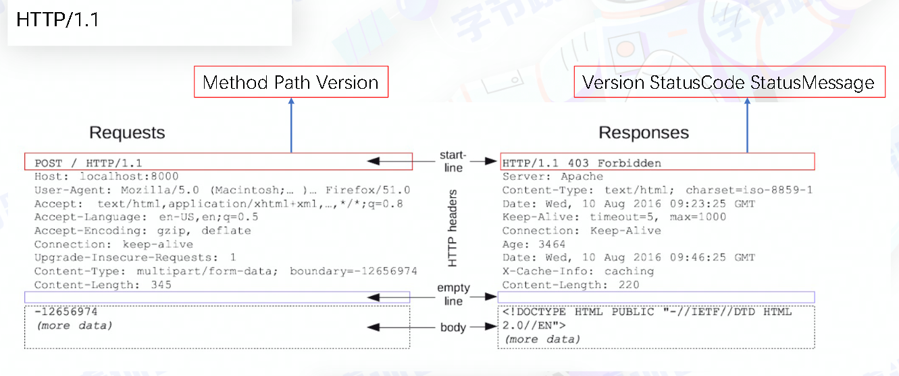

### **Method**

| GET        | 请求一个指定资源的表示形式。使用 GET 的请求应该只被用于获取数据  |
| ---------- | ---------------------------------------------------------------- |
| **POST**   | 用于将实体提交到指定的资源，通常导致在服务器上的状态变化或副作用 |
| **PUT**    | 用请求有效载荷替换目标资源的所有当前表示                         |
| **DELETE** | 删除指定资源                                                     |
| HEAD       | 请求一个与 GET 请求的响应相同的响应，但没有响应体                |
| CONNECT    | 建立一个到由目标资源标识的服务器的隧道。                         |
| OPTIONS    | 用于描述目标资源的通信选项。                                     |
| TRACE      | 沿着到目标资源的路径执行一个消息环回测试。                       |
| PATCH      | 用于对资源应用部分修改。                                         |

- safe(安全的)：不会修改服务器数据的方法，GET、HEAD、OPTIONS
- Idempoent(幂等)：
  - 同样的请求被执行一次与连续执行多次的效果是**一样**的，服务器的状态也是**一样**的
  - 所有 safe 的方法都 Idempotent 的
  - GET HEAD OPTIONS PUT DELETE

### 状态码

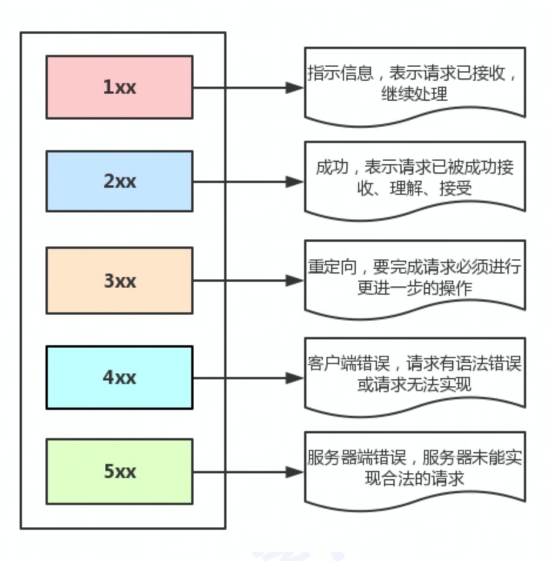

**常见状态码**

- 200 OK - 客户端请求成功
- 301 - 资源（网页等）永久重定向（被永久转移到其他 URL）
- 302 - 临时重定向
- 401 Unauthorized - 请求未授权
- 404 - 请求的资源不存在，可能是输入了错误的 URL
- 500 - 服务器内部发生了不可预期的错误
- 504 Gateway Timeout - 网关或代理服务器无法在规定时间内获得想要的响应

### RESTful API

> 一种 API 的设计风格；REST - Representational State Transfer

1. 每一个 URI 代表—种资源;
2. 客户端和服务器之间,传递这种资源的某种表现层
3. 客户端通过 HTTP method，对服务器端资源进行操作．实现"表现层状态转化"

| 请求            | 返回码              | 含义                                                                                                           |
| --------------- | ------------------- | -------------------------------------------------------------------------------------------------------------- |
| GET /zoos       | 200 OK              | 列出所有动物园，服务器成功返回                                                                                 |
| POST /zoos      | 201 CREATED         | 新建一个动物园，服务器创建成功                                                                                 |
| PUT /zoos/ID    | 400 INVALID REQUEST | 更新某个指定动物园的信息（提供该动物园的全部信息) 用户发出的请求有错误，服务器没有进行新建或修改数据的操作 |
| DELETE /zoos/ID | 204 NO CONENET      | 删除某个动物园，删除成功                                                                                       |

### 常用请求头

| Accept            | 接收类型，表示浏览器支持的 MIME 类型（对标服务端返回的 Content-Type)                  |
| ----------------- | ------------------------------------------------------------------------------------- |
| Content-Type      | 客户端发出去的实体内容的类型                                                          |
| Cache-Control     | 指定请求和响应遵循的缓存机制，如 no-cache                                             |
| If-Modified-Since | 对应服务端的 Last-Modified，用来匹配看文件是否变动，只能精确到 1s 之内                |
| Expires           | 缓存控制，在这个时间内不会请求，直接使用缓存，服务端时间                              |
| Max-age           | 代表资源在本地缓存多少秒，有效时间内不会请求，而是使用缓存                            |
| If-None-Match     | 对应服务端的 ETag，用来匹配文件内容是否改变（非常精确)                                |
| Referer           | 该页面的来源 URL(适用于所有类型的请求．会精确到详细页面地址, csrf 拦截常用到这个字段) |
| Cookie            | 有 cookie 并且**同域**访问时会自动带上                                                |
| Origin            | 最初的请求是从哪里发起的（只会精确到端口）,Origin 比 Referer 更尊重隐私               |
| User-Agent        | 用户客户端的一些必要信息，如 UA 头部等                                                |

### 常用响应头

| Content-Type                | 服务端返回的实体内容类型                                        |
| --------------------------- | --------------------------------------------------------------- |
| Cache-Control               | 指定请求和响应遵循的缓存机制，如 no-cache                       |
| Last-Modified               | 请求资源的最后的修改时间                                        |
| Expires                     | 应该在什么时候认为文档已经过期，从而不再缓存它                  |
| Max-age                     | 客户端的本地资源应该缓存多少秒，开启了 Cache-Control 后有效     |
| Etag                        | 资源的特定版本的标识符，Etags 类似于指纹                        |
| Set-Cookie                  | 设置和页面关联的 cookie，服务器通过这个头部把 cookie 传给客户端 |
| Server                      | 服务器的一些相关信息                                            |
| Access-Control-Allow-Origin | 服务器端允许的请求**Origin**头部（譬如为\*）                    |

### 缓存

**强缓存**：资源在本地已经有了，直接使用

- Expires：时间戳
- Cache-Control：可缓存性
  - no-cache：协商缓存验证
  - no-store：不使用任何缓存
- Max-age：单位是秒，存储最大周期，相对于请求的时间
- must-revalidate：一旦资源过期，在成功向原始服务器验证之前，不能使用

**协商缓存**：本地的缓存能不能用一定要和服务端进行通信验证

- Etag/If-None-Match：资源的特定版本标识符，类似于指纹
- Last-modified/If-Modified-Since：最后修改时间

**浏览器请求缓存流程**

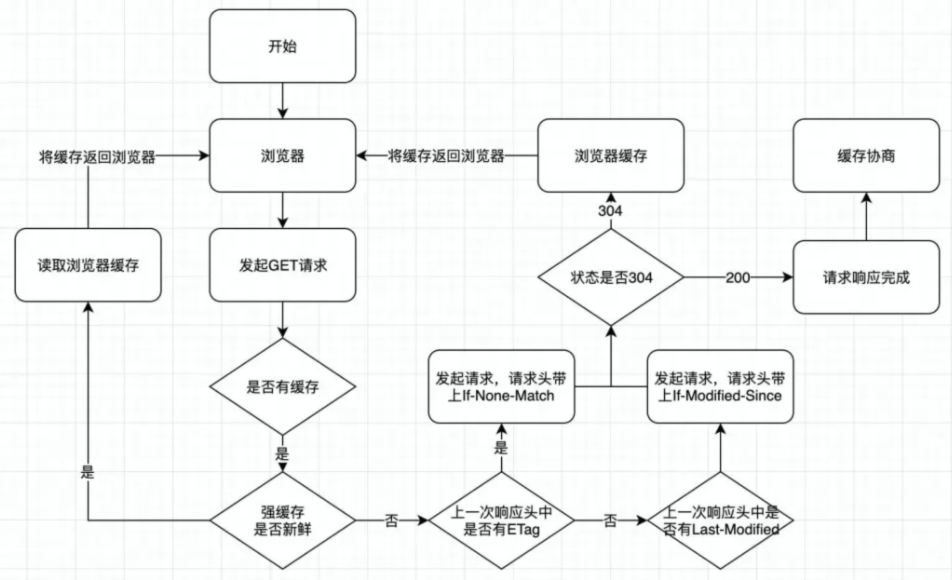

### Cookie

Set-Cookie - response\*\*

| Name=value                   | 各种 cookie 的名称和值                                                                                                           |
| ---------------------------- | -------------------------------------------------------------------------------------------------------------------------------- |
| Expires=Date                 | Cookie 的有效期，缺省时 Cookie 仅在浏览器关闭之前有效。                                                                          |
| Path=Path                    | 限制指定 Cookie 的发送范围的文件目录，默认为当前                                                                                 |
| Domain=domain                | 限制 cookie 生效的域名，默认为创建 cookie 的服务域名                                                                             |
| secure                       | 仅在 HTTPS 安全连接时，才可以发送 cookie                                                                                         |
| HttpOnly                     | JavaScript 脚本无法获得 cookie                                                                                                   |
| SameSite=[None\|Strict\|Lax] | None：同站跨站请求都可以发送 Strict：仅在同站发送 Lax：允许与顶级导航一起发送，并将与第三方网站发起的 GET 请求一起发送 |

### HTTP/2 概述

> 更快、更稳定、更简单

- **帧（frame）**：HTTP/2 通信的最小单位，每个帧都包含帧头，至少也会标识出当前帧所属的数据流。
- 二进制

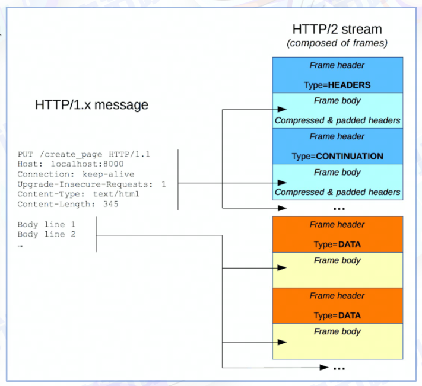

- **消息**：与逻辑请求或响应消息对应的完整的一系列帧。
- **数据流：**已建立的连接内的双向字节流.可以承载—条或多条消息。
- 交错发送，接收方重新组织

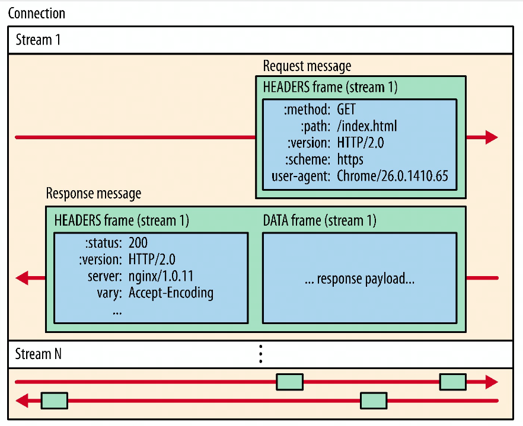

- HTTP/2 连接都是永久的，而且仅需要每个来源一个连接
- **流控制**：阻止发送方向接收方发送大量数据的机制，比如说网页在播放视频，用户暂停了，就可以暂停加载缓存视频，留出带宽。
- 服务器推送，比如页面 HTML 中引用了 css 和 js 文件，服务器可主动推送该文件，加快访问速度。

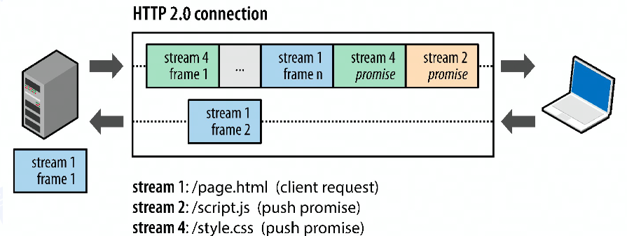

### HTTPS 概述

- HTTPS : Hyper Text Transfer Protocol Secure

- 经过 TSL/SSL 加密

  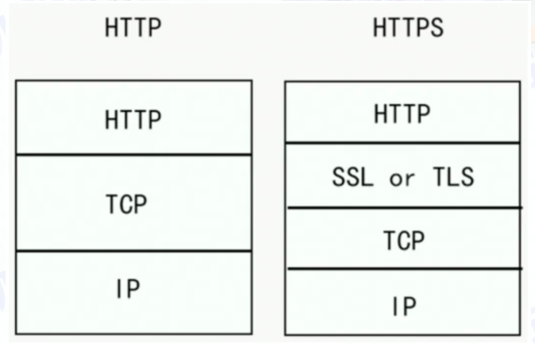

- 对称加密：加密和解密都是使用同一个密钥

- 非对称加密，加密和解密需要使用两个不同的密钥 ∶ 公钥(public key)和私钥(private key)

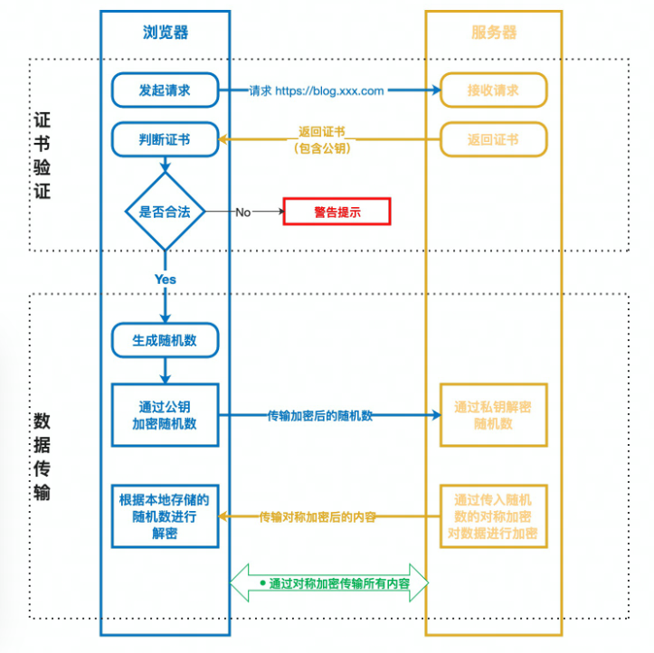

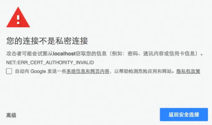

## 场景分析

### 静态资源

> 访问[今日头条网站](https://www.toutiao.com/)

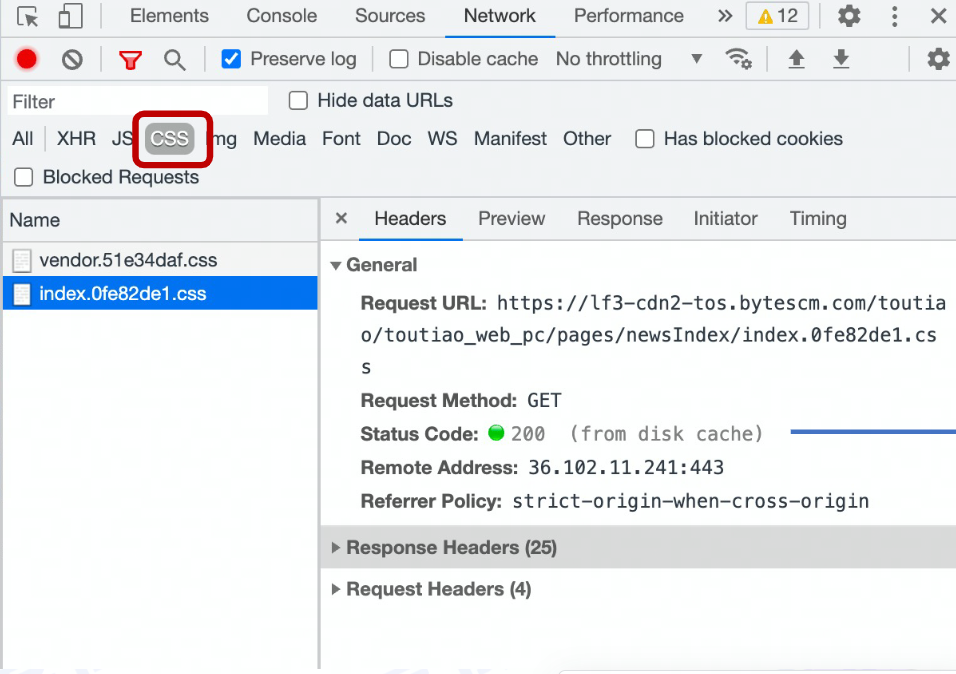

**状态码为 200 不一定是发起了请求**

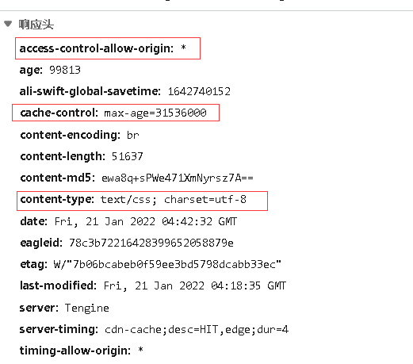

- 强缓存：Cache-Control：缓存一年
- 允许所有域名访问
- 资源类型是 CSS

**静态资源方案：缓存 + CDN + 文件名 hash**

- CDN : Content Delivery Network
- 通过用户就近性和服务器负载的判断，CDN 确保内容以—种极为高效的方式为用户的请求提供服务

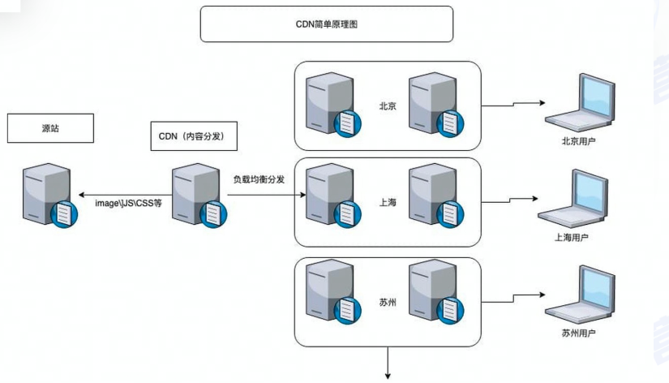

### 跨域

- same-origin
- cross-origin

> 三部分，有一部分不一样就是跨域（cross-origin）了

### 跨域解决方案

### CORS：Cross-Origin Resource Sharing

- 预请求 OPTIONS：获知服务端是香允许该跨源请求（复杂请求)
- 相关协议头
  - Access-Control-Allow-Origin
  - Access-Control-Expose-Headers
  - Access-Control-Max-Age
  - Access-Control-Allow-Credentials
  - Access-Control-Allow-Methods
  - Access-Control-Allow-Headers
  - Access-Control-Request-Method
  - Access-Control-Request-Headers.
  - Origin

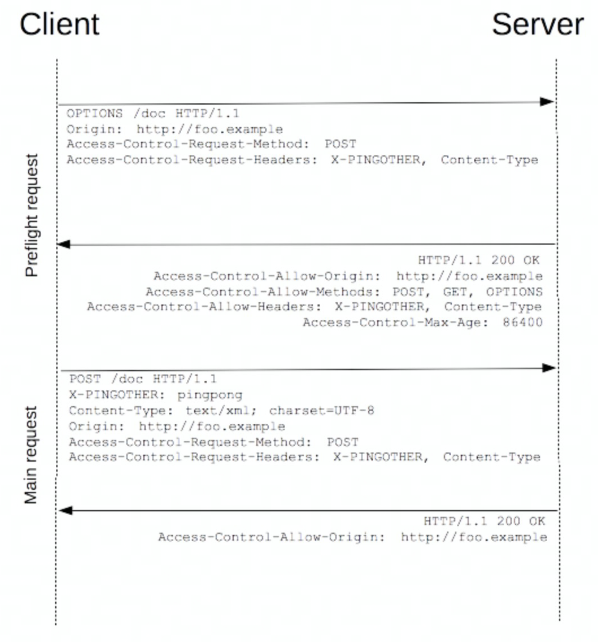

> 客户端发起 **OPTIONS** 请求，携带一些信息，服务器判断返回允许的信息，客户端进行匹配，通过后再发起 正常请求流程

### 代理服务器

> 同源策略是**浏览器的安全策略**，不是 HTTP 的。通过请求本地的和页面同域下的代理服务器，代理服务器做接口转发，转发请求到服务器，转发结果回来。

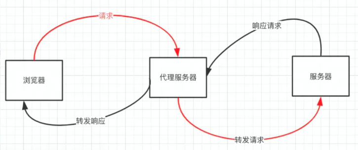

iframe：解决跨域有很多限制，不会使用。

### 登录

> 业务场景：表单登录、扫码登录
>
> 技术方式：SSO，单点登录（Single Sign On）

### 表单登录

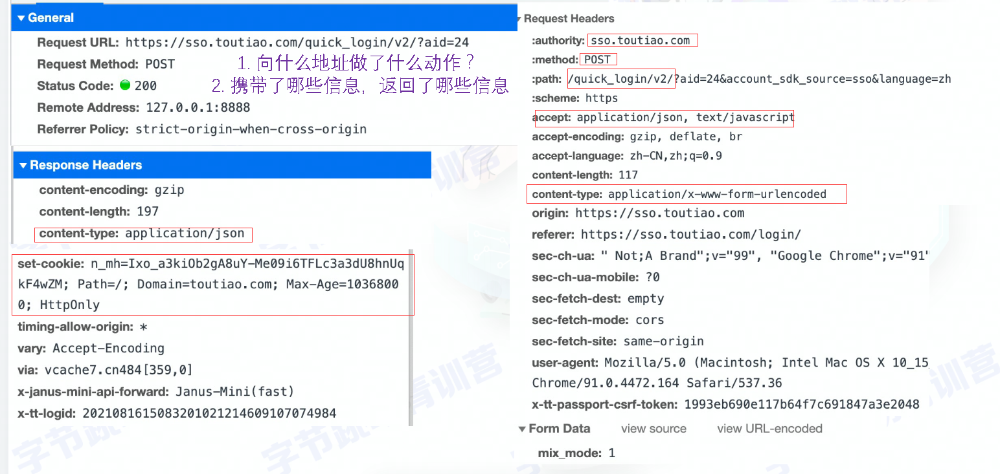

- 使用 POST 方法
- 目标域名：https://sso.toutiao.com
- 目标 path /quick_login/v2/
- 携带信息
  - POST body，数据格式为 from
  - 希望获取的格式为 json
  - 已有的 cookie
- 返回信息
  - 数据格式 json
  - 种 cookie 的信息

### 鉴权

> session + cookie
>
> JSON web token

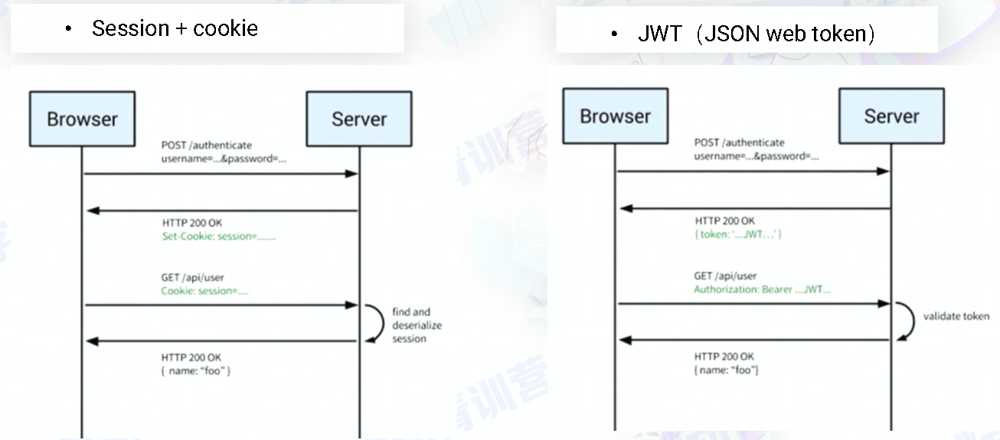

SSO：单点登录（Single Sign On）

> 在子网站登录后保存登录态，子网站直接自动登录。减少登录操作，保留用户。

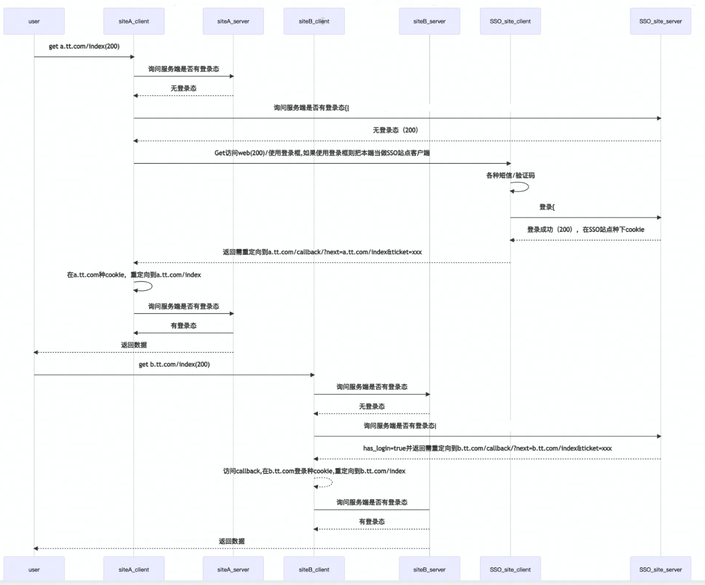

## 实际应用

### 浏览器

#### **AJAX 之 XHR**

> XHR：XMLHttpRequest

- readyState

| 0   | UNSENT           | 代理被创建,但尚未调用 open（）方法。              |
| --- | ---------------- | ------------------------------------------------- |
| 1   | OPENED           | open() 方法已经被调用                             |
| 2   | HEADERS_RECEIVED | send() 方法已经被调用，并且头部和状态已经可获得。 |
| 3   | LOADING          | 下载中， responseText 属性已经包含部分数据。      |
| 4   | DONE             | 下载操作已完成                                    |

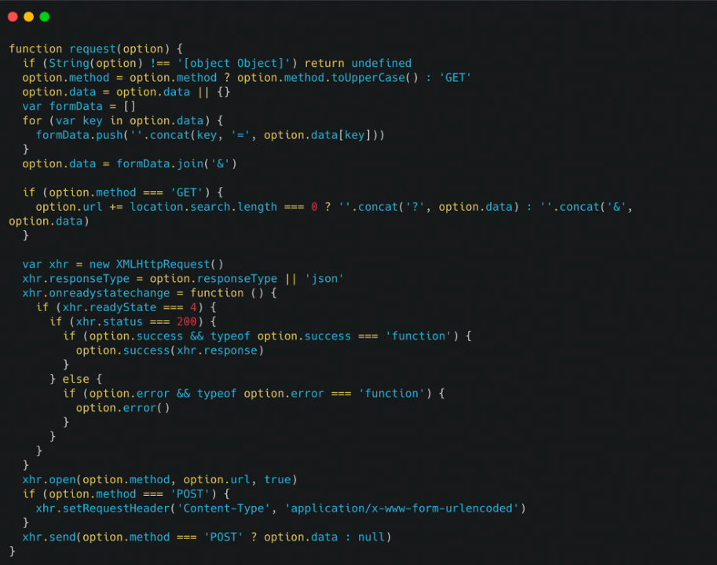

#### AJAX 之 Fetch

- XMLHttpRequest 的升级版
- 使用 Promise
- 模块化设计，response 对象、request 对象、header 对象
- 通过数据流处理对象，支持分块读取

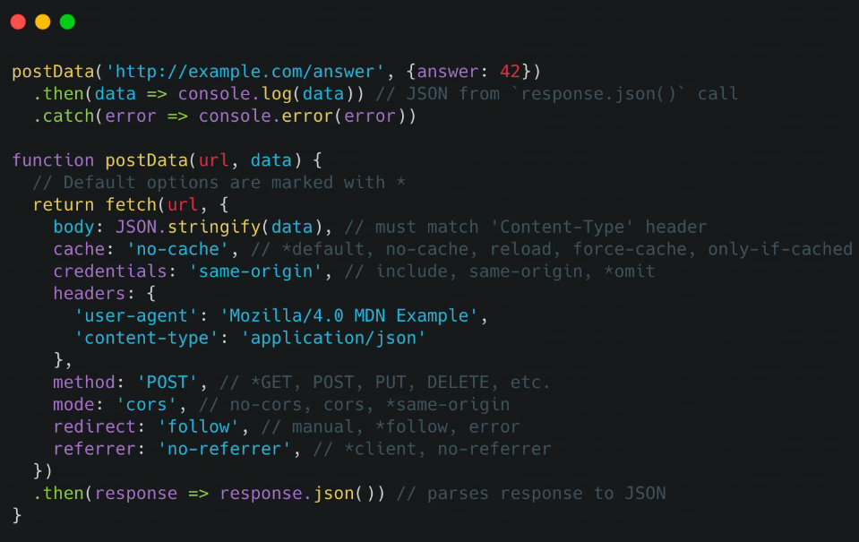

### node

标准库：HTTP/HTTPS

- 默认模块，无需安装其他依赖
- 功能有限，不是十分友好

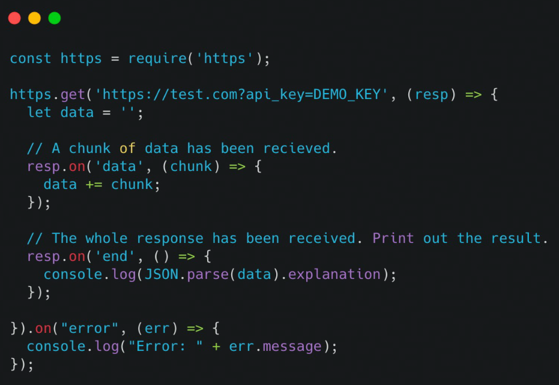

### 常用的请求库：[axios](https://axios-http.com/)

- 支持浏览器、nodejs 环境
- 有着丰富的拦截器
- [中文文档](https://axios-http.com/zh/docs/intro)

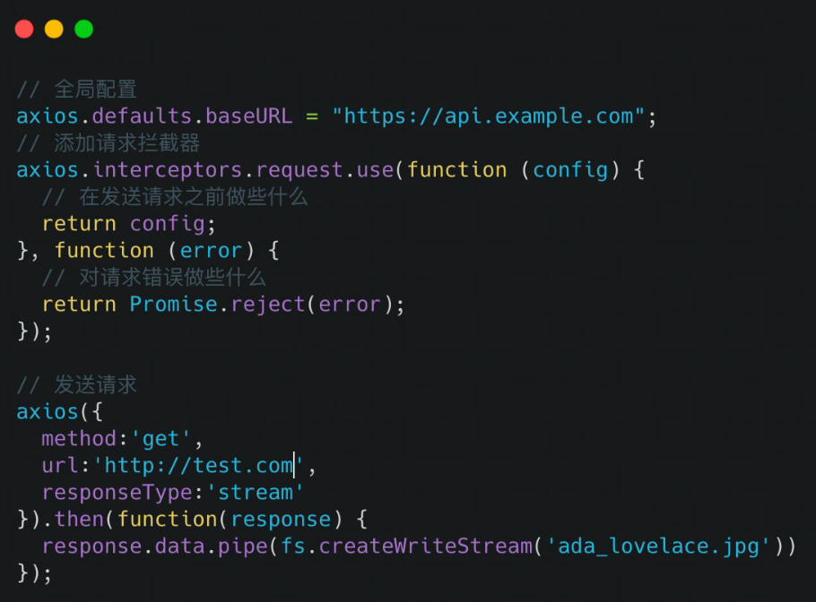

### 用户体验

**网络优化**

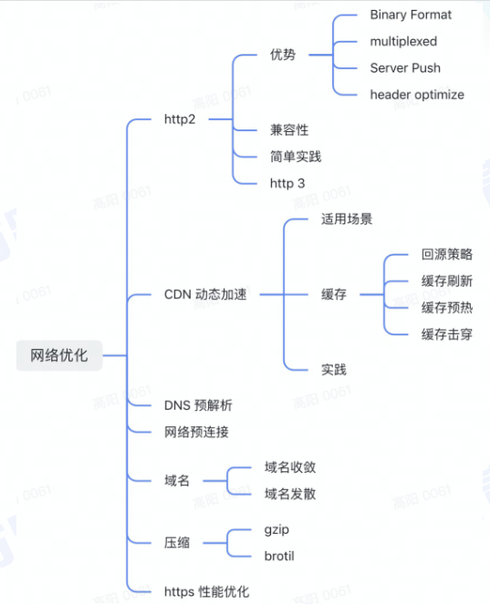

- link 标签声明，预解析、预连接

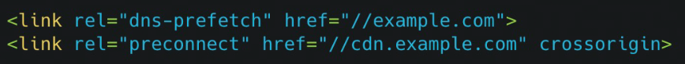

**稳定性**

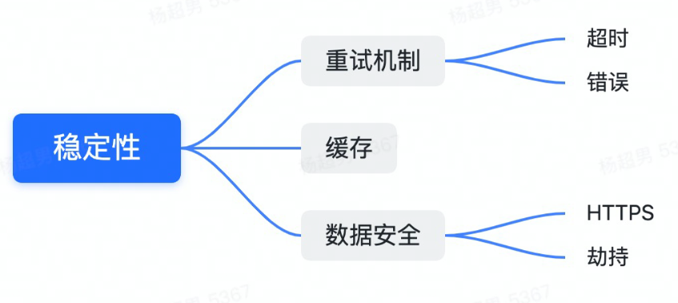

- 重试是保证隐定的有效手段，但要防止加剧恶劣情况
- 缓存合理使用， 作为最后一道防线

## 扩展：通信方式

### WebSocket

- 浏览器与服务器进行全双工通讯的网络技术
- 典型场景：实时性要求高，例如聊天室
- URL 使用 ws:// 或 wss:// 等开头

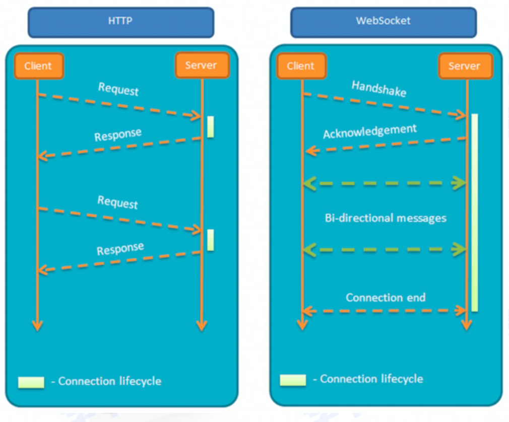

## QUIC: Quick UDP Internet Connection

- 0-RTT 建联(首次建联除外)。
- 类似 TCP 的可靠传输。
- 类似 TLS 的加密传输，支持完美前向安全。
- 用户空间的拥塞控制，最新的 BBR 算法。
- 支持 h2 的基于流的多路复用, 但没有 TCP 的 HOL 问题。
- 前向纠错 FEC。
- 类似 MPTCP 的 Connection migration。

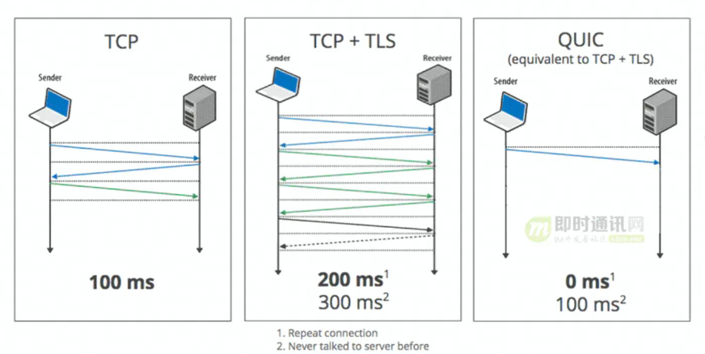

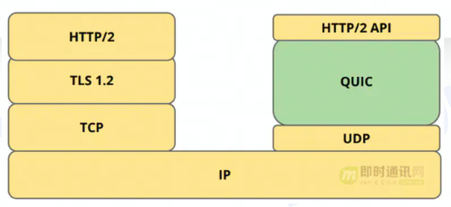
