## Node.js 的应用场景

### 前端工程化

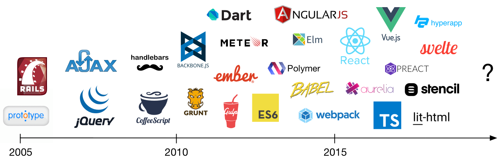

> 首先要提到的是前端工程化的场景。早期 `AJAX` `jQuery`比较流行的时候，我们直接在页面中引入所需要的 `lib` 即可。后续随着模块化、transpile，需求逐渐增多，对后端能力的需求也逐渐强烈。反过来说，也正是 Node.js 赋予了 JS 开发者在浏览器外运行代码的能力，加速催生了这些项目的出现。

- Bundle：webpack、vite、esbuild、parcel
- Uglify：uglify.js
- Transpile：babel.js、typescript
- 其他语言加入竞争：esbuild、parcel、prisma
- 现状：难以替代

### Web 服务端应用

> 第二个常见的场景是使用 Node.js 开发 Web 服务端应用，也就是后端服务

- 学习曲线平缓，开发效率较高
- 运行效率接近常见的编译语言
- 社区生态丰富以及工具链成熟（npm、V8 inspector）
- 与前端结合的场景会有优势（SSR）
- 现状：竞争激烈，Node.js 有自己独特的优势

### Electron 跨端桌面应用

> 这个不只是指 electron，还包括 nw.js 。。。这个场景在比较大的企业里面非常常见。

- 商业应用：vscode、slack、discord、zoom
- 大型公司内的效率工具
- 现状：大部分场景在选型时，都值得考虑

> Node.js 在字节
>
> - BFF 应用、SSR 应用，举例：[Modern.js](https://modernjs.dev/)
> - 服务端应用：今日头条、西瓜视频、懂车帝
> - Electron 应用：飞连、飞书
> - 每年新增 1000+ Node.js 应用

## Node.js 运行时结构

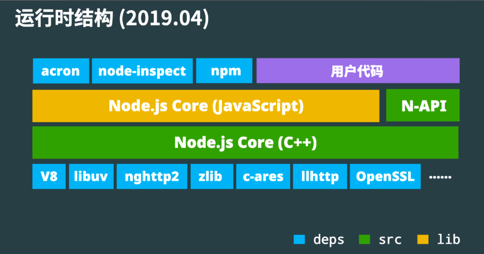

- V8：JavaScript runtime，诊断调试工具（inspector）
- libuv：eventloop（事件循环）、syscall（系统调用）
- 举例：用 node-fetch 发起请求时...

### 特点

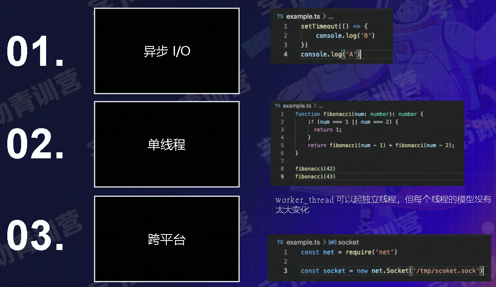

### 异步 I/O

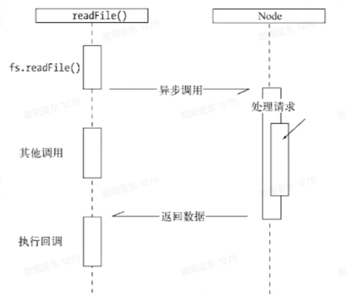

- 当 Node.js 在执行 I/O 操作时，会在响应返回后恢复操作，而不是阻塞线程并占用额外内存等待

### 单线程

- JS 单线程
  - 实际：JS 线程 + uv 线程池 + V8 任务线程池 + V8 inspector 线程
- 优点：不用考虑多线程状态同步问题，也就不需要锁；同时还能比较高效地利用系统资源
- 缺点：阻塞会产生更多负面影响
  - 解决办法：多进程或多线程

### 跨平台

- 跨平台：大部分功能、API
- Node.js 跨平台 + JS 无需编译环境（+Web 跨平台 + 诊断工具跨平台）= 开发成本低（大部分场景无需担心跨平台操作），整体学习成本低

## 编写 Http Server

### 安装 Node.js

- Mac、Linux 推荐使用 **nvm** 。多版本管理

- Windows 推荐使用 nvm4w 或是 [官方安装包](https://github.com/coreybutler/nvm-windows/releases)

- 安装慢、安装失败的情况，设置安装源

  ```sh
  NVM_NODEJS_ORG_MIRROR=https://npmmirror.com/mirrors/node nvm install 16
  ```

### Http Sever

> 使用原生模块去写，加强对模块的了解，如果出现问题时有助于排查。不要一上来就用一些框架，框架用于快速开发使用。

**Hello World**

```js
const http = require('http')

const port = 3000

const server = http.createServer((req, res) => {
  res.end('hello')
})

server.listen(port, () => {
  console.log(`listening on ${port}`)
})
```

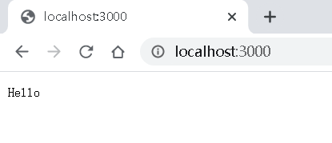

**JSON**

```js
const http = require('http')

const port = 3000

const server = http.createServer((req, res) => {
  const bufs = []
  req.on('data', (buf) => {
    bufs.push(buf)
  })
  req.on('end', () => {
    // bufs
    const buf = Buffer.concat(bufs).toString('utf8')
    let msg = 'hello'
    try {
      const ret = JSON.parse(buf)
      msg = ret.msg
    } catch (e) {
      // res.end('invald json')
    }
    const responseJSON = {
      msg: `receive ${msg}`,
    }
    res.setHeader('Content-Type', 'application/json')
    res.end(JSON.stringify(responseJSON))
  })
})

server.listen(port, () => {
  console.log(`listening on ${port}`)
})
```

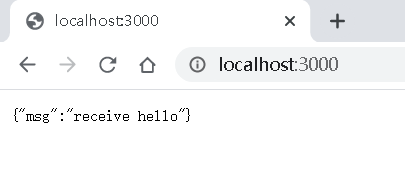

### Http Client

> 发请求给 Http Server

```js
const http = require('http')

const body = JSON.stringify({
  msg: 'Hello from my own client',
})

const req = http.request(
  'http://127.0.0.1:3000',
  {
    method: 'POST',
    header: {
      'Content-Type': 'application/json',
    },
  },
  (res) => {
    const bufs = []
    res.on('data', (buf) => {
      bufs.push(buf)
    })
    res.on('end', () => {
      const buf = Buffer.concat(bufs)
      const json = JSON.parse(buf)

      console.log('json.msg is:', json.msg)
    })
  }
)

req.end(body)
```

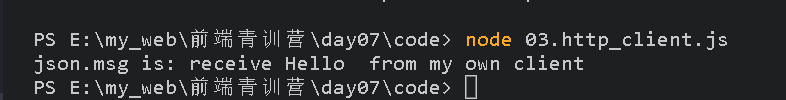

### Promisify

> 用 Promise + async + await 重写这两个例子，同步方式，使代码便于理解

技巧：将 callback 转换为 promise

```js
const http = require('http')

const port = 3000

const server = http.createServer(async (req, res) => {
  // receive body from client
  const msg = await new Promise((resolve, reject) => {
    const bufs = []
    req.on('data', (buf) => {
      bufs.push(buf)
    })
    req.on('error', (err) => {
      reject(err)
    })
    req.on('end', () => {
      // bufs
      const buf = Buffer.concat(bufs).toString('utf8')
      let msg = 'hello'
      try {
        const ret = JSON.parse(buf)
        msg = ret.msg
      } catch (e) {
        // res.end('invald json')
      }
      resolve(msg)
    })
  })

  // response
  const responseJSON = {
    msg: `receive ${msg}`,
  }
  res.setHeader('Content-Type', 'application/json')
  res.end(JSON.stringify(responseJSON))
})

server.listen(port, () => {
  console.log(`listening on ${port}`)
})
```

### 静态文件服务

> 编写一个简单的静态文件服务

```js
const http = require('http')
const fs = require('fs')
const path = require('path')
const url = require('url')

const folderPath = path.resolve(__dirname, './static')

const port = 3000

const server = http.createServer((req, res) => {
  // expect http://127.0.0.1:3000/index.html
  const info = url.parse(req.url)
  // static/index.html
  const filePath = path.resolve(folderPath, './' + info.path)
  console.log('filePath', filePath)
  // stream api...
  const fileStream = fs.createReadStream(filePath)
  fileStream.pipe(res)

  // res.setHeader()
})

server.listen(port, () => {
  console.log(`listening on ${port}`)
})
```

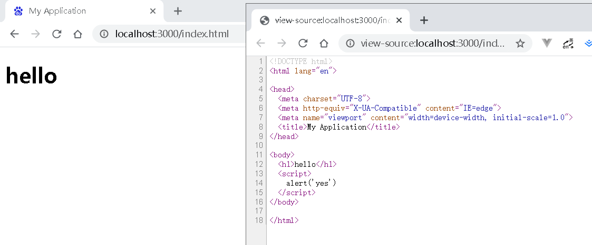

> 与高性能、可靠的服务相比还差什么
>
> 1. CDN：缓存 + 加速
> 2. 分布式储存，容灾
>
> 可使用外部服务：cloudflare、七牛云、阿里云、火山云...

### React SSR

- SSR（server side rendering）特点：
  - 相比传统 HTML 模板引擎：避免重复编写代码
  - 相比 SPA（single page application）：首屏渲染更快，搜索引擎优化（SEO） 友好
- 缺点
  - 通常 QPS 较低，前端代码编写时需要考虑服务端渲染情况。

```js
const React = require('react')
const ReactDOMServer = require('react-dom/server')
const http = require('http')

function App(props) {
  // jsx return (<div>hello</div>)
  return React.createElement('div', {}, props.children || 'hello')
}

const port = 3000

const server = http.createServer((req, res) => {
  res.end(`
  <!DOCTYPE html>
  <html>
    <head>
      <title>My Application</title>
    </head>
    <body>
      ${ReactDOMServer.renderToString(
        React.createElement(App, {}, 'my_content')
      )}
			<script>
      // init react application...
      </script>
    </body>
  </html>
  `)
})

server.listen(port, () => {
  console.log(`listening on ${port}`)
})
```

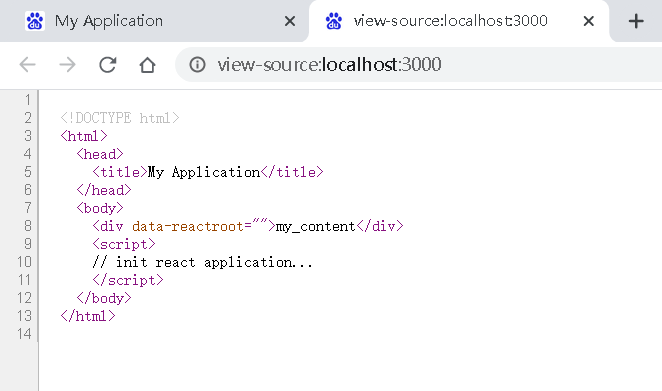

**SSR 难点**

1. 需要处理打包代码
2. 需要思考前端代码在服务端运行时的逻辑
3. 移除对服务端无意义的副作用，或重置环境

### Debug

> ~~一个说法：当你知道了利用一些工具去调试一门语言的时候，你才真正开始学会了这门语言。~~

- V8 inspector：开箱即用、特性丰富强大、与前端开发一致、跨平台

  - node --inspect
  - 打开默认页面 http://127.0.0.1:9229/json
  - 复制 Url 内容打开新窗口

  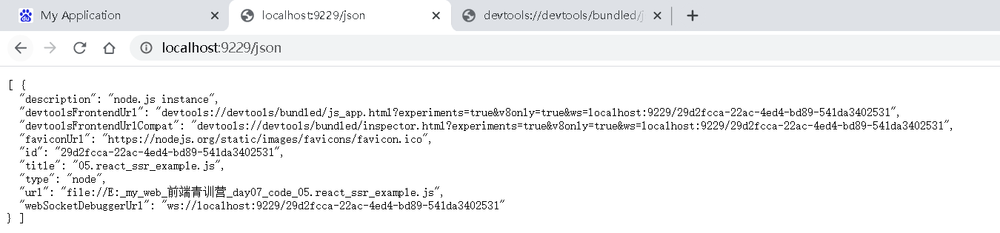

  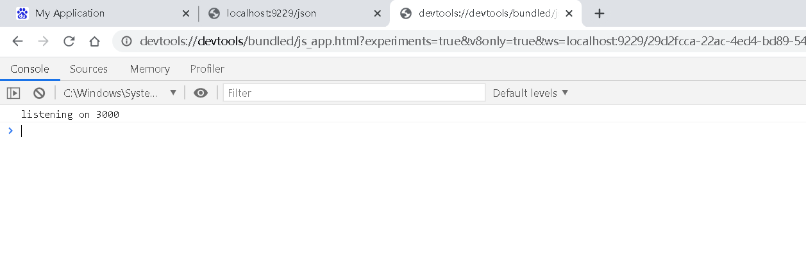

  - 进入 source 面板，按 Ctrl + P 选择打开文件，即可打断点调试

  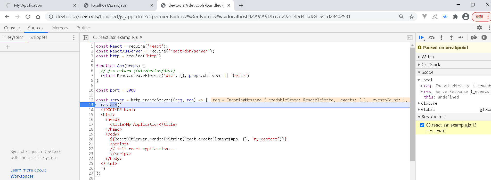

  - 实际上不会去打断点去阻塞整个应用，这是非常危险的
  - 一般在行号右键，选择 add Logpoint，插入 console.log 打印会比阻塞更方便快捷。

  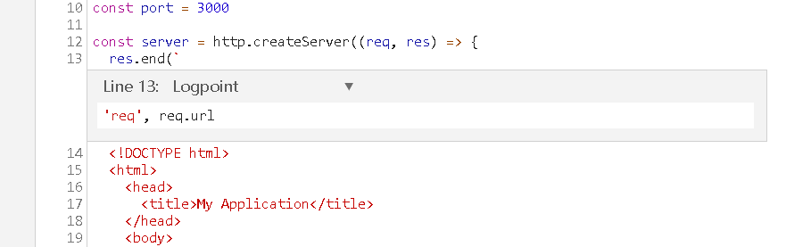

  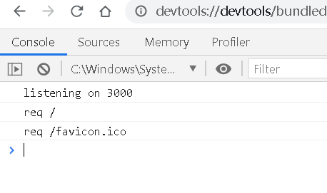

- 场景

  - 查看 console.log 内容
  - breakpoint
  - 高 CPU 、死循环：cpuprofile
  - 高内存占用：heapsnapshot
  - 性能分析

### 部署

- 部署要解决的问题
  - 守护进程：当进程退出时，重新拉起
  - 多进程：cluster 便捷的利用多进程
  - 记录进程状态，用于诊断
- 容器环境
  - 通常有健康检查的手段，只需要考虑多核 CPU 利用率的问题

## 扩展话题

### Node.js 贡献代码

- 快速了解 Node.js 代码
  - [Node.js core 贡献入门](https://github.com/joyeecheung/talks/blob/master/code_and_learn_2019_beijing/contributing-to-node-core.pdf)
- 好处
  - 从使用者的角色逐步理解底层细节，可以解决更复杂的问题;
  - 自我证明，有助于职业发展;
  - 解决社区问题，促进社区发展;
- 难点
  - 花时间

### 编译 Node.js

- 为什么要学习编译 Node.js
  - 认知：黑盒到白盒，发生问题时能有迹可循
  - 贡献代码的第一步
- 如何编译
  - 参考：[Maintaining the build files](https://github.com/nodejs/node/blob/master/doc/guides/maintaining-the-build-files.md)
  - ./configure && make install

### 诊断/追踪

- 诊断是一个低频、重要同时也相当有挑战的方向。是企业衡量自己能否依赖一门语言的重要参考。
- 技术咨询行业中的热门角色。
- 难点
  - 需要了解 Node.js 底层，需要了解操作系统以及各种工具
  - 需要经验

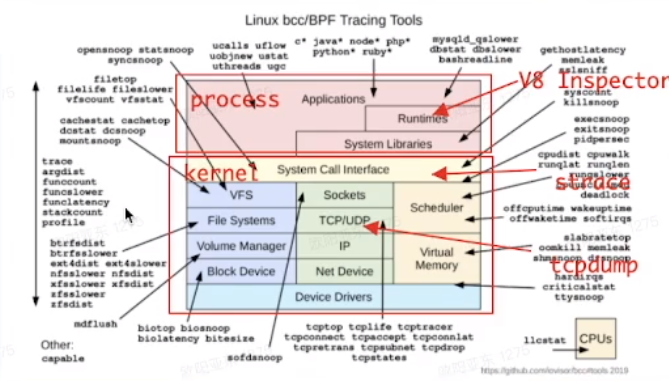

### WASM，NAPI

- Node.js（因为 v8）是执行 WASM 代码的天然容器，和浏览器 WASM 是同一运行时，同时 Node.js 支持 WASI
- NAPI 执行 C 接口的代码（C/C++/Rust），同时能保留原生代码的性能
- 不同编程语言间通信的一种方案。
