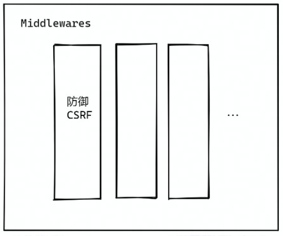

## Web 安全


> 安全问题”很常见“，会危害
>
> - 用户
> - 公司
> - 程序员（丢工作）

# 攻击篇

## Cross-Site Scripting（XSS）

跨站脚本攻击

```html
<script>
  alert('xss')
</script>
```

### XSS =

- 盲目信任用户提交的内容
- +

- string --> DOM
  - document.write
  - element.innerHTML = anyString
  - SSR(user_data) 伪代码

### XSS 的特点

1. 通常难以从 UI 上感知（暗地里执行脚本）
2. 窃取用户信息（cookie、token）
3. 绘制 UI （例如弹窗），诱骗用户点击/填写表单

### XSS demo

- 服务端代码


- 客户端可以直接提交脚本内容


### Stored XSS

存储型 XSS

- 恶意脚本被存在数据库中
- 访问页面 --> 读取数据 == 被攻击
- 危害最大，对全部用户可见


### Reflected XSS

反射型 XSS

- 不涉及数据库
- 从 URL 上攻击


### DOM-based XSS

基于 DOM 的 XSS

- 不需要服务器的参与
- 恶意攻击的发起 + 执行，全部在浏览器完成


**Reflected VS DOM-based**

- 完成脚本注入的地方不同


### Mutation-based XSS

- 利用了浏览器渲染 DOM 的特性（独特优化）
- 不同浏览器，会有区别（按浏览器进行攻击）

:sunglasses:：没人比我更懂浏览器:man::ok_hand:


## Cross-Site Request Forgery (CSRF)

跨站伪造请求

- 在用户不知情的前提下
- 利用用户权限（cookie）
- 构造指定的 HTTP 请求，窃取或修改用户敏感信息

1. 用户**没有**访问银行页面（点击未知来源的链接，访问了恶意页面）
2. 银行页面中的特定**接口被请求**
3. 请求 **执行成功**


### CSRF - GET

- 点击了链接，就发送了请求
- 访问页面，图片被加载，就发送了请求


### CSRF - POST

- 构造表单，发起 POST 请求


## Injection

### SQL Injection

SQL 注入攻击


1. 读取请求字段
2. 直接以字符串形式拼接 SQL 语句


- 恭喜你删库跑路成就达成


### Injection 不止 SQL

- CLI：命令行
- OS command：系统命令
- Server-Side Request Forgery(SSRF)：服务端伪造请求
  - 严格来说，SSRF 不是 Injection，但是原理类似

### Injection demo1 - 执行命令


### Injection demo2 - 读取 + 修改

- 如修改暴露的 nginx.conf 配置文件，设置代理，将流量转发到第三方


### SSRF demo

1. 请求**用户自定义**的 callback URL
2. web server 通常有内网的访问权限


## Denial of Service（DoS）

服务拒绝攻击

- 通过某种方式（构造特定请求），导致服务器资源被显著消耗，来不及响应更多请求，导致请求挤压，进而雪崩效应。

### ReDos

基于正则表达式的拒绝服务攻击

> 正则表达式的贪婪模式
>
> 


- 服务端写了正则匹配，传入容易发生回溯的字符串
- 响应时间大大延长
- 接口吞吐量下降，无法响应请求

### Distributed DoS（DDoS）

分布式 DoS 攻击

- 短时间内，来自大量僵尸设备的请求流量，服务器不能及时完成全部请求，导致请求堆积，进而雪崩效应，无法响应新请求。
- 通俗理解：不搞复杂的，请求量大就完事了

攻击特点

- 直接访问 IP
- 任意 API
- 消耗大量带宽（耗尽）

### DDoS demo：SYN Flood


- 攻击者利用 TCP 的三次握手，不会返回第三次的 ack，导致连接不能被释放，服务器很快达到最大连接数，从而服务器会拒绝新的连接。

### Logical DoS

- 耗时的同步操作
- 数据库写入
- SQL join
- 循环执行逻辑

## 基于传输层的攻击方式：

## 中间人攻击


1. 明文传输
2. 信息篡改不可知
3. 对方身份未验证

# 防御篇

## XSS 的防御

- 永远不要信任用户的提交内容
  - 不用将用户提交的内容之间转换成 DOM


### 防御工具

前端

- 主流框架（Vue、React 等）默认防御 XSS
- google-closure-library

服务端（Node）

- DOMPurify

### 用户需求，必须动态生成 DOM

1. String --> DOM ：必须对 string 进行转义

2. 上传 svg 文件：需要进行扫描，去除 script

   ```svg
   <svg>
   	<script>alert("xss");</script>
   </svg>
   ```

3. 自定义跳转链接：要做好过滤

   ```html
   <a href="javascript:alert("xss")"></a>
   ```

4. 自定义样式：非常巧妙，使用 css 发出请求

   

5. Blob 动态生成 script

   

## CSRF 的防御

> Same-origin Policy：浏览器的同源策略
>
> - 协议、域名、端口都要一样才是同源，否则是跨域，要看服务器配置是否要阻塞 HTTP 请求
>
> Content Security Policy（CSP）：内容安全策略
>
> - 那些源（域名）被认为是安全的。
>
> - 来自安全源的脚本可执行，否则直接抛出错误
>
> - 对 eval + inline script 说:no_entry_sign:
>
> - 服务器响应头
>
>   
>
> - 浏览器 meta
>
>   

### origin + referer


### token

- if（请求来自合法页面）
- then（服务器接收页面请求）
- then（服务器可以标识）


1. token 和用户绑定：攻击者也可以是用户 === 可以获取自己的 token
2. token 要有过期时间：前向保密

### iframe 攻击


- 设置 button 本身的点击事件没有，点击会穿透到下一层，iframe 中页面发出请求是同源的。[demo](https://codesandbox.io/s/boring-ptolemy-4rjy6?file=/src/App.js)
- 防御方法：设置响应头部加上 `X-Frame-Options：DENY/SAMEORIGIN`，deny 拒绝所有，sameorigin 同源下的 iframe 才可以

### CSRF anti-pattern

**GET !== GET + POST**

> 为了省力将多个逻辑放到一个接口，非常危险，攻击者一石二鸟。


### 避免用户信息被携带：SameSite Cookie


从根源上解决了 CSRF，限制了 cookie 的域名


- 但是，依赖 cookie 的第三方服务怎么办
  - 内嵌一个 X 站播放器，识别不了用户登录态，发不了弹幕
- 解决方案：`Set-Cookie: SameSite=None; Secure;`

### SameSite VS CORS

两者区别：


### SameSite demo

- 第一方 [FirstPartCookie](https://csb-7kweu-liuyuchenzh.vercel.app/)：字段正常携带

  

- 设置了 SameSite=None 的第三方 [3PartCookie](https://csb-mnlu0-liuyuchenzh.vercel.app/)：域名不同，lax 字段不会被携带

  


### 防御 CSRF 的正确姿势

- case by case 防御？:no_good::
- 从 Node 角度：使用中间件专门生成防御 CRFS 的策略



## Injection 的防御

### SQL Injection

- 找到项目中 查询 SQL 的地方

- 使用 `prepared statement`

  

### Injection beyond SQL

- 最小权限原则
  - :no_entry: **sudu** || **root**
- 建立允许白名单 + 过滤
  - :no_entry: **rm**
- 对 **URL** 类型参数进行协议、域名、ip 等限制
  - :no_entry: **访问内网**

## DoS 的防御

### Regex Dos

- **code review（:no_entry: /(ab\*)+/）**
- 代码扫描 + 正则性能测试
- 拒绝使用用户提供的正则

### DDoS


### Logical DoS


## 传输层：防御中间人

### 使用 HTTPS


### HTTPS 的一些特性

- 可靠性：加密，:no_entry: 明文
- 完整性：MAC 验证，:no_entry: 篡改
- 不可抵赖性：数字签名，:+1: 身份

**加密**：此处为 TLS 1.2


**完整性**


> 数字签名
>
> 签名执行者使用私钥加密，别人使用公钥解密，匹配私钥的话解密成功
>
> - privateKey（自己藏好）
> - publicKey（公开可见）
>
> 

**不可抵赖：数字签名**


- 浏览器内置许多 CA 的 publicKey

当签名算法不够健壮时：


> 目前 CA 的算法还是十分健壮的，不太可能被单一的攻击者暴力破解，可以放心使用。

### HTTP Strict-Transport-Security（HSTS）

> 先有一次 HTTPS 请求，之后的请求都会将 HTTP 升级成 HTTPS


### Subresource Integrity（SRI）

静态资源被劫持篡改


解决：对比 hash

#### SRI demo

标签 hash （原始内容 hash） VS 实际内容 hash


## 补充：Feature Policy/Permission Policy

一个源（页面下）可以使用哪些功能

- camera：调用相机
- microphone：调用麦克风
- autoplay：自动播放
- ...

> 万一页面被攻击了，也可以限制页面不能调用一些敏感的权限，iframe 里面的 allow 属性也可以实现这样的限制功能

```html
<ifarme allow="xxx"></ifarme>
```

## 总结

- 安全无小事
- 使用的依赖（npm package，甚至是 Node.js ），可能成为最薄弱的一环
  - [left-pad 事件](https://blog.npmjs.org/post/141577284765/kik-left-pad-and-npm.html)
  - [eslint-scope 事件](https://eslint.org/blog/2018/07/postmortem-for-malicious-package-publishes)
  - [event-stream 事件](https://blog.npmjs.org/post/180565383195/details-about-the-event-stream-incident)
  - :warning: `npm install`除了带了黑洞，还可以带来漏洞
- 保持学习的心态。攻击手段不断的在升级，我们要不断学习最新的 web 安全知识，来保证我们应用的安全。
