## 什么是 Webpack

前端项目由 **资源** 构成

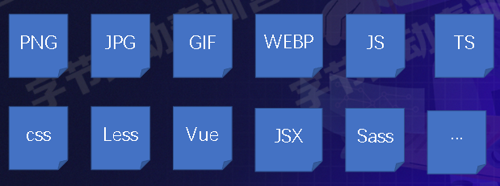

当然可以手动管理这些资源：

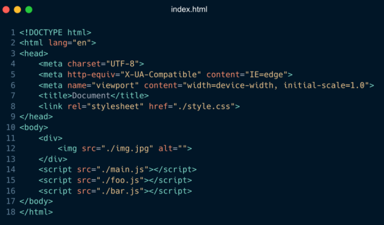

但是

- 依赖手工，比如有 50 个 JS 文件，操作过程繁琐
- 当代码文件之间有依赖的时候，就得严格按依赖顺序书写
- 开发与生产环境一致，难以接入 TS 或 JS 新特性
- 比较难接入 Less、Sass 等工具
- JS、图片、CSS 资源管理模型不一致

> 所以出现了很多的工程化的工具，某种程度上，正是这些工具的出现，才有了 **前端工程** 这一概念

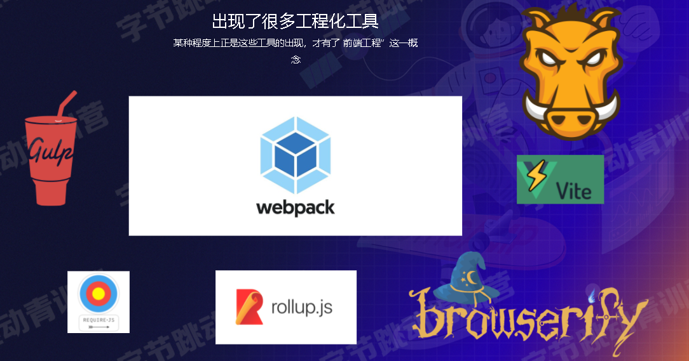

**Webpack 本质上是一种前端资源编译、打包工具**

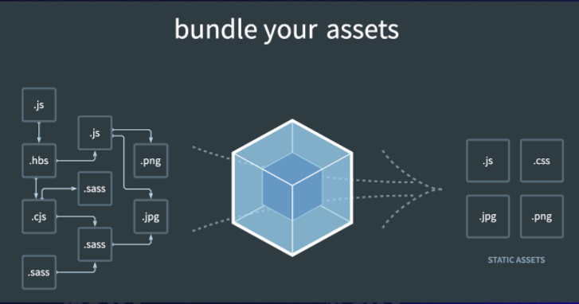

- 多份资源文件打包成—个 Bundle
- 支持 Babel、Eslint、TS、CoffeScript、Less、Sass 支持模块化处理 css、图片等资源文件
- 支持 HMR ＋开发服务器
- 支持持续监听、持续构建
- 支持代码分离
- 支持 Tree-shaking
- 支持 Sourcemap
- ...

## 体验 Webpack

> 快速上手，在 src 目录下创建 index.js 文件

1. 安装 `npm i -D webpack webpack-cli`

2. 编辑配置文件 `webpack.config.js`

   ```js
   const path = require('path')

   module.exports = {
     entry: './src/index',
     output: {
       filename: 'bundle.js',
       path: path.join(__dirname, './dist'),
     },
   }
   ```

3. 执行编译命令 `npx webpack`

4. 在 dist 目录下生成了 bundle.js

## 核心流程

**极度简化版**

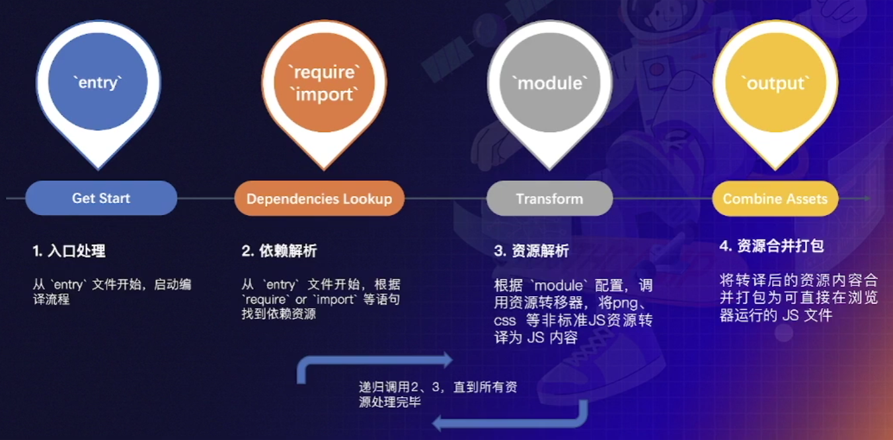

## 模块化 + 一致性

- 多个文件资源合并成一个，减少 http 请求数
- 支持模块化开发
- 支持高级 JS 特性
- 支持 Typescript、CoffeScript 方言
- 统一图片、CSS、字体等其它资源的处理模型
- Etc...

## 使用 Webpack

关于 Webpack 的使用方法，基本都围绕 **配置** 展开，而这些配置大致可划分为两类：

- 流程类：作用于流程中 某个 or 若干个 环节，直接影响打包效果的配置项
- 工具类：主流程之外，提供更多工程化能力的配置项

### 流程类配置项

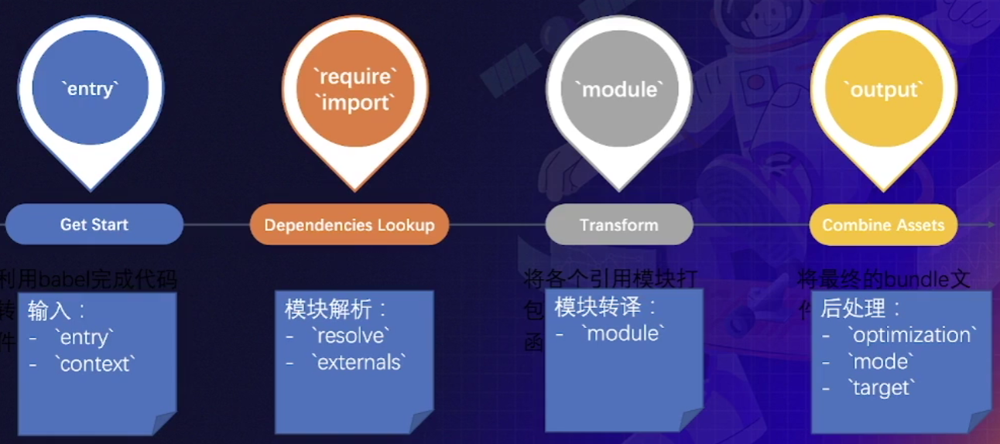

### 配置总览

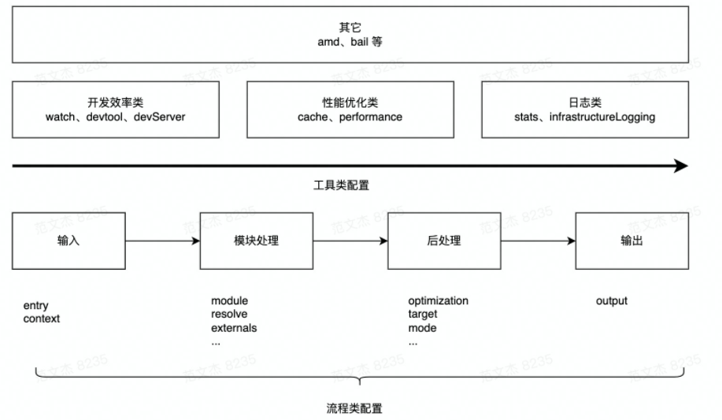

使用频率：

- `entry/output`
- `module/plugins`
- `mode`
- `watch/devServer/devtool`

[配置 | webpack 中文文档 (docschina.org)](https://webpack.docschina.org/configuration/)

### 使用 Webpack

- 文件结构

  ```
  .
  |--src
  |  |--index.js
  |--webpack.config.js
  ```

1. 声明入口 `entry`

```js
module.exports = {
  entry: './src/index',
}
```

2. 声明产物出口 `output`

```js
const path = require('path')

module.exports = {
  entry: './src/index',
  output: {
    filename: 'bundle.js',
    path: path.join(__dirname, './dist'),
  },
}
```

### 处理 CSS

1. 安装 Loader

```sh
npm i -D css-loader style-loader
```

2. 添加 module 处理 css 文件

```js
const path = require('path')

module.exports = {
  entry: './src/index', // 入口文件
  mode: 'development',
  devtool: false,
  // 输出文件与路径
  output: {
    filename: 'bundle.js',
    path: path.join(__dirname, './dist'),
  },
  module: {
    rules: [
      {
        test: /\.css$/,
        use: ['style-loader', 'css-loader'],
      },
    ],
  },
}
```

[css-loader](https://github.com/webpack-contrib/css-loader)

[style-loader | webpack](https://webpack.js.org/loaders/style-loader/)

[Webpack 原理系列七：如何编写 loader (qq.com)](https://mp.weixin.qq.com/s/TPWcB4MfVrTgFtVxsShNFA)

### 接入 Babel

处理 CS6+ 语法

1. 安装依赖

```sh
npm i -D @babel/core @babel/preset-env babel-loader
```

2. 添加 module 配置

```js
const path = require('path')

module.exports = {
  entry: './src/index', // 入口文件
  mode: 'development',
  devtool: false,
  // 输出文件与路径
  output: {
    filename: 'bundle.js',
    path: path.join(__dirname, './dist'),
  },
  module: {
    rules: [
      {
        test: /\.js$/,
        use: [
          {
            loader: 'babel-loader',
            options: {
              presets: [['@babel/preset-env']],
            },
          },
        ],
      },
    ],
  },
}
```

[babel-loader | webpack](https://webpack.js.org/loaders/babel-loader/)

[Babel · The compiler for next generation JavaScript (babeljs.io)](https://babeljs.io/)

[@babel/preset-env](https://babeljs.io/docs/en/babel-preset-env)

[@babel/preset-react ](https://babeljs.io/docs/en/babel-preset-react)：处理 JSX 语法

[@babel/preset-typescript](https://babeljs.io/docs/en/babel-preset-typescript)：将 TypeScript 代码转换成 JavaScript 代码

### 生成 HTML 插件

1. 安装依赖

   ```sh
   npm i -D html-webpack-plugin
   ```

2. 添加 plugins 配置

```js
const path = require('path')
const HtmlWebpackPlugin = require('html-webpack-plugin')

module.exports = {
  entry: './src/index', // 入口文件
  mode: 'development',
  devtool: false,
  // 输出文件与路径
  output: {
    filename: 'bundle.js',
    path: path.join(__dirname, './dist'),
  },
  plugins: [new HtmlWebpackPlugin()],
}
```

3. 将会生成 index.html 文件

[HtmlWebpackPlugin | webpack](https://webpack.js.org/plugins/html-webpack-plugin/)

### 工具线


- HMR
- Tree-Shaking
- 缓存
- Sourcemap
- 性能监控
- 日志
- 代码压缩
- 分包
- ...

### HMR

**Hot Module Replacement：模块热替换**：构建开发服务器，实时查看效果

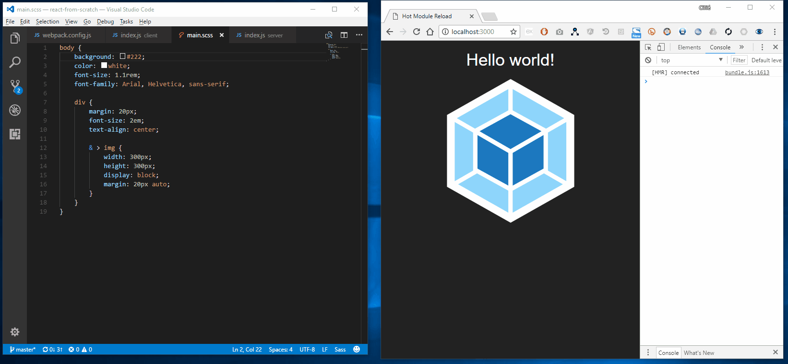

1. 安装依赖

   ```sh
   npm i -D webpack-dev-server
   ```

2. 开启 HMR

   ```js
   module.exports = {
     // ...
     devServer: {
       hot: true, // 开启
       port: 9999,
       open: true,
     },
     plugins: [new HtmlWebpackPlugin()],
     watch: true, // 持续监听文件的变化
   }
   ```

3. 启动服务 `npx webpack serve`

4. 更改代码即可实时更新

### Tree-Shaking

**树摇：用于删除 Dead Code**

Dead Code

- 代码没有被用到，不可到达
- 代码的执行结果不会被用到
- 代码只读不写
- ...
- 模块导出了，但是未被其他模块使用

对工具库，如 `Lodash` 有奇效

1. 开启 Tree-Shaking

```js
module.exports = {
  // ...
  mode: 'production', //
  optimization: {
    usedExports: true,
  },
}
```

## 进阶篇：理解 Loader

> webpack 只认识 JS
>
> 为了处理非标准 JS 资源，设计出资源翻译模块—— Loader
>
> 用于将资源翻译为标准 JS

链式调用：前面的输出作为后面的输入

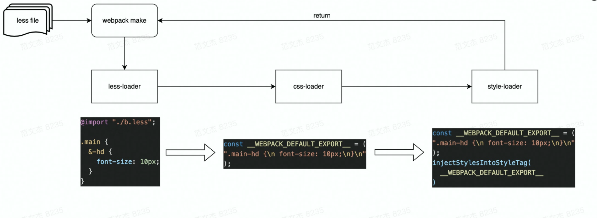

- less-loader：实现 less => css 的转换
- css-loader：将 CSS 包装成类似 module.exports = "B{css]"的内容，包装后的内容符合 JavaScript 语法
- style-loader：将 css 模块包进 require 语句，并在运行时调用 injectStyle 等函数将内容注入到页面的 style 标签

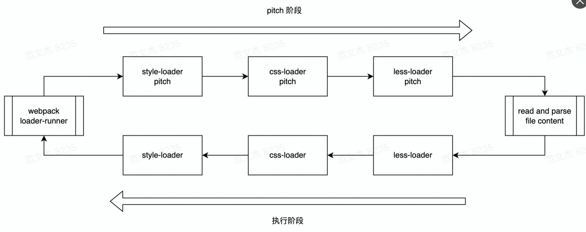

特点：

- 链式执行
- 支持异步执行
- 分 normal、pitch 两种模式
- [Webpack 原理系列七：如何编写 loader (qq.com)](https://mp.weixin.qq.com/s/TPWcB4MfVrTgFtVxsShNFA)

### 自定义编写 Loader

loader 是一个函数，接收源码，处理后，返回源码，新建 `loader.js`

```js
module.exports = function(source) {
  // 打印下源码，然后返回源码
  console.log(source)
  return source
}
```

配置

```js
const path = require('path')

module.exports = {
  entry: './src/index',
  mode: 'development',
  devtool: false,
  output: {
    filename: 'bundle.js',
    path: path.join(__dirname, './dist'),
  },
  module: {
    rules: [
      {
        test: /\.js$/,
        use: path.join(__dirname, './loader.js'),
      },
    ],
  },
}
```

站在使用的角度上，建议掌握常见 Loader 的功能、配置方法

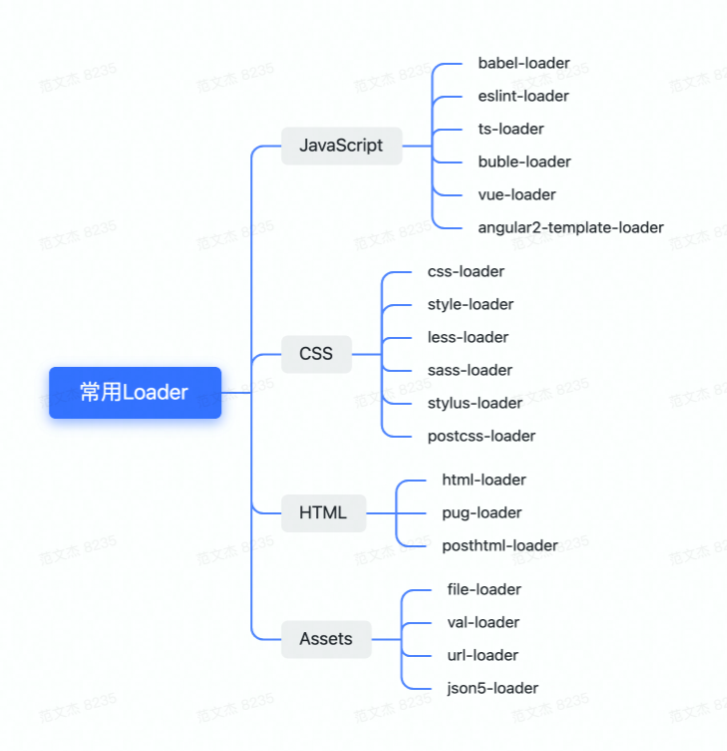

## 进阶篇：理解插件 plugin

为什么要设计插件？

> - 新人需要了解整个流程细节，上手成本高
>
> - 功能迭代成本高，牵一发动全身
>
> - 功能僵化作为开源项目而言缺乏成长性
>
> - 。。。
>
>   心智成本高 => 可维护性低 => 生命力弱

插件架构精髓：对扩展开放，对修改封闭

甚至，Webpack 本身很多功能也是基于插件实现的

插件用起来简单，只需要 new 实例，写起来...

```js
class SomePlugin {
  apply(compiler) {
    compiler.hooks.thisCompilation.tap('SomePlugin', (compilation) => {})
  }
}
```

### 钩子的核心信息

1. 时机：编译过程的特定节点，Webpack 会以钩子形式通知插件此刻正在发生什么事情;
2. 上下文：通过 tapable 提供的回调机制，以参数方式传递上下文信息;
3. 交互：在上下文参数对象中附带了很多存在 side effect 的交互接口，插件可以通过这些接口改变
4. 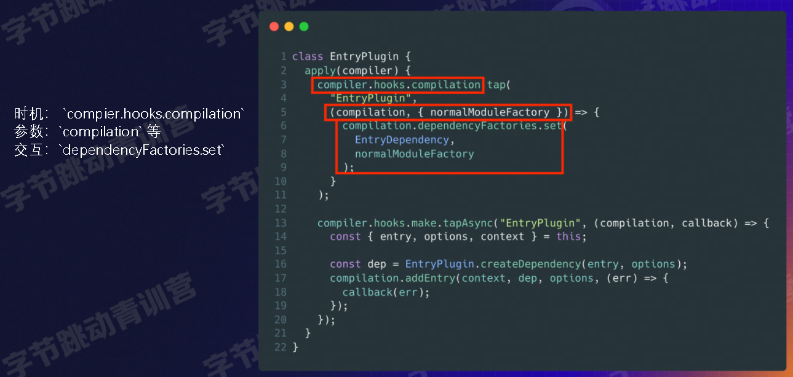

一些关键钩子

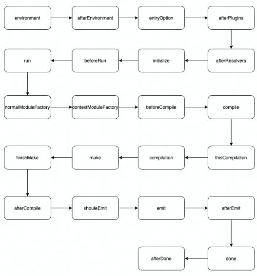

参考

[[源码解读\] Webpack 插件架构深度讲解 ](https://mp.weixin.qq.com/s/tXkGx6Ckt9ucT2o8tNM-8w)

[[万字总结\] 一文吃透 Webpack 核心原理 ](https://mp.weixin.qq.com/s/SbJNbSVzSPSKBe2YStn2Zw)

## [Webpack 5 知识体系 - GitMind](https://gitmind.cn/app/doc/fac1c196e29b8f9052239f16cff7d4c7)

## 学习方法

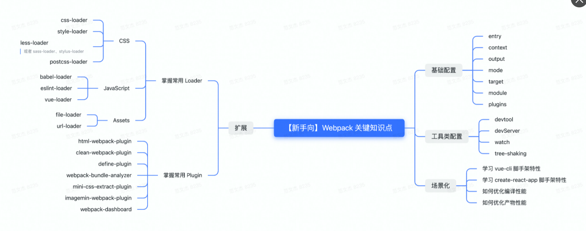

1. 入门级：

   理解打包流程
   熟练掌握常用配置项、Loader、插件的使用方法

   能够灵活搭建集成 Vue、React、Babel、Eslint、Less、Sass、图片处理等工具的 Webpack 环境
   掌握常见脚手架工具的用法，例如: Vue-cli、 create-react-app、@angular/cli

2. 进阶：

   理解 Loader ， Plugin 机制

   能够自行开发 webpack 组件
   理解常见性能优化手段,并能用于解决实际问题

   理解前端工程化概念与生态现状

3. 大师级

   阅读源码，理解 Webpack 编译、打包原理，甚至能够参与共建
