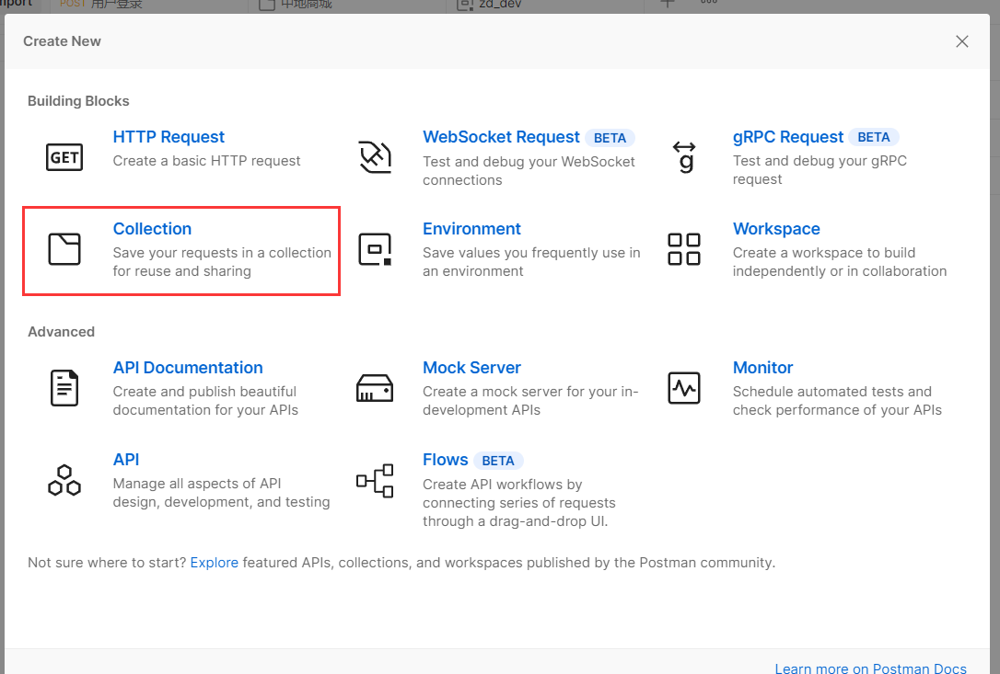
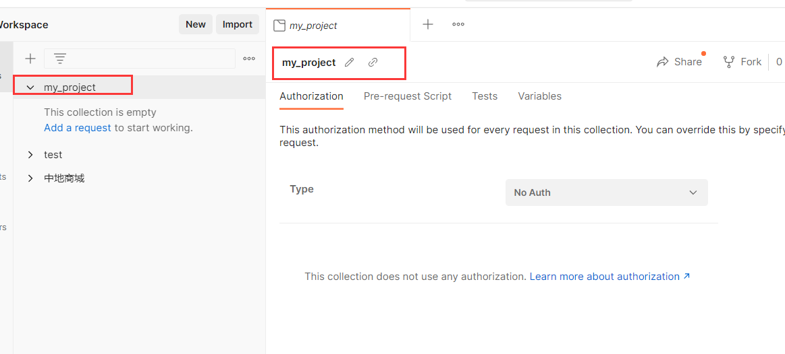
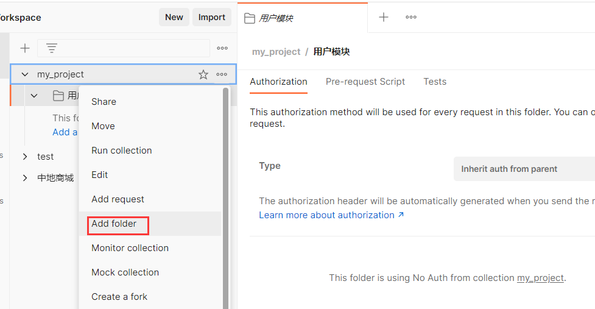
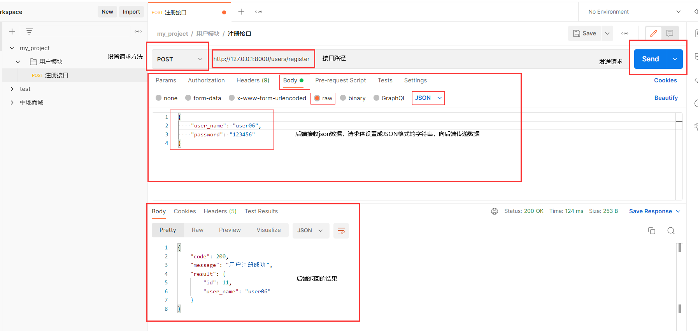
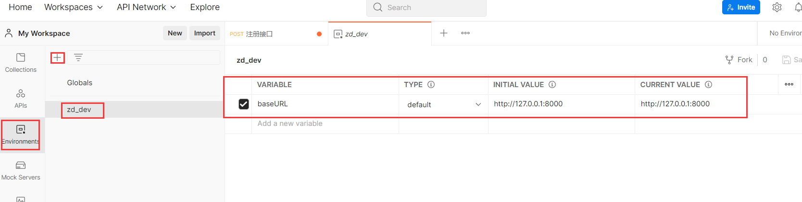
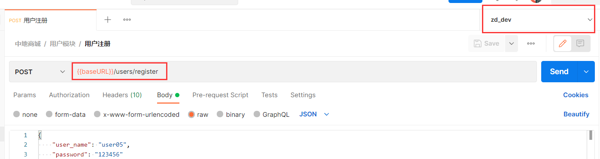
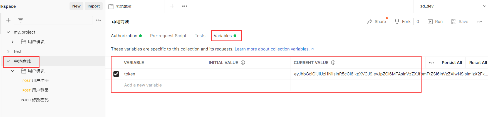
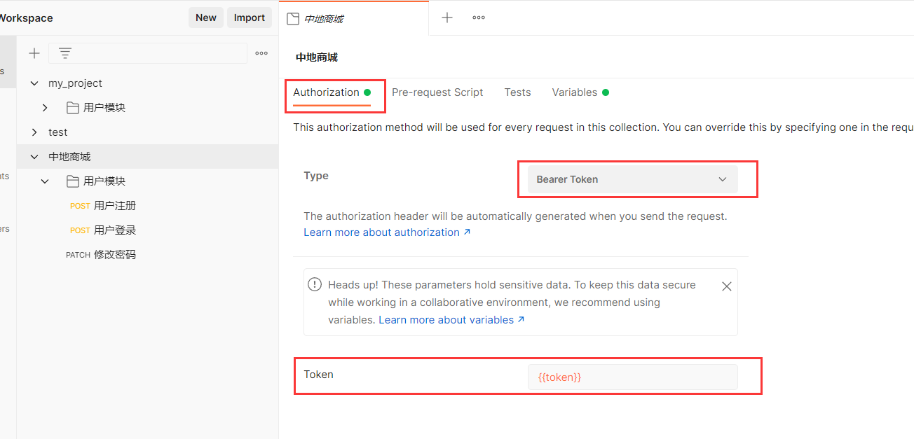
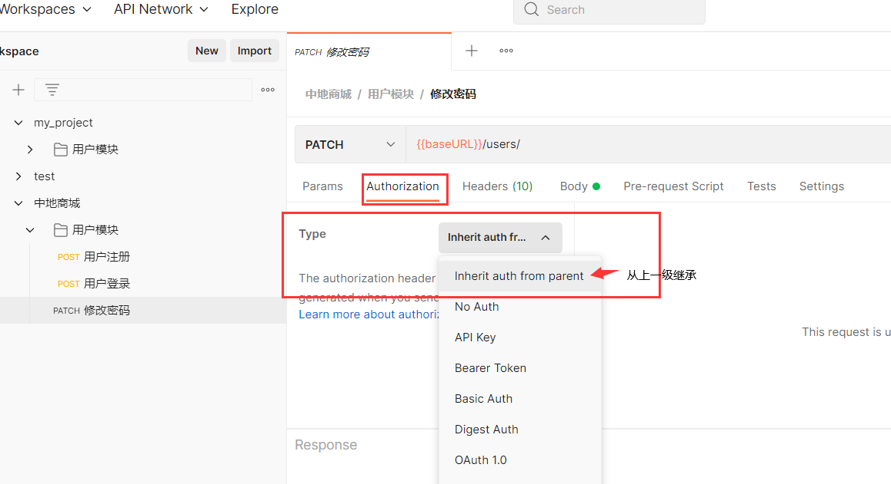
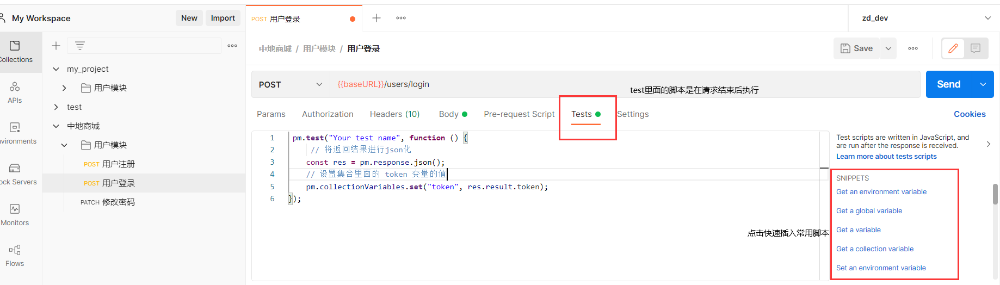

## 1. 简单使用

file > new 新建 collection ：接口集合，命名为项目的名字





右键集合名字 Add folder 添加一个文件夹，文件夹按模块名字分类



右键文件夹，Add request 新增一个请求接口，命名一下便于区分

发起post请求



## 2. 环境变量的使用

每次都要带上接口服务器地址，如上面的http://127.0.0.1，十分的麻烦。可以定义一个环境，然后引用里面变量的值即可



下拉选择对应的环境，然后使用 `{{ 变量名 }}` 来引入变量值



如果接口地址发生改变，这样只需要在外面环境里面更改对应的变量值就行。

开发环境 和 项目上线后的环境，直接切换即可，不需要去改动每个接口。

## 3. 统一添加 authorization

一般项目里面使用 JWT（json web token），做用户登录态的保持，和验证。登录成功后，后端会返回一个 token 字符串，之后涉及到的接口的请求需要在请求头 request header 里面 添加 authorization 字段，值是服务器返回的 token 值。用于验证。

在集合里面新建一个 变量 token



然后统一在集合里面 设置添加 authorization



接口的authorization字段默认从上一级继承，这样每次请求时都会携带上了。



但是这样，每次登录后还要手动复制token的值，然后去修改变量，十分的麻烦

## 4. 脚本的使用

在登录 login 请求的test里面编写脚本，test脚本是会在请求结束后执行。在脚本里面设置更新环境变量



每次登录请求结束就会重新设置token的值为最新返回的值。

```js
 pm.test("Your test name", function () {
     // 将返回结果进行json化
    const res = pm.response.json();
    // 设置集合里面的 token 变量的值
    pm.collectionVariables.set("token", res.result.token);
});
```

