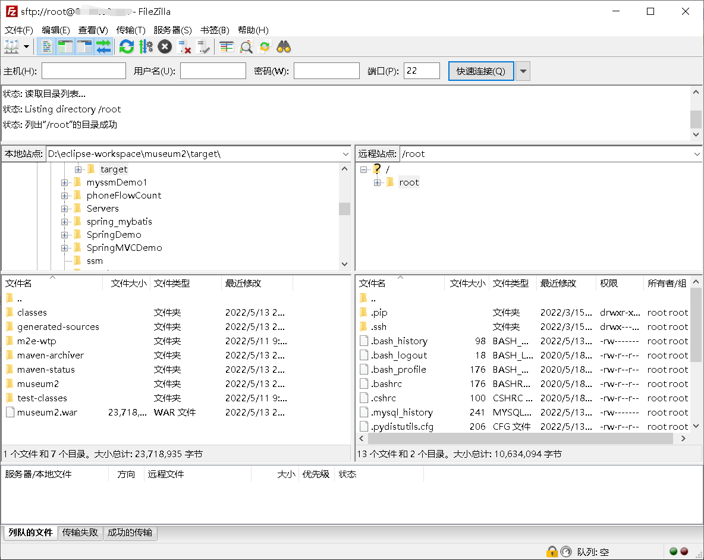

## 第一步跟着官网教程在服务器上搭建 javaweb 环境

### 1.登录你的云服务器

1. 更改你的实例密码

- 登录[管理控制台](https://ecs.console.aliyun.com/#/home),找到目标实例，然后在操作列选择【更多】> 【密码/密钥】 > 【重置实例密码】，然后在弹出的对话框设置 ECS 实例的登录密码。

2. 在你的电脑上打开终端，使用 ssh 连接实例。

- 输入：`ssh root@你的公网ip`，远程连接
- 再输入 yes
- 然后输入你的实例密码，即可登录

### 2.安装 java JDK

1. 执行以下命令，使用 yum 安装 JDK1.8。

- `yum -y install java-1.8.0-openjdk*`

2. 安装成功后，在输入 `java -version`，看到成功打印了 java 的版本，即为安装成功。（不需要配置环境变量，这非常舒服哈哈哈）

### 3.安装 mysql 数据库

1. 执行以下命令，下载并安装 MySQL 官方的 Yum Repository。

- `wget http://dev.mysql.com/get/mysql57-community-release-el7-10.noarch.rpm`
- `yum -y install mysql57-community-release-el7-10.noarch.rpm`
- `yum -y install mysql-community-server`
- 在执行最后一条命令的时候，我的服务器报错了，无法安装，错误信息如下
- `GPG key at file:///etc/pki/rpm-gpg/RPM-GPG-KEY-mysql (0x5072E1F5) is already installed The GPG keys ....`
- 网上查了资料，原因是 Mysql 的 GPG 升级了，需要重新获取。执行如下命令，即可
- `rpm --import https://repo.mysql.com/RPM-GPG-KEY-mysql-2022`
- 然后再重新执行`yum -y install mysql-community-server`，即可安装成功。

2. 启动 MySQL 数据库：`systemctl start mysqld.service`
3. 查看 MySQL 初始密码：`grep "password" /var/log/mysqld.log`
4. 登录 mysql 数据库：`mysql -uroot -p`，回车，输入刚才查看的初始密码，登陆成功后，命令提示符为`mysql>`，(注意之后输入命令，每一条命令必须以分号;结束)。
5. 执行以下命令，修改 MySQL 默认密码为 12345678。

```shell
set global validate_password_policy=0;  #修改密码安全策略为低（只校验密码长度，至少8位）。
ALTER USER 'root'@'localhost' IDENTIFIED BY '12345678';
```

6. 授予 root 用户远程管理权限：`GRANT ALL PRIVILEGES ON *.* TO 'root'@'%' IDENTIFIED BY '12345678';`
7. 输入 `exit` 即可退出数据库。

### 4.安装 Tomcat

1. 下载 Tomcat 压缩包：

- `wget https://mirrors.tuna.tsinghua.edu.cn/apache/tomcat/tomcat-8/v8.5.69/bin/apache-tomcat-8.5.69.tar.gz`
- 执行了之后发现 404 not found 错误，资源找不到，然后进去清华镜像站查看现在的是 8.5.78 版本，所有替换之后重新下载
- `wget https://mirrors.tuna.tsinghua.edu.cn/apache/tomcat/tomcat-8/v8.5.78/bin/apache-tomcat-8.5.78.tar.gz`

2. 解压下载下来的压缩包：`tar -zxvf apache-tomcat-8.5.78.tar.gz`
3. 修改 Tomcat 名字，并移动到新目录下。`mv apache-tomcat-8.5.78 /usr/local/Tomcat8.5`
4. 为 Tomcat 授权：`chmod +x /usr/local/Tomcat8.5/bin/*.sh`
5. 修改 Tomcat 默认端口号为 80。（Tomcat 默认端口号为 8080。改为 80 后即可不加端口号访问，因为 http 协议的默认端口是 80，可以省略）

- `sed -i 's/Connector port="8080"/Connector port="80"/' /usr/local/Tomcat8.5/conf/server.xml`
- 也可以使用 vim 手动修改 server.xml 里面的端口号。

6. 启动 Tomcat：`/usr/local/Tomcat8.5/bin/./startup.sh`
7. 浏览器输入:`http://公网ip`即可看到 Tomcat 的欢迎页
8. 停止服务：`/usr/local/Tomcat8.5/bin/./shutdown.sh`

   _或者简单粗暴，直接清除 Tomcat 运行进程_

- `ps -ef|grep tomcat8` # 查看进程
- `kill -9 888` # 888 是进程号，这里自行匹配

### 然后 Javaweb 开发环境就已经搭建好了。

## 将本地的 maven 项目部署到 Tomcat 中

- eclipse 里面，右键项目，选择 run as ---》maven install，即会在项目的 target 目录中生成项目名称.war 文件，将这个文件丢到 Tomcat 安装目录下的 webapps 目录下即部署成功。
- 将文件拷贝到 Tomcat/bin/webapps 目录下
- `mv museum2.war /usr/local/Tomcat8.5/webapps`
- 这里使用了 `FileZilla` 软件通过 sftp 上传文件到云服务器上。
  

## 创建项目需要的 MySQL 数据库

1. 登录 mysql：`mysql -uroot -p12345678`
2. 执行上传到服务器的.sql 文件，`source /root/xxx.sql`，执行成功创建好数据库和数据表。

> 感想：阿里云 ESC 服务器搭建环境真是非常的快速，又方便。整个过程花不了多少时间。
