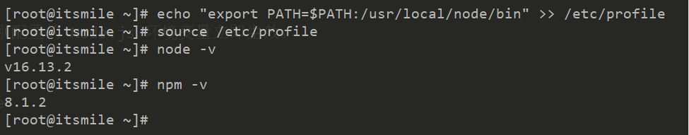
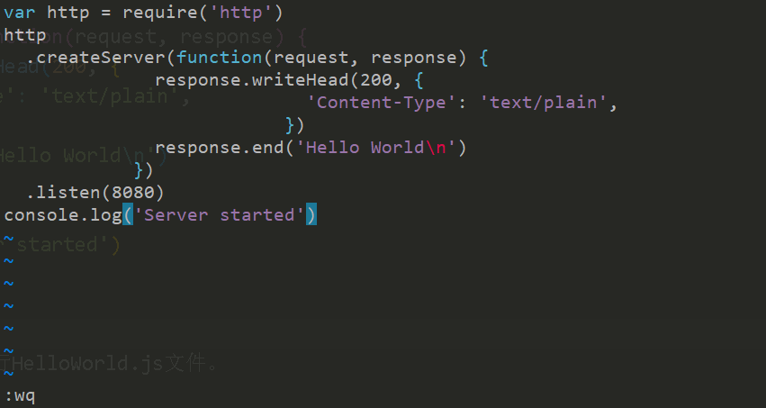
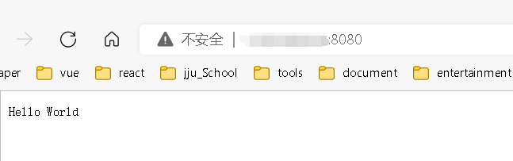
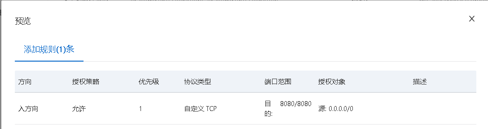

## 官网教程在服务器上搭建 Node.js 环境

### 1.登录你的云服务器

1. 更改你的实例密码

- 登录[管理控制台](https://ecs.console.aliyun.com/#/home),找到目标实例，然后在操作列选择【更多】> 【密码/密钥】 > 【重置实例密码】，然后在弹出的对话框设置 ECS 实例的登录密码。

2. 在你的电脑上打开终端，使用 ssh 连接实例。

- 输入：`ssh root@你的公网ip`，远程连接
- 再输入 yes
- 然后输入你的实例密码，即可登录

### 2.安装 Node.js

1. 执行以下命令，下载 Node.js。

```sh
wget https://npmmirror.com/mirrors/node/v16.13.2/node-v16.13.2-linux-x64.tar.xz
```

2. 执行以下命令，解压 Node.js 的安装包。

```sh
tar -xvf node-v16.13.2-linux-x64.tar.xz
```

3. 执行以下命令，移动并重命名 Node.js 安装目录。

```sh
mv node-v16.13.2-linux-x64/ /usr/local/node
```

### 3. 配置 Node.js

1.  执行以下命令，将 Node.js 的可执行文件目录加入到系统环境变量中。

```sh
echo "export PATH=$PATH:/usr/local/node/bin" >> /etc/profile
```

2. 执行以下命令，使刚配置的 Node.js 环境变量立即生效。

```sh
source /etc/profile
```

3. 执行以下命令，分别查看 node 和 npm 版本。

```sh
node -v
npm -v
```

显示版本号即说明环境配置成功


### 4. 测试 Node.js 环境

1. 使用 vim 命令创建一个测试文件。

```sh
vim HelloWorld.js
```

2. 在 HelloWorld.js 文件中写入如下代码。

```js
var http = require('http')
http
  .createServer(function(request, response) {
    response.writeHead(200, {
      'Content-Type': 'text/plain',
    })
    response.end('Hello World\n')
  })
  .listen(8080)
console.log('Server started')
```

保存退出


3. 执行以下命令，运行 HelloWorld.js 文件。

```sh
node HelloWorld.js
```

4. 打开浏览器，在地址栏中输入 http://<ECS 公网 IP>:8080，例如http://127.0.0.0:8080。
   即可看到网页返回 helloworld


:::tip
如果无法访问，是安全组里面没有配置开放端口，在管理控制台添加一条安全组规则，即可访问。

:::
